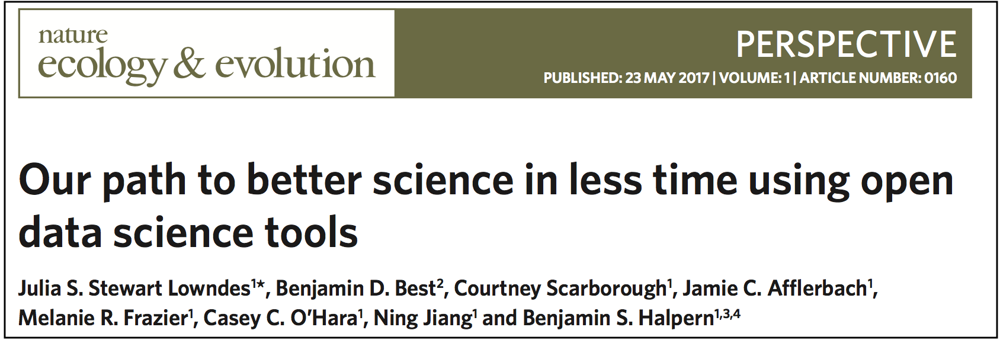
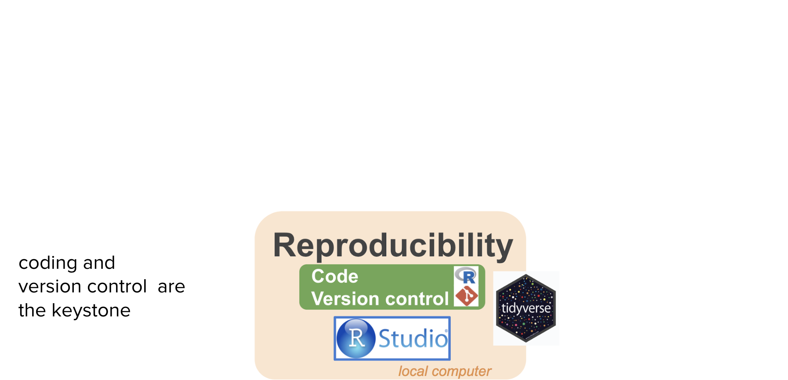
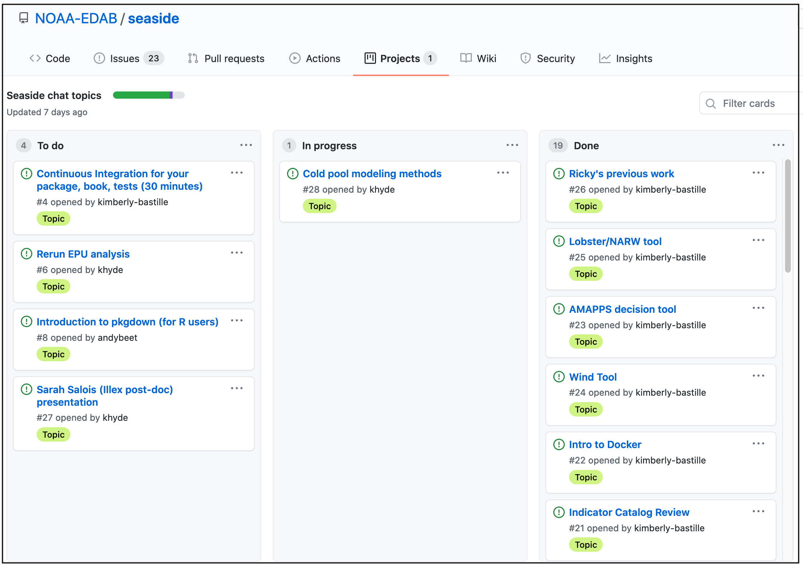
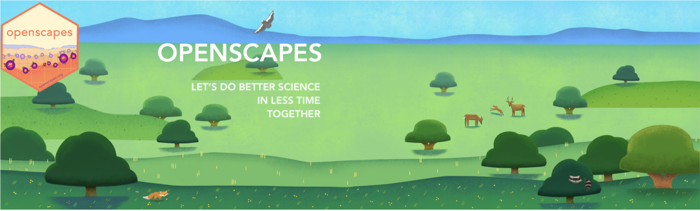
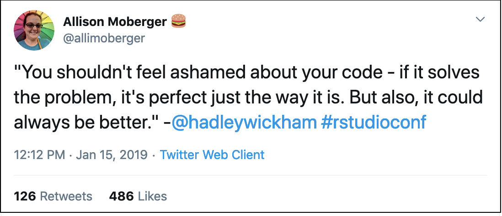

```{r setup, include=FALSE}
options(htmltools.dir.version = FALSE, warning=FALSE, message=FALSE, verbose = FALSE)
knitr::opts_chunk$set(echo = FALSE, message=FALSE, warning=FALSE)

library(xaringan)
# library(fontawesome) #devtools::install_github("rstudio/fontawesome")
# library(icon) #devtools::install_github("ropenscilabs/icon")
```

class: title-slide, right, bottom
background-image: url(img/horst-starwars-rey.png)
background-size: contain
background-position: bottom left 


## `r rmarkdown::metadata$title`
### `r rmarkdown::metadata$author`
### `r rmarkdown::metadata$institute`

[@juliesquid](https://twitter.com/juliesquid)  
[lowndes@nceas.ucsb.edu](mailto:lowndes@nceas.ucsb.edu)  
[openscapes.org/media](http://openscapes.org/media)  


???

Thank you so much. I'm really excited to be here today to talk about R and teamwork for better science in less time. 

I'm so happy to have the chance to speak with you all today because —

---
exclude: TRUE
## Hi, I'm a marine ecologist & open champion
```{r sq-tag2, out.width = '40%', fig.align='center'}
knitr::include_graphics("img/*JulieReleaseAugerIMG_9311-crop.png")
# *JulieReleaseAugerIMG_9397.jpg # release to water
# *IMG_9268.JPG # measure
```

.footnote[
photo: Greg Auger. [reproducibility story](https://www.nature.com/articles/d41586-018-05990-5) 
]

???

My PhD research studying Humboldt squid in the Pacific Ocean was the start of my data and coding journey, where I learned how important coding and reproducibility was. and it's been over eight years since I finished my PhD and have been at NCEAS. So what I want to talk about today:

---
class: inverse
## The problem
### We often approach data analysis as an individual burden.
### This is slow, brittle, demoralizing, & perpetuates inequities.

<br>

## A contributing solution
### Reframe data analysis as a collaborative, open practice.
### Build for efficiency, resilience, empowerment, &  inclusion.

???
So I like to talk about this with star wars analogies.

---

```{r luke}
```
class: center, middle
background-image: url(img/horst-starwars-luke.png)
background-size: contain

.footnote[
art: [@allison_horst](https://twitter.com/allison_horst)
]

???

We've all felt like Luke Skywalker here with data analysis, when we can't solve the the challenge in front of us with the skillsets we have.

It is demoralizing and lonely. And if you imagine Luke attempting to use whatever pulleys and ropes he might have with him, you know it wouldn't be pretty, it wouldn't be reproducible or reusable, and it probably wouldn't get him where he needs to be on time.

transition: but luckily what happens next is that he meets Yoda

---
class: top, center
```{r yoda, out.width = '88%'}
knitr::include_graphics("img/horst-starwars-yoda.png") 
```

.footnote[
art: [@allison_horst](https://twitter.com/allison_horst)
]

???

Yoda uses the Force to solve Luke's problem in a way Luke never imagined was possible.

This is going to open up Luke's whole world because he can learn from Yoda and not only solve his current but it will broaden his mind to what is possible in the future.

transition: Luke didn't have to derive the Force on his own, and he didn't go on to defeat the Empire himself, he had a whole community.

---
```{r hands} 
```
class: center, middle
background-image: url(img/horst-starwars-hands.png)  
background-size: contain


.footnote[
art: [@allison_horst](https://twitter.com/allison_horst)
]

???

And this community is powerful because of the diversity of backgrounds and expertise, and although not everyone is a Jedi, everyone contributes in really critical ways.

transition: So just to recap, 

---
```{r rey-toc-full}
```
class: title-slide, right, bottom
background-image: url(img/horst-starwars-rey.png)
background-size: contain
background-position: bottom left   


???

Open data science is the Force that enables us as scientists to do better science in less time. For me, R is a bit part of this as you'll see.

R and friends empowers us to get our own data out of the swamp.

It empowers us and build off of our confidence and experiences and broaden the scope of scientific challenges that we can tackle, which is relevant whether you are at NOAA or anywhere else.

transition: so my talk will really be framed around these ideas: that the software and the teamwork go hand-in-hand.

---
## Open data science

**the tooling and people enabling reproducible, transparent, and inclusive practices for data analysis**

```{r loop-wtext, out.width = '100%'}
knitr::include_graphics("img/horst-lowndes-loop-w-esiptext.png")
# https://docs.google.com/presentation/d/1DjrMaEOw1F7zAIEXq3ZjiiyaqVAjydLyYww7huGfch8/edit#slide=id.g8b762bd836_0_4884
```


.footnote[
art: [@allison_horst](https://twitter.com/allison_horst)   
]

???
I define ODS>..

So I have been thinking about this in terms of open data science tools and practices and teamwork & collaboration, and that they exist in feedback loop. 

So it's not only the tools like the Force or the anlyticcal power of R that lead to better science in less time, it's also the fact that many other people can use or interplay with these tools. 

Learning and using similar software promotes and streamlines teammwork. And also working as a team better equips you to learn open practices data science.

So let's talk about this

---
```{r OHI hex, out.width = '55%', fig.align='center'}
knitr::include_graphics("img/OHI-hex.png")
```

.footnote[
web: [ohi-science.org](http://ohi-science.org); [@OHIscience](https://twitter.com/OHIscience)
]

???
An example of this in action is with the Ocean Health Index, which is an assessment framework to quantify the benefits and impacts on oceans at different scales. I’ve worked with the Ocean Health Index since 2013 and there is a lot to say about it that I won't get into today. What’s relevant here is that we combine and model lots of data, we repeat our analyses every year, and we do it as a team. And, because we are a team of marine ecologists, we all came with varying levels of self-taught analytical experience. 

So we found out the hard way that our default approaches for 
data analysis were not reproducible by even ourselves.

 Getting through this involved quite a reckoning, but when we got through it, we knew we had a story to tell.

---
class: middle, center
```{r nature-bsilt, out.width = '100%', fig.align='center'}

```

.footnote[
source: [Lowndes *et al.* 2017](https://www.nature.com/articles/s41559-017-0160); web: [ohi-science.org/betterscienceinlesstime](http://ohi-science.org/betterscienceinlesstime/)
]

???

Figuring out was a big enough deal that we published this in Nature Ecology & Evolution. 

What made it unique: we shared our struggles, and described the transition

---
exclude: TRUE
### More reproducibility & collaboration, less time
```{r fig 1-whiteout, out.width = '60%', fig.align='center'}
knitr::include_graphics("img/bsilt-fig1-simple.png")
```

.footnote[
source: [*Lowndes et al. 2017* Our path  to better science in less time using open data science tools](https://www.nature.com/articles/s41559-017-0160)
]

???

---
### More reproducibility & collaboration, less time
.pull-left[
<br>
```{r fig 1-whiteoutss, out.width = '100%'}
knitr::include_graphics("img/bsilt-fig1-simple.png")
```
]

.pull-right[
<br>
<br>
- **Motivated by reproducibility for data wrangling** ("preparation")

- **Found new frontiers for collaboration and communication**

<!---

- **Required new skillsets & mindsets**

- **Possible because of trust, teamwork, & leadership**

--->

- **Amazed continually by online communities of open practice**
]
.footnote[
source: [*Lowndes et al. 2017* Our path  to better science in less time using open data science tools](https://www.nature.com/articles/s41559-017-0160)
]

???

This fig shows that as we repeated our analyses each year, they were easier to reproduce and it was easier to collaborate, and it took less time each year. We introduced open data science tools and practices iteratively, first focused on repeatability, then collaboration, and now we're focused on training.

And I wanted to highlight that we motivation was because of data prep


---
exclude: TRUE
```{r ohi-how-we-work2, out.width = '100%', fig.align='center'}
knitr::include_graphics("img/ohi-how-we-work2.png")
```

.footnote[
source: [OHI slides — UW](https://docs.google.com/presentation/d/1LA4EcnRxD11rjwbRh0hrjPG5J0dmiiuCbNaoQrz0XHU/edit?usp=sharing)
]

???


---
## We worked openly within our team
```{r workflow-repro-wtext, out.width = '100%', fig.align='center'}

```

.footnote[
source: [OHI slides — WHOI](https://drive.google.com/open?id=1SHvJbBWrGVqzjAPos1jbtxSn_2DAl44JmDgY5v2NxC8)
]

???

---
## We worked openly within our team

```{r workflow-full-wtext, out.width = '100%', fig.align='center'}
knitr::include_graphics("img/workflow-full-wtext.png")
```

.footnote[
source: [OHI slides — WHOI](https://drive.google.com/open?id=1SHvJbBWrGVqzjAPos1jbtxSn_2DAl44JmDgY5v2NxC8)
]

???

---
## RStudio for R, text editing, Github sync, & more
```{r workflow-ex-repro-wtext, out.width = '100%'}
knitr::include_graphics("img/workflow-ex-repro-wtext.png")
```

.footnote[
source: [OHI slides — WHOI](https://drive.google.com/open?id=1SHvJbBWrGVqzjAPos1jbtxSn_2DAl44JmDgY5v2NxC8)
]

???

---
## GitHub for archiving and bookkeeping
```{r workflow-ex-collab-wtext, out.width = '100%'}
knitr::include_graphics("img/workflow-ex-collab-wtext.png")
```

.footnote[
source: [OHI slides — WHOI](https://drive.google.com/open?id=1SHvJbBWrGVqzjAPos1jbtxSn_2DAl44JmDgY5v2NxC8)
]

???

---
## Github for discussion & project mgmt
```{r workflow-ex-collab2-wtext, out.width = '100%', fig.align='center'}
knitr::include_graphics("img/workflow-ex-collab2-wtext.png")
```

.footnote[
source: [OHI slides — WHOI](https://drive.google.com/open?id=1SHvJbBWrGVqzjAPos1jbtxSn_2DAl44JmDgY5v2NxC8)
]

???

---
## RMarkdown: reproducible, updatable reports

```{r rmd-openpubfest, out.width = '100%'}

```

.footnote[
source: [Lowndes & Tierney 2020, Open Pub Fest](https://docs.google.com/presentation/d/1Jv0akRHEnjG_4t_9P7t93682BCBJskYnRu_7EnaeDQI/edit?usp=sharing)
]

---
exclude: TRUE
## RMarkdown sidenote

```{r, echo=TRUE}
library(tidyverse) # install.packages(tidyverse)
library(palmerpenguins) # install.packages(palmerpenguins)
penguins %>%
  count() 
my_data <- 1:10
median_my_data <- median(my_data)
```


We found that 

---
## RMarkdown for docs, publishing & websites
```{r workflow-ex-comm-wtext, out.width = '100%'}
knitr::include_graphics("img/workflow-ex-comm-wtext.png")
```

.footnote[
source: [OHI slides — WHOI](https://drive.google.com/open?id=1SHvJbBWrGVqzjAPos1jbtxSn_2DAl44JmDgY5v2NxC8)
]

???

---
## R for dashboards & stakeholder engagement

```{r shiny-ne, out.width = '90%', fig.align='center'}
knitr::include_graphics("img/jafflerbach-shiny-ne.png") 
```

.footnote[
dashboard (Shiny): [@jafflerbach](https://twitter.com/jafflerbach). 
inspiration: [Imagine Boston](https://analytics.boston.gov/app/imagine-boston) 
]

???

And when we are working closely with partners who are engaged with data analysis decisions, we have been able to create dashboards as well. 


---
exclude: TRUE
## RMarkdown for slides!
```{r user-xaringan, out.width = '80%', fig.align='center'}
knitr::include_graphics("img/user-keynote-titleslide.png") 
```

.footnote[
slides (xaringan): [jules32.github.io/useR-2019-keynote](https://jules32.github.io/useR-2019-keynote)
]

???

And for fun, for creating talks at useR

transition: 
A few examples from the RStats community...


---
## Open data science

```{r loop-wtext2, out.width = '100%'}
knitr::include_graphics("img/horst-lowndes-loop-w-esiptext.png")
```

.footnote[
art: [@allison_horst](https://twitter.com/allison_horst)   
]

???

But remember, these tools are really most powerful with teams.

And teams is about mindsets and behaviors of individuals and shared, sustainable culture 

---

<br>
<br>
```{r community-logosx, out.width = '100%', fig.align='center'}
knitr::include_graphics("img/ods-community-logos.png")
```

???

So that was about the tools, and these are some of the communities that make them. We've learned so much from these communities, that focus on inclusion and empowerment. And from them we've established shared norms and shared mindsets.

---
class: inverse, center, middle
## It’s like agreeing that we will all drive on the left or the right. A hallmark of civilization is following conventions that constrain your behavior a little, in the name of public safety.

**Jenny Bryan & Jim Hester, [What They Forgot to Teach You About R](https://rstats.wtf/)**


---
## Data science mindset
<br>
```{r data-science-r4ds, out.width = '90%', fig.align='center'}
knitr::include_graphics("img/r4ds_data-science.png")
```

.footnote[
<br>
[Wickham & Grolemund, 2016: "R for Data Science"](https://r4ds.had.co.nz/)
]  

???

This graphic really changed they way we work and think. 

First, it separates the Understand part. This is this science part. It's an iterative process of transforming, subsetting, comparting data, vizulazing, modeling. And it's distinct from the import and tidying parts. This is critical. 

---
## Data science mindset
<br>
```{r data-science-r4ds-lohr, out.width = '90%', fig.align='center'}
knitr::include_graphics("img/r4ds_data-science-lohr.png")
```

.footnote[
<br>
[Wickham & Grolemund, 2016: "R for Data Science"](https://r4ds.had.co.nz/)  
[Lohr, 2014 "For Big-Data Scientists, ‘Janitor Work’ Is Key Hurdle to Insights"](https://www.nytimes.com/2014/08/18/technology/for-big-data-scientists-hurdle-to-insights-is-janitor-work.html)
]  

???

This graphic really changed they way we work and think. 

First, it separates the Understand part. This is this science part. It's an iterative process of transforming, subsetting, comparting data, vizulazing, modeling. And it's distinct from the import and tidying parts. This is critical. 
---
## Data science mindset & tools
<br>
```{r tidyverse, out.width = '60%', fig.align='center'}
knitr::include_graphics("img/r4ds_data-science-tidyverse.png")
```
  
.footnote[
source: [Hadley Wickham, 2019](https://speakerdeck.com/hadley/welcome-to-the-tidyverse?slide=28); web: [tidyverse.org](https://www.tidyverse.org/)
]  

???

Expect there's a better way

---
<br>
<br>
```{r tidy_workbenches, out.width = '90%', fig.align='center'}

```

.footnote[
art: [@allison_horst](https://twitter.com/allison_horst); [illustrated series](https://www.openscapes.org/blog/2020/10/12/tidy-data/)
]

???
Working with tidy data you can use existing tools in familiar ways rather than hand-crafting one-time approaches that are hard to iterate, share, or reuse

---
<br>
<br>
```{r tidy_collab, out.width = '100%', fig.align='center'}

```

.footnote[
art: [@allison_horst](https://twitter.com/allison_horst); [illustrated series](https://www.openscapes.org/blog/2020/10/12/tidy-data/)
]

???

Tidy data for easier collaboration! Whether collaborators are current teammates, Future You, or Future Us, organizing and sharing data in a consistent and predictable way means less adjustment, time, and effort for all.

Tidy data for reproducibility and reuse! By using tools that all expect tidy data as 
inputs, you can build and iterate powerful workflows that are easier to understand,  update, and reuse. 

---
## Open mindset
### "transparency at all stages of the research process, coupled with free and open access to data, code, and papers"

source: [*Hampton et al. 2015* The Tao of open science for ecology](https://esajournals.onlinelibrary.wiley.com/doi/full/10.1890/ES14-00402.1)

--

### "collaboration, empowerment, inclusivity, and accountability" ... "trust" ... "safe to be vulnerable"

source: [*Wright 2019* Why bother with the “open” anyway?](https://medium.com/@stephanie_6761/why-bother-with-the-open-anyway-c76afb4dcb85)

--

### "...technology enabling social infrastructure that can promote inclusivity to create kinder science"

source: [*Lowndes 2019* Open software means kinder science](https://blogs.scientificamerican.com/observations/open-software-means-kinder-science/)


???

I'd  also add: Kindness

---
exclude: TRUE
## Open mindset and tools

```{r ods-software, out.width = '65%', fig.align='center'}
knitr::include_graphics("img/screenshot-paur-talk-ods.png") 
```

.footnote[
source: [OHI slides](https://docs.google.com/presentation/d/12m8dUpIOz16x1RlZWLtj9u5E9wMxtYuP0T_HxoDnyKw/edit?usp=sharing)
]

???

---
<br>

```{r loop-how-we-work1, out.width = '100%', fig.align='center'}
 
```

???

Animate: This is what better science in less time looks like for us. Over 4 years we incrementally introduced the tooling like open source coding into our workflow and established team norms. It meant changing the ways that we had always worked during our whole careers, and it was intimidating, because before we started we were like Luke when he just crashed – we couldn’t imagine what was possible and didn’t have confidence that we could do it ourselves. 

But we were able to do this because we had several entryways. 

---
<br>

```{r loop-how-we-work-bold, out.width = '100%', fig.align='center'}
 
```

???

animate: The things that benefitted us the most was leadership and trust. A culture of horizontal leadership enabled a team member who knew the tooling to champion it within our team, and for the rest of us to become comfortable with both the benefits and investment it required. We learned from the global R community, and established weekly team meetings where we would co-learn together.

This investment paid off and we had time to focus on new innovation in our science and enable others to build off our work through these new channels. The OHI R package has supported 20 groups around the world that are tailoring our methods to do data-informed ocean management to their own waters, which was unimaginable in the way we worked previously. 

transition: pause

we really worked like a team. It's about kindness, inclusion, and belonging.


---
```{r loop-entryway1, out.width = '100%', fig.align='center'}
 
```

---
```{r loop-entryway2, out.width = '100%', fig.align='center'}
 
```

---
```{r openscapes-grassland, out.width = '100%', fig.align='center'}
knitr::include_graphics("img/horst_openscapes_desert-text.png")
```

--

### We empower teams to be more efficient, resilient, & inclusive

**Designed to onboard teams to collaborative skillsets & mindsets, focused on leadership & community**

- **Operationalizing our experiences with the Ocean Health Index**
- **Remote-by-design & cohort-based: 3 hrs/month for 2-4 months**
- **First cohorts: environmental scientists from academia and government**


.footnote[
web: [openscapes.org](https://www.openscapes.org); twitter: [@openscapes](https://twitter.com/openscapes)
]

---

exclude: TRUE
```{r loop-champions, out.width = '100%', fig.align='center'}
knitr::include_graphics("img/horst-loop-champions-esip1.png")
```


```{r loop-champions2, out.width = '100%', fig.align='center'}
knitr::include_graphics("img/horst-loop-champions-esip2.png")
```


---
exclude:TRUE
```{r loop-champions3, out.width = '100%', fig.align='center'}
knitr::include_graphics("img/horst-loop-champions-esip3.png")
```

---
class: middle
.pull-left[
```{r pinskylab, out.width = '100%'}

```
.footnote[
github: [@pinskylab](https://github.com/pinskylab)
]

]

.pull-right[
```{r froehlich-lab, out.width = '100%'}

```


.footnote[
github: [@froehlich-lab](https://github.com/Froehlich-Lab/anti-racism)
]
]


---
.pull-left[
<br>
<br>
```{r baysidechat, out.width = '100%'}

```

.footnote[
tweet: [@MoDubs11](https://twitter.com/MoDubs11/status/1204489227737550848)
]
]

.pull-right[
<br>
```{r faylab, out.width = '100%'}

```

.footnote[
tweet: [@thefaylab](https://twitter.com/thefaylab/status/1239997719449665536)
]
]

---
exclude: TRUE 
class: middle, center
```{r noaa-seaside, out.width = '80%'}

```

.footnote[
github: [@NOAA-EDAB/seaside](https://github.com/NOAA-EDAB/seaside/projects/2)
]

---
name: so-many-wins
class: center, middle
background-image: url(img/champions-force11-so-many-wins.png) 
background-size: contain
---
## Supercharge your research

.pull-left[
### 1. Normalize data discussions 
### 2. Identify and address shared needs
### 3. Think ahead for Future You & Future Us
]

.pull-right[
```{r supercharge-esip, out.width = '100%'}
knitr::include_graphics("img/horst-seaside-chats.png")
```
]


.footnote[
**A 10-week plan for open data science: [*Lowndes et al. 2019* ](https://www.nature.com/articles/d41586-019-03335-4)**<br>
**[openscapes.org](https://openscapes.org): [blog](https://www.openscapes.org/blog/), [media](https://openscapes.org/media);
[resources](https://openscapes.org/resources)**

]

---
class: inverse, center, middle
##“If you want to learn to write, you read a lot, <br>if you want to play music, you listen a lot. <br>It’s hard to do this with data analysis.” 

**Hilary Parker & Roger Peng, [RStudio::conf(2020) keynote](https://rstudio.com/resources/rstudioconf-2020/not-so-standard-deviations-episode-100/) & [NSSD podcast episode 100]( http://nssdeviations.com/100-live-from-rstudio-conf-2020)**

---
exclude: TRUE
```{r loop-entrywayyy2, out.width = '100%', fig.align='center'}
 
```

---
exclude: TRUE
```{r openscapes-grasslandss, out.width = '100%', fig.align='center'}

```

### We welcome scientists to the open data science <br>and help grow the movement

**Engage: build awareness and excitement with empathy, art, and storytelling**  
**Empower: connect with existing open software and communities**  
**Amplify: champion broadly to increase visibility, value, and practice**  

.footnote[
web: [openscapes.org](https://www.openscapes.org); twitter: [@openscapes](https://twitter.com/openscapes)
]


???
**trust** • **resilience** • **overlapping skillsets & interoperability** • **leadership • kindness**  


---
## Thank you, and welcome to open data science!

```{r horst-air, out.width = '75%', fig.align='center'}

```

.pull-left[
**Special thanks to**:  
[Allison Horst](https://twitter.com/allison_horst) — all Openscapes artwork  
OHI • Mozilla • Openscapes • #rstats • Carpentries  
]

.pull-right[
**Please get involved:**   
[openscapes.org/contact](https://www.openscapes.org/contact/) • [@openscapes](https://openscapes.org)

####   

]

???

Thank you.

[Alison Hill](https://github.com/apreshill/talks/blob/master/uo-sad-plot-better/index.Rmd#L7) —  xaringan theme


---
```{r fin}
```
class: title-slide, right, bottom
background-image: url(img/horst-starwars-rey.png)
background-size: contain
background-position: bottom left 


## `r rmarkdown::metadata$title`
### `r rmarkdown::metadata$author`
### `r rmarkdown::metadata$institute`

[@juliesquid](https://twitter.com/juliesquid)  
[lowndes@nceas.ucsb.edu](mailto:lowndes@nceas.ucsb.edu)  
[openscapes.org/media](http://openscapes.org/media)  


---

---
## \#rstats Twitter

```{r welcome-rstats, out.width = '55%', fig.align='center'}
knitr::include_graphics("img/horst-welcome_to_rstats_twitter.png")  
```

.footnote[
art: [@allison_horst](https://twitter.com/allison_horst)
]

???
So much cool stuff available, how do you learn what's going on? Twitter. 

I was super skeptical

---
.pull-left[
<br>
```{r rnoaa, out.width = '100%'}
knitr::include_graphics("img/tweet-Md_Harris-rnoaa.png")
```

.footnote[
tweet: [@Md_Harris](https://twitter.com/Md_Harris/status/1074469302974193665/photo/1)]
]

--

.pull-right[
### My internal monologue: 

**- Cool visualization!**  
**- I want to represent my data this way**  
**- He includes [his code](https://gist.github.com/mrecos)!**  
**- Package from [@sckottie](https://twitter.com/sckottie) at [rOpenSci](https://ropensci.org)**  
**- rnoaa is to streamline NOAA data to R!**  
**- I'll share with Openscapes**
]

???

---
.pull-left[
<br>
```{r rnoaa2, out.width = '100%'}
knitr::include_graphics("img/tweet-Md_Harris-rnoaa.png")
```

.footnote[
tweet: [@Md_Harris](https://twitter.com/Md_Harris/status/1074469302974193665/photo/1)]
]

.pull-right[
### My internal monologue: 

**- Cool visualization!**  
**- I want to represent my data this way**  
**- He includes [his code](https://gist.github.com/mrecos)!**  
**- Package from [@sckottie](https://twitter.com/sckottie) at [rOpenSci](https://ropensci.org)**  
**- rnoaa is to streamline NOAA data to R!**  
**- I'll share with Openscapes**


```{r halley-rnoaa, out.width = '60%', fig.align='center'}
knitr::include_graphics("img/tweet-docfroehlich-rnoaa-full.png")  
```
 
.footnote[
tweet: [@DocFroehlich](https://twitter.com/DocFroehlich/status/1085990833571020800)
]

]

???

Halley has a big science following already and now tweets also about open data science, so this is a great example of the influence these champions are already having. 


---
.pull-left[

<br>
<br>
<br>
<br>

```{r rladies-sydney, out.width = '100%', fig.align='center'}
knitr::include_graphics("img/tweet-apreshill-rladies-sydney.png")
```

.footnote[
twitter: [@apreshill](https://twitter.com/apreshill/status/1184660994007519232); 
web: [RLadies Sydney](https://rladiessydney.org/courses/ryouwithme/)
]
]

.pull-right[

<br>
<br>

```{r wearerladies-sydney, out.width = '100%', fig.align='center'}
knitr::include_graphics("img/tweet-wearerladies-rladiesmelb-thread.png")
```

.footnote[
twitter: [@WeAreRLadies](https://twitter.com/WeAreRLadies/status/1225028377280516096)
]
]
???

https://twitter.com/WeAreRLadies/status/1087741684618809346
https://twitter.com/frau_dr_barber/status/1127189812308369408

---
.pull-left[
```{r ropensci-janitor, out.width = '100%', fig.align='center'}
  
```

.footnote[
web: [ropensci/packages](https://ropensci.org/packages); [janitor](https://sfirke.github.io/janitor)
]
]

.pull-right[
```{r tbep, out.width = '100%', fig.align='center'}
knitr::include_graphics("img/tweet-fawda123-tbep.png")  
```

.footnote[
tweet: [@fawda123](https://twitter.com/jomilo75/status/1099044075158659072);
blog: [openscapes](https://openscapes.org/blog/2020/11/16/tampa-bay-reporting/)
]
]

???
These kinds of conversations and communities enable packages like these, from rOpenSci

rOpenSci doing code review

---
.pull-left[
<br>
```{r gam, out.width = '100%'}

```

.footnote[
tweet: [@WeAreRLadies](https://twitter.com/WeAreRLadies/status/1140669339978391552)
]
]

.pull-right[
<br>
```{r oaggimenez, out.width = '100%', fig.align='center'}
  
```
.footnote[
tweet: [@oaggimenez](https://twitter.com/oaggimenez/status/1093882504560414721)
]
]

??? 

RLadies. Gender diversity in R


---
class: center, middle
```{r grrrck, out.width = '70%', fig.align='center'}

```

```{r hadley-better, out.width = '70%', fig.align='center'}

```

.footnote[
tweet: [@grrrck](https://twitter.com/grrrck/status/1252704601024999437), [@allimoberger](https://twitter.com/allimoberger/status/1085268564821585921)
]

---
.pull-left[
```{r blkindata, out.width = '100%'}

```

.footnote[
tweet: [@BlkInData](https://twitter.com/BlkInData/status/1328291205369749511)
]
]

.pull-right[
<br>
<br>
<br>
```{r blkindata2, out.width = '100%'}

```

.footnote[
tweet: [@stabdelraheem](https://twitter.com/stabdelraheem/status/1328399373470896128)
]
]


