```{r setup, include=FALSE}
options(htmltools.dir.version = FALSE, warning=FALSE, message=FALSE, verbose = FALSE)
knitr::opts_chunk$set(echo = FALSE, message=FALSE, warning=FALSE)

library(xaringan)
library(fontawesome) #devtools::install_github("rstudio/fontawesome")
library(icon) #devtools::install_github("ropenscilabs/icon")
```

class: title-slide, right, bottom
background-image: url(img/horst-starwars-rey.png)
background-size: contain
background-position: bottom left 


## `r rmarkdown::metadata$title`
### `r rmarkdown::metadata$author`
### `r rmarkdown::metadata$institute`

[`r icon::fa("twitter")` @juliesquid](https://twitter.com/juliesquid)  
[`r icon::fa("paper-plane")` lowndes@nceas.ucsb.edu](mailto:lowndes@nceas.ucsb.edu)  
[`r icon::fa("desktop")` openscapes.org/media](http://openscapes.org/media)  


???

Thank you so much. I'm 

NOAA PhD work

---
## PhD research with NOAA SWFSC
```{r sq-tag2, out.width = '40%', fig.align='center'}
knitr::include_graphics("img/*JulieReleaseAugerIMG_9311-crop.png")
# *JulieReleaseAugerIMG_9397.jpg # release to water
# *IMG_9268.JPG # measure
```

.footnote[
photo: Greg Auger 
]

???

I am actually a squid ecologist, which is why many of you know me as juliesquid. 

That is me on the right, holding a squid that can be nearly as big as I am. 

We caught it and I am releasing it alive back into the ocean with a little electronic tag on it. The tag turns this squid little oceanographer, because it will collect data about it environment as it swims through the ocean. i collected data every second, which means I could actually see the squid breathe, since its breathing and movement are coupled through jet propulsion. 

My whole PhD research group focused on squid. We were interested because squid have huge impact on ecosystems since they eat a lot and grow quickly and they also have huge impact on economies because globally there is such high consumption of calamari. In our lab some focused on ecology like me, others on locomotion, camouflage, or early life development. 

---
class: inverse
## This is a story about...
<br>

### open data science
### teamwork & community
### empowerment & inclusion

---

```{r luke}
```
class: center, middle
background-image: url(img/horst-starwars-luke.png)
background-size: contain

.footnote[
art: [@allison_horst](https://twitter.com/allison_horst)
]

???

This is Luke Skywalker after he crashed his plane in the swamp on Dagobah.

He cannot solve the the challenge in front of him with the skillsets he has.

He is demoralized and alone. And if you imagine him attempting to use whatever pulleys and ropes he might have with him, you know it wouldn't be pretty, it wouldn't be reproducible, and it probably wouldn't get him where he needs to be on time.

transition: but luckily what happens next is that he meets Yoda

---
class: top, center
```{r yoda, out.width = '88%'}
knitr::include_graphics("img/horst-starwars-yoda.png") 
```

.footnote[
art: [@allison_horst](https://twitter.com/allison_horst)
]

???

Yoda uses the Force to solve Luke's problem in a way Luke never imagined was possible.

This is going to open up Luke's whole world because he can learn from Yoda and not only solve his current but it will broaden his mind to what is possible in the future.

transition: But Luke didn't go on to defeat the Empire himself, he had a whole community.

---
```{r hands} 
```
class: center, middle
background-image: url(img/horst-starwars-hands.png)  
background-size: contain


.footnote[
art: [@allison_horst](https://twitter.com/allison_horst)
]

???

And this community is powerful because of the diversity of backgrounds and expertise, and although not everyone is a Jedi, everyone contributes in really critical ways.

transition: So just to recap, 

---
```{r rey-toc-full}
```
class: title-slide, right, bottom
background-image: url(img/horst-starwars-rey.png)
background-size: contain
background-position: bottom left   


???

R is the Force that enables us as scientists to do better science in less time.

It empowers us to get our own data out of the swamp.

It empowers us and build off of our confidence and experiences and broaden the scope of scientific challenges that we can tackle, which is relevant whether you are at SCCWRP or anywhere else.

transition: so my talk will really be framed around these ideas: that the software and the teamwork go hand-in-hand.

---
class: middle, center
```{r nature-bsilt0, out.width = '100%', fig.align='center'}
knitr::include_graphics("img/nature-screenshot-title.png")
```

.footnote[
source: [Lowndes *et al.* 2017](https://www.nature.com/articles/s41559-017-0160); web: [ohi-science.org/betterscienceinlesstime](http://ohi-science.org/betterscienceinlesstime/)
]

???

Figuring out was a big enough deal that we published this in Nature Ecology & Evolution. 

What made it unique: we shared our struggles, and described the transition

---
## Open data science

```{r loop-wtext, out.width = '100%'}
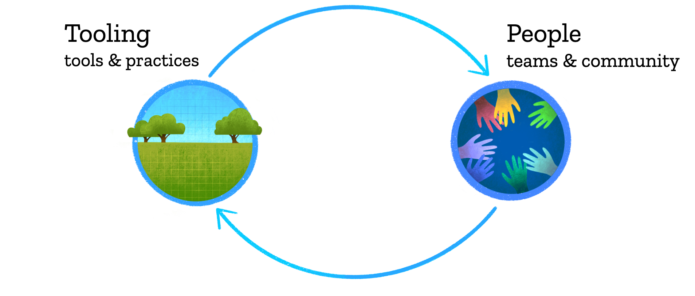
# https://docs.google.com/presentation/d/1DjrMaEOw1F7zAIEXq3ZjiiyaqVAjydLyYww7huGfch8/edit#slide=id.g8b762bd836_0_4884
```

**the tooling and people enabling reproducible, transparent, and inclusive practices for data analysis**


.footnote[
art: [@allison_horst](https://twitter.com/allison_horst)   
]

???

So I have been thinking about this in terms of open data science tools and practices and teamwork & collaboration, and that they exist in feedback loop. 

So it's not only the tools like the Force or the anlyticcal power of R that lead to better science in less time, it's also the fact that many other people can use or interplay with these tools. 

Learning and using similar software promotes and streamlines teammwork. And also working as a team better equips you to learn open practices data science.

So this is going to be my loose outline for the talk, trying to describe more about this. And I'll do that through 2 programs I've been involved in, which I will introduce briefly first. 

We really felt the power of this feedback loop through OHI


---
exclude:TRUE
```{r ohi-banner, out.width = '80%', fig.align='center'}
knitr::include_graphics("img/ohi-illustration-hex.png")
```

.pull-left[
**A scientific method, tool, and community for channeling the best available scientific information into marine policy.**  
<br>
**Global assessments annually since 2012**  
<br>
**Independent OHI+ assessments in 20 geographies**

<!---(example: Ecuador, Baltic, Northeast US) --->

.footnote[
source: [*Halpern et al. 2012*: An Index to assess the health and benefits of the global ocean](http://www.nature.com/nature/journal/v488/n7413/full/nature11397.html); web: [ohi-science.org](http://ohi-science.org)
]
]

.pull-right[
```{r teamx2, out.width = '100%', fig.align='center'}
knitr::include_graphics("img/ohi-team-2018b-crop.jpeg") 
```
]

???

A scientific method, tool, and community for channeling the best available scientific information into marine policy.

It is being used by the United Nations and by 20 groups around the world. 

There is a lot to it but what is relevant here is that we combine lots of data, we repeat our analyses every year, and we do it as a team.

But we are marine scientists, and we were never trained to work responsibly with data. 

So we found out the hard way that our default approaches were not reproducible by even ourselves. 

Getting through this involved quite a reckoning, but when we got through it, we knew we had a story to tell. 

transition: I like to talk about this with analogies from Star Wars 

---
exclude:TRUE
```{r openscapes grasslandx, out.width = '100%', fig.align='center'}
knitr::include_graphics("img/horst_openscapes_grassland_1500px-text-hex.png")
```

.pull-left[
**We champion open practices in science to help uncover data-driven solutions faster.**  
<br>
**Champions Program mentors research teams to help build mindsets and habits around open data science, and grow the community of practice.**  
<br>
**Operated by NCEAS and incubated by Mozilla** 

]

.pull-right[
```{r zoom12, out.width = '85%', fig.align='center'}
knitr::include_graphics("img/Cohort1_zoom.png") 
```

.footnote[
web: [openscapes.org](https://openscapes); twitter: [@openscapes](https://twitter.com/openscapes)
]
]

???
So I developed Openscapes, 

this builds from nearly 7 years of the OHI


---
```{r OHI hex, out.width = '55%', fig.align='center'}
knitr::include_graphics("img/OHI-hex.png")
```

.footnote[
web: [ohi-science.org](http://ohi-science.org); [@OHIscience](https://twitter.com/OHIscience)
]

---
exclude: TRUE
class: middle, center
```{r nature-bsilt, out.width = '100%', fig.align='center'}
knitr::include_graphics("img/nature-screenshot-title.png")
```

.footnote[
source: [Lowndes *et al.* 2017](https://www.nature.com/articles/s41559-017-0160); web: [ohi-science.org/betterscienceinlesstime](http://ohi-science.org/betterscienceinlesstime/)
]

???

Figuring out was a big enough deal that we published this in Nature Ecology & Evolution. 

What made it unique: we shared our struggles, and described the transition

---
### More reproducibility & collaboration, less time
```{r fig 1-whiteout, out.width = '60%', fig.align='center'}
knitr::include_graphics("img/bsilt-fig1-simple.png")
```

.footnote[
source: [*Lowndes et al. 2017* Our path  to better science in less time using open data science tools](https://www.nature.com/articles/s41559-017-0160)
]

???

It looks like this. 

Shown here as the circles get smaller and moving up the y axis. It also go easier for us to collaborate each year, along the x axis. 

We couldn't overhaul everything all at once, but focused on different pieces incrementally each year. 

Having all of this coding infrastructure in place is what enables those 20 independent groups I mentioned to study ocean health in the places they care about. 

---
### More reproducibility & collaboration, less time
.pull-left[
<br>
```{r fig 1-whiteoutss, out.width = '100%'}
knitr::include_graphics("img/bsilt-fig1-simple.png")
```
]

.pull-right[
<br>
- **Motivated by reproducibility for "data preparation" aka data wrangling**

- **Blown away by collaboration and communication**
]
.footnote[
source: [*Lowndes et al. 2017* Our path  to better science in less time using open data science tools](https://www.nature.com/articles/s41559-017-0160)
]

???
An example of this in action is with the Ocean Health Index, where open data science enabled us to do better science in less time and reimagine what is possible. I’ve worked with the Ocean Health Index since 2013 and there is a lot to say about it but what’s relevant here is that we combine lots of data, we repeat our analyses every year, and we do it as a team. And, because we are a team of marine ecologists, we all came with varying levels of self-taught analytical experience. 

Animate: This is what better science in less time looks like for us. Over 4 years we incrementally introduced the tooling like open source coding into our workflow and established team norms. It meant changing the ways that we had always worked during our whole careers, and it was intimidating, because before we started we were like Luke when he just crashed – we couldn’t imagine what was possible and didn’t have confidence that we could do it ourselves. 

But we were able to do this because we had several entryways. 

animate: The things that benefitted us the most was leadership and trust. A culture of horizontal leadership enabled a team member who knew the tooling to champion it within our team, and for the rest of us to become comfortable with both the benefits and investment it required. We learned from the global R community, and established weekly team meetings where we would co-learn together.

This investment paid off and we had time to focus on new innovation in our science and enable others to build off our work through these new channels. The OHI R package has supported 20 groups around the world that are tailoring our methods to do data-informed ocean management to their own waters, which was unimaginable in the way we worked previously. 

transition: pause

---
exclude: TRUE
```{r ohi-how-we-work2, out.width = '100%', fig.align='center'}
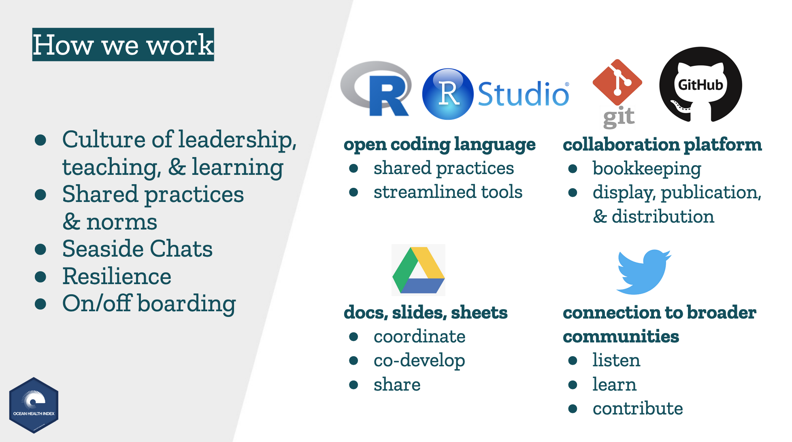
```

.footnote[
source: [OHI slides — UW](https://docs.google.com/presentation/d/1LA4EcnRxD11rjwbRh0hrjPG5J0dmiiuCbNaoQrz0XHU/edit?usp=sharing)
]

???


---
class: center, middle
```{r workflow-repro-wtext, out.width = '100%'}
knitr::include_graphics("img/workflow-repro-wtext.png")
```

.footnote[
source: [OHI slides — WHOI](https://drive.google.com/open?id=1SHvJbBWrGVqzjAPos1jbtxSn_2DAl44JmDgY5v2NxC8)
]

???

---
class: center, middle
```{r workflow-full-wtext, out.width = '100%'}
knitr::include_graphics("img/workflow-full-wtext.png")
```

.footnote[
source: [OHI slides — WHOI](https://drive.google.com/open?id=1SHvJbBWrGVqzjAPos1jbtxSn_2DAl44JmDgY5v2NxC8)
]

???

---
## RStudio for R, text editing, Github sync, & more
```{r workflow-ex-repro-wtext, out.width = '100%'}
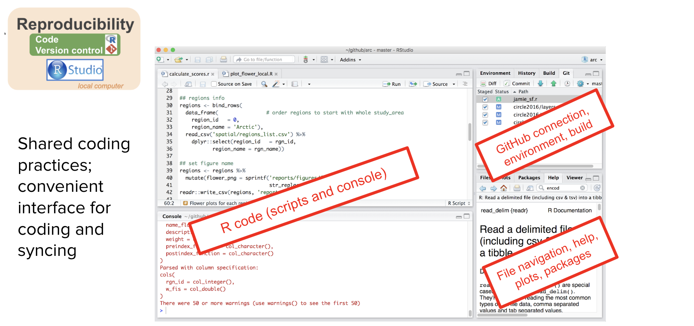
```

.footnote[
source: [OHI slides — WHOI](https://drive.google.com/open?id=1SHvJbBWrGVqzjAPos1jbtxSn_2DAl44JmDgY5v2NxC8)
]

???

---
## GitHub for archiving and bookkeeping
```{r workflow-ex-collab-wtext, out.width = '100%'}
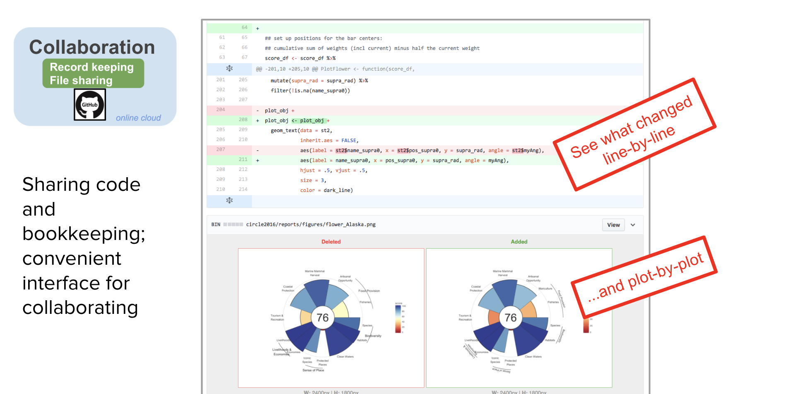
```

.footnote[
source: [OHI slides — WHOI](https://drive.google.com/open?id=1SHvJbBWrGVqzjAPos1jbtxSn_2DAl44JmDgY5v2NxC8)
]

???

---
## Github for discussion & project mgmt
```{r workflow-ex-collab2-wtext, out.width = '100%', fig.align='center'}
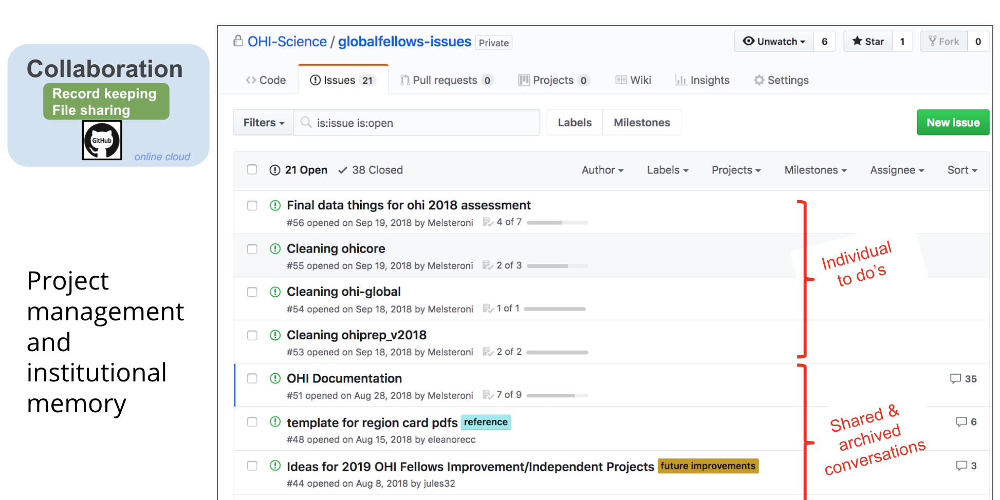
```

.footnote[
source: [OHI slides — WHOI](https://drive.google.com/open?id=1SHvJbBWrGVqzjAPos1jbtxSn_2DAl44JmDgY5v2NxC8)
]

???

---
## RMarkdown: reproducible, updatable reports

```{r rmd-openpubfest, out.width = '100%'}
knitr::include_graphics("img/rmd-openpubfest.png")
```

.footnote[
source: [Lowndes & Tierney 2020, Open Pub Fest](https://docs.google.com/presentation/d/1Jv0akRHEnjG_4t_9P7t93682BCBJskYnRu_7EnaeDQI/edit?usp=sharing)
]

---
## RMarkdown for docs, publishing & websites
```{r workflow-ex-comm-wtext, out.width = '100%'}
knitr::include_graphics("img/workflow-ex-comm-wtext.png")
```

.footnote[
source: [OHI slides — WHOI](https://drive.google.com/open?id=1SHvJbBWrGVqzjAPos1jbtxSn_2DAl44JmDgY5v2NxC8)
]

???

---
## Shiny for interactive dashboards

```{r shiny-ne, out.width = '90%', fig.align='center'}
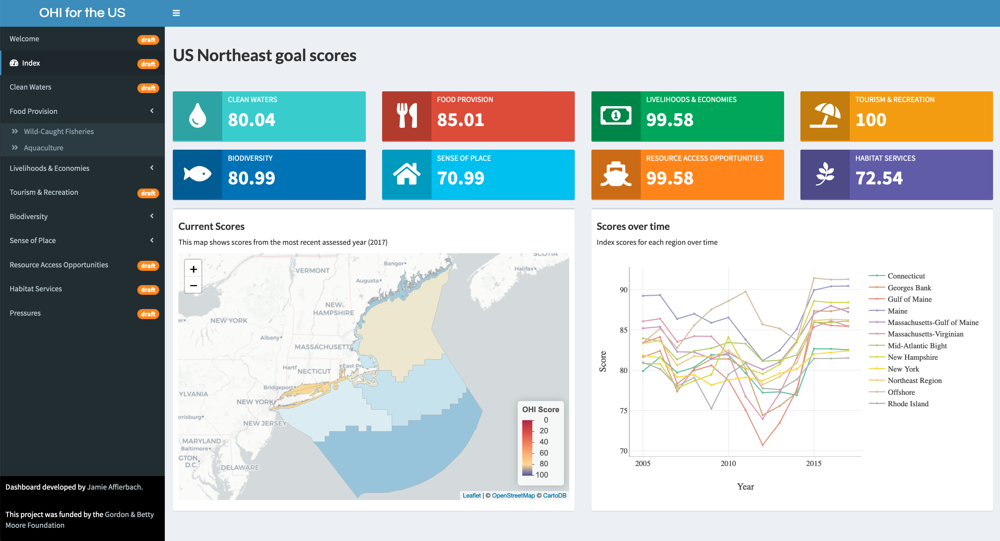 
```

.footnote[
dashboard (Shiny): [@jafflerbach](https://twitter.com/jafflerbach), work in progress. 
inspiration: [Imagine Boston](https://analytics.boston.gov/app/imagine-boston) 
]

???

And when we are working closely with partners who are engaged with data analysis decisions, we have been able to create dashboards as well. 


---
## RMarkdown for slides!
```{r user-xaringan, out.width = '80%', fig.align='center'}
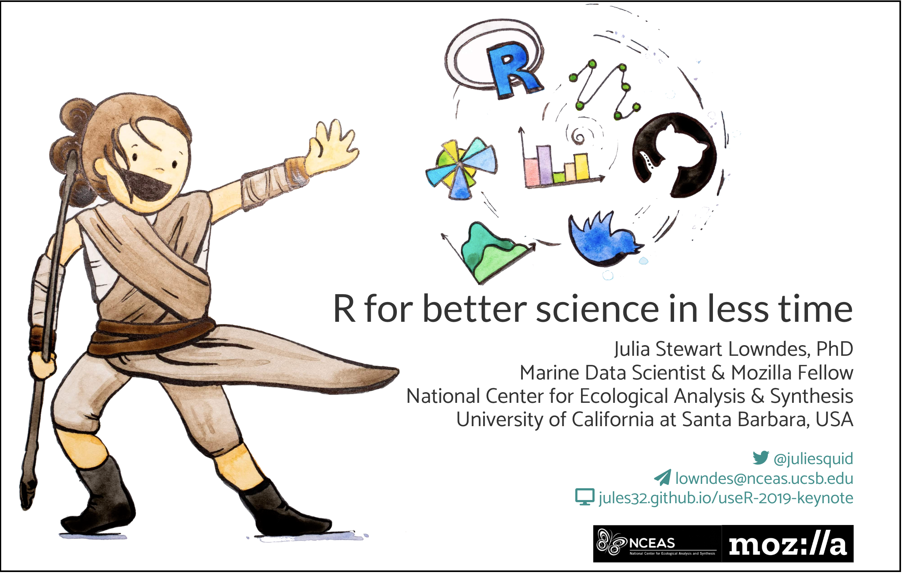 
```

.footnote[
slides (xaringan): [jules32.github.io/useR-2019-keynote](https://jules32.github.io/useR-2019-keynote)
]

???

And for fun, for creating talks at useR

transition: 


---
class: inverse, center, middle
## The \#rstats community is incredible

<br>

### A few examples...

---
```{r ropensci-janitor-redoc, out.width = '100%', fig.align='center'}
knitr::include_graphics("img/ropensci-janitor-redoc.png")  
```

.footnote[
web: [ropensci/packages](https://ropensci.org/packages); [janitor](https://sfirke.github.io/janitor); [redoc](https://twitter.com/noamross/status/1127273301443850240?lang=en)
]


???
These kinds of conversations and communities enable packages like these, from rOpenSci

This is the kind of things we talk about in Openscapes: what are you doing, and what tools are available to help you?

---
rOpenSci, rnoaa, noam gams, ggplot flipbook, R for Excel users
Josh London
Megsie?


---
## Open data science

```{r loop-wtext2, out.width = '100%'}

```

.footnote[
art: [@allison_horst](https://twitter.com/allison_horst)   
]

???

But remember, these tools are really most powerful with teams.

And teams is about mindsets and behaviors of individuals and shared, sustainable culture 

---
# Data science mindset
<br>
```{r data-science-r4ds, out.width = '90%', fig.align='center'}
knitr::include_graphics("img/r4ds_data-science.png")
```

.footnote[
<br>
[Wickham & Grolemund, 2016: "R for Data Science"](https://r4ds.had.co.nz/)
]  

???

This graphic really changed they way we work and think. 

First, it separates the Understand part. This is this science part. It's an iterative process of transforming, subsetting, comparting data, vizulazing, modeling. And it's distinct from the import and tidying parts. This is critical. 

---
# Data science mindset
<br>
```{r data-science-r4ds-lohr, out.width = '90%', fig.align='center'}
knitr::include_graphics("img/r4ds_data-science-lohr.png")
```

.footnote[
<br>
[Wickham & Grolemund, 2016: "R for Data Science"](https://r4ds.had.co.nz/)  
[Lohr, 2014 "For Big-Data Scientists, ‘Janitor Work’ Is Key Hurdle to Insights"](https://www.nytimes.com/2014/08/18/technology/for-big-data-scientists-hurdle-to-insights-is-janitor-work.html)
]  

???

This graphic really changed they way we work and think. 

First, it separates the Understand part. This is this science part. It's an iterative process of transforming, subsetting, comparting data, vizulazing, modeling. And it's distinct from the import and tidying parts. This is critical. 


---
# Data science mindset & tools
<br>
```{r tidyverse, out.width = '60%', fig.align='center'}
knitr::include_graphics("img/r4ds_data-science-tidyverse.png")
```
  
.footnote[
source: [Hadley Wickham, 2019](https://speakerdeck.com/hadley/welcome-to-the-tidyverse?slide=28); web: [tidyverse.org](https://www.tidyverse.org/)
]  

???

Expect there's a better way

---
## Open mindset
### "transparency at all stages of the research process, coupled with free and open access to data, code, and papers"

source: [*Hampton et al. 2015* The Tao of open science for ecology](https://esajournals.onlinelibrary.wiley.com/doi/full/10.1890/ES14-00402.1)

--

### "collaboration, empowerment, inclusivity, and accountability" ... "trust" ... "safe to be vulnerable"

source: [*Wright 2019* Why bother with the “open” anyway?](https://medium.com/@stephanie_6761/why-bother-with-the-open-anyway-c76afb4dcb85)

--

### "...technology enabling social infrastructure that can promote inclusivity to create kinder science"

source: [*Lowndes 2019* Open software means kinder science](https://blogs.scientificamerican.com/observations/open-software-means-kinder-science/)


???

I'd  also add: Kindness

---
## Open mindset and tools

```{r ods-software, out.width = '65%', fig.align='center'}
knitr::include_graphics("img/screenshot-paur-talk-ods.png") 
```

.footnote[
source: [OHI slides](https://docs.google.com/presentation/d/12m8dUpIOz16x1RlZWLtj9u5E9wMxtYuP0T_HxoDnyKw/edit?usp=sharing)
]

???


---
<br>

```{r loop-how-we-work1, out.width = '100%', fig.align='center'}
knitr::include_graphics("img/horst_loop_how_we_work_esip.png") 
```

???
An example of this in action is with the Ocean Health Index, where open data science enabled us to do better science in less time and reimagine what is possible. I’ve worked with the Ocean Health Index since 2013 and there is a lot to say about it but what’s relevant here is that we combine lots of data, we repeat our analyses every year, and we do it as a team. And, because we are a team of marine ecologists, we all came with varying levels of self-taught analytical experience. 

Animate: This is what better science in less time looks like for us. Over 4 years we incrementally introduced the tooling like open source coding into our workflow and established team norms. It meant changing the ways that we had always worked during our whole careers, and it was intimidating, because before we started we were like Luke when he just crashed – we couldn’t imagine what was possible and didn’t have confidence that we could do it ourselves. 

But we were able to do this because we had several entryways. 

animate: The things that benefitted us the most was leadership and trust. A culture of horizontal leadership enabled a team member who knew the tooling to champion it within our team, and for the rest of us to become comfortable with both the benefits and investment it required. We learned from the global R community, and established weekly team meetings where we would co-learn together.

This investment paid off and we had time to focus on new innovation in our science and enable others to build off our work through these new channels. The OHI R package has supported 20 groups around the world that are tailoring our methods to do data-informed ocean management to their own waters, which was unimaginable in the way we worked previously. 

transition: pause

It's about kindness, inclusion, and belonging.


---
```{r loop-entryway1, out.width = '100%', fig.align='center'}
knitr::include_graphics("img/horst_loop_entryway1.png") 
```

---
```{r loop-entryway2, out.width = '100%', fig.align='center'}
knitr::include_graphics("img/horst_loop_entryway2.png") 
```

---
```{r openscapes-grassland, out.width = '100%', fig.align='center'}
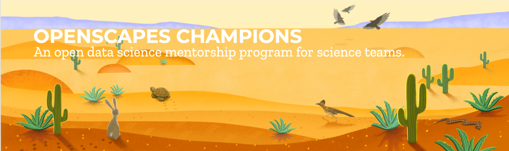
```

--

### We empower teams with skillsets and mindsets, focused on leadership and community

- Team- and cohort-based, including team leads and members
- Deliberate focus on empathy, inclusion & kindness
- Mentored-coached Mozilla-style: remote-by-design
- Lesson series focus on tooling & people

.footnote[
web: [openscapes.org](https://www.openscapes.org); twitter: [@openscapes](https://twitter.com/openscapes)
]

---
```{r loop-champions, out.width = '100%', fig.align='center'}
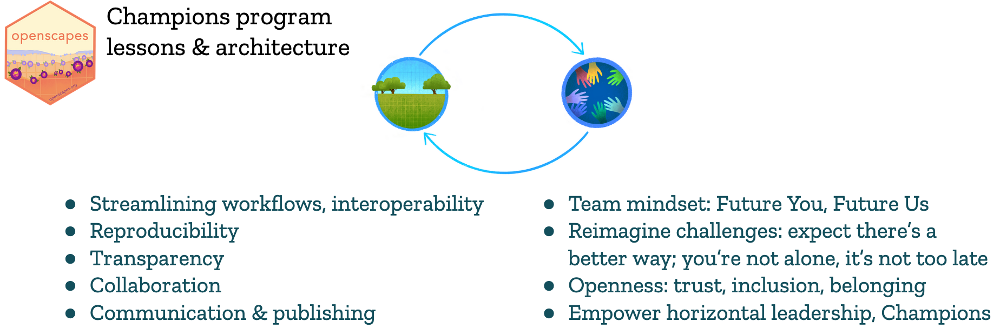
```

--

```{r loop-champions2, out.width = '100%', fig.align='center'}
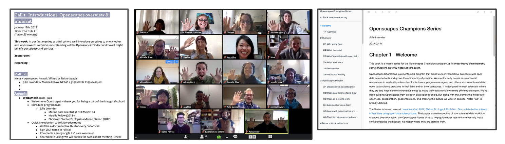
```


---
```{r loop-champions3, out.width = '100%', fig.align='center'}
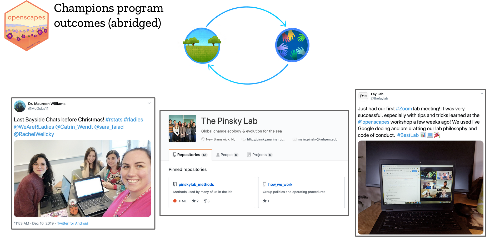
```


---
Community showcase:

Malin how we work
Halley anti-racism
TBEP stoplight and blog
Scott Large seaside chats

---
Most valuable thing: 

reframing data analysis as a collaborative effort rather than a personal burden 
---
```{r supercharge-esip, out.width = '100%', fig.align='center'}
knitr::include_graphics("img/nature-supercharge-esip.png")
```
--

<br>

***“This isn’t just about coding & GitHub, it’s about changing the way we do science.”***    - Prof. Malin Pinsky

***“Openscapes has created a new way of thinking about merging empathy and science. That's an invaluable gift to me.”*** - Prof. Halley Froehlich

---
```{r grassland-esip, out.width = '100%', fig.align='center'}

```

???
**trust** • **resilience** • **overlapping skillsets & interoperability** • **leadership • kindness**  

---
class: inverse, center, middle
##“If you want to learn to write, you read a lot, <br>if you want to play music, you listen a lot. <br>It’s hard to do this with data analysis.” 

**Hilary Parker & Roger Peng, RStudio::conf(2020) keynote & NSSD podcast episode 100**


---
# Thank you all so much

.pull-left[
###OHI team <br>Mozilla team<br>Openscapes Champions<br>#rstats community

### Please get involved: [openscapes.org/contact](https://www.openscapes.org/contact/); [@openscapes](https://openscapes.org)

<br>

####xaringan theme: [@apreshill](https://github.com/apreshill/talks/blob/master/uo-sad-plot-better/index.Rmd#L7)

]

.pull-right[
### Art by Allison Horst
```{r horst-air, out.width = '60%', fig.align='center'}
knitr::include_graphics("img/horst_rstudio_air.png")
```

<br>

####   
]

???

Thank you.

---
```{r fin}
```
class: title-slide, right, bottom
background-image: url(img/horst-starwars-rey.png)
background-size: contain
background-position: bottom left 


## `r rmarkdown::metadata$title`
### `r rmarkdown::metadata$author`
### `r rmarkdown::metadata$institute`

[`r icon::fa("twitter")` @juliesquid](https://twitter.com/juliesquid)  
[`r icon::fa("paper-plane")` lowndes@nceas.ucsb.edu](mailto:lowndes@nceas.ucsb.edu)  
[`r icon::fa("desktop")` openscapes.org/media](http://openscapes.org/media)  


---
.pull-left[
<br>
```{r rnoaa, out.width = '100%'}
knitr::include_graphics("img/tweet-Md_Harris-rnoaa.png")
```

.footnote[
tweet: [@Md_Harris](https://twitter.com/Md_Harris/status/1074469302974193665/photo/1)]
]

--

.pull-right[
### My internal monologue: 

**- Cool visualization!**  
**- I want to represent my data this way**  
**- He includes [his code](https://gist.github.com/mrecos)!**  
**- Package from [@sckottie](https://twitter.com/sckottie) at [rOpenSci](https://ropensci.org)**  
**- rnoaa is to streamline NOAA data to R!**  
**- I'll share with Openscapes**
]

???

---
.pull-left[
<br>
```{r rnoaa2, out.width = '100%'}
knitr::include_graphics("img/tweet-Md_Harris-rnoaa.png")
```

.footnote[
tweet: [@Md_Harris](https://twitter.com/Md_Harris/status/1074469302974193665/photo/1)]
]

.pull-right[
### My internal monologue: 

**- Cool visualization!**  
**- I want to represent my data this way**  
**- He includes [his code](https://gist.github.com/mrecos)!**  
**- Package from [@sckottie](https://twitter.com/sckottie) at [rOpenSci](https://ropensci.org)**  
**- rnoaa is to streamline NOAA data to R!**  
**- I'll share with Openscapes**


```{r halley-rnoaa, out.width = '60%', fig.align='center'}
knitr::include_graphics("img/tweet-docfroehlich-rnoaa-full.png")  
```
 
.footnote[
tweet: [@DocFroehlich](https://twitter.com/DocFroehlich/status/1085990833571020800)
]

]

???

Halley has a big science following already and now tweets also about open data science, so this is a great example of the influence these champions are already having. 


---
.pull-left[

<br>
<br>
<br>
<br>

```{r rladies-sydney, out.width = '100%', fig.align='center'}
knitr::include_graphics("img/tweet-apreshill-rladies-sydney.png")
```

.footnote[
twitter: [@apreshill](https://twitter.com/apreshill/status/1184660994007519232); 
web: [RLadies Sydney](https://rladiessydney.org/courses/ryouwithme/)
]
]

.pull-right[

<br>
<br>

```{r wearerladies-sydney, out.width = '100%', fig.align='center'}
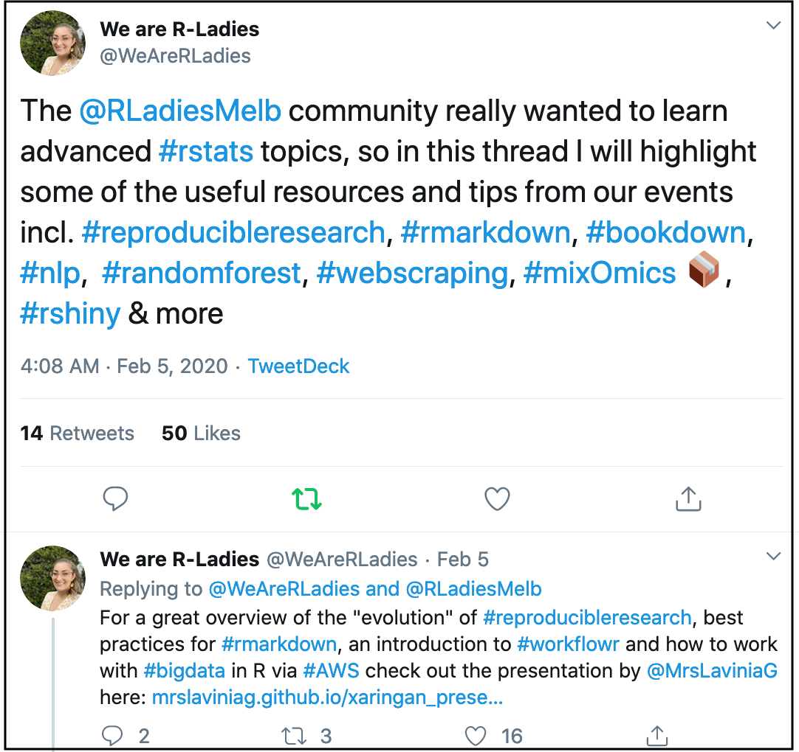
```

.footnote[
twitter: [@WeAreRLadies](https://twitter.com/WeAreRLadies/status/1225028377280516096)
]
]
???

https://twitter.com/WeAreRLadies/status/1087741684618809346
https://twitter.com/frau_dr_barber/status/1127189812308369408


