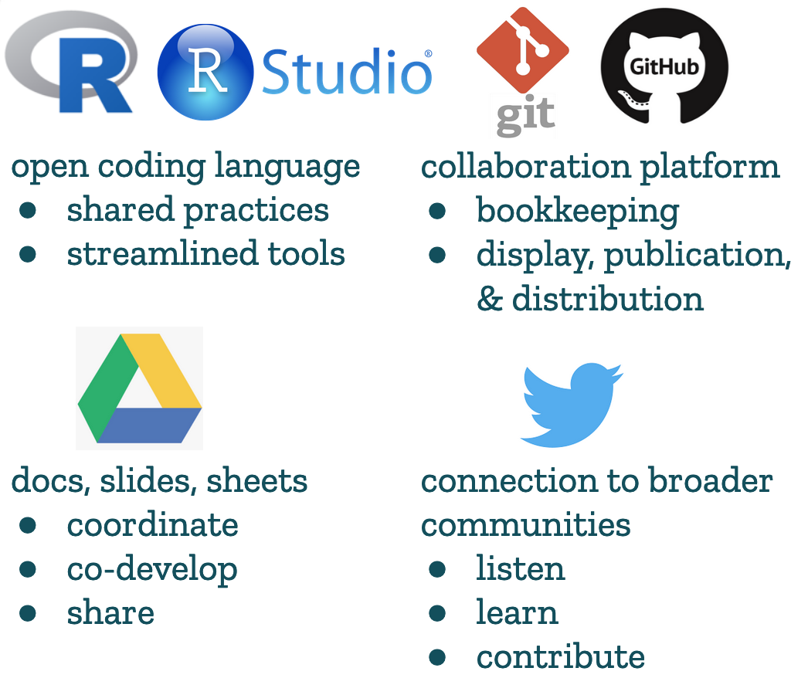
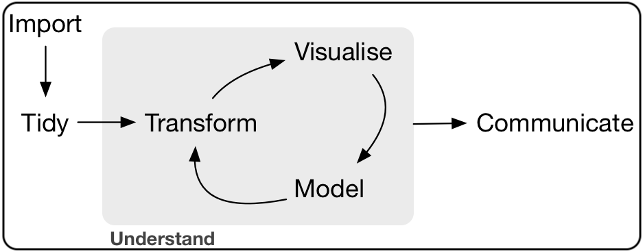
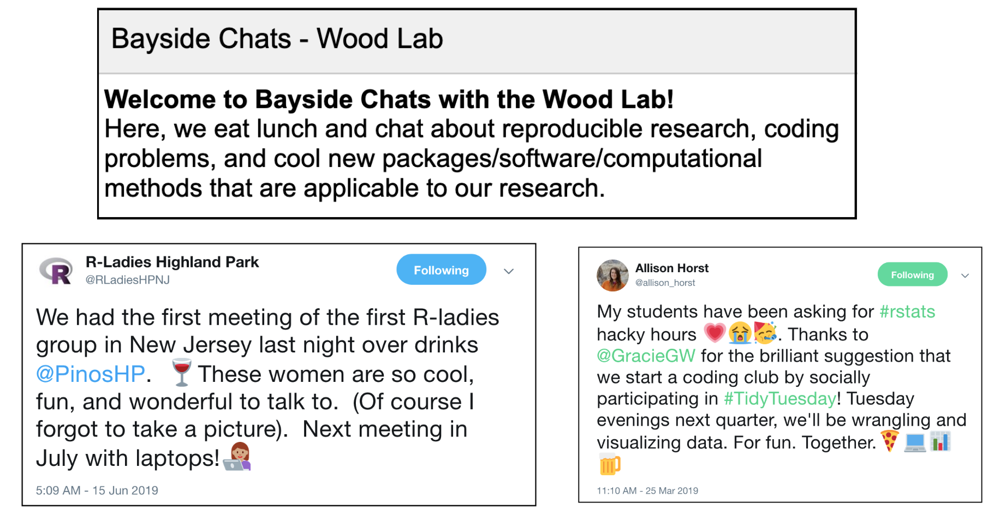
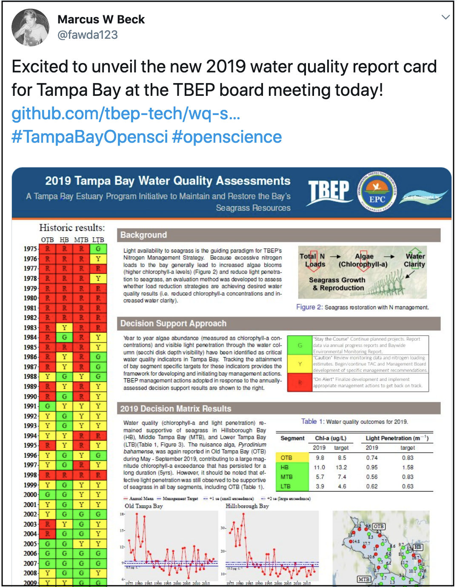
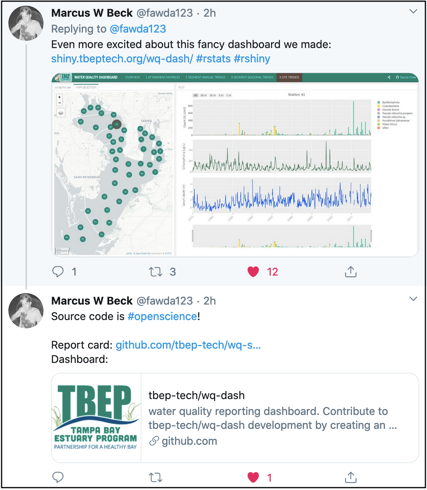

```{r setup, include=FALSE}
options(htmltools.dir.version = FALSE, warning=FALSE, message=FALSE, verbose = FALSE)
knitr::opts_chunk$set(echo = FALSE, message=FALSE, warning=FALSE)

library(xaringan)
library(fontawesome) #devtools::install_github("rstudio/fontawesome")
library(icon) #devtools::install_github("ropenscilabs/icon")
```

class: title-slide, right, bottom
background-image: url(img/horst-starwars-rey.png)
background-size: contain
background-position: bottom left 


## `r rmarkdown::metadata$title`
### `r rmarkdown::metadata$author`
### `r rmarkdown::metadata$institute`

[`r icon::fa("twitter")` @juliesquid](https://twitter.com/juliesquid)  
[`r icon::fa("paper-plane")` lowndes@nceas.ucsb.edu](mailto:lowndes@nceas.ucsb.edu)  
[`r icon::fa("desktop")` openscapes.org/media](http://openscapes.org/media)  


???

---
```{r loop-wtext, out.width = '100%'}
knitr::include_graphics("img/horst-lowndes-loop-wtext.png")
# https://docs.google.com/presentation/d/13JkwCiXjfZfNucAsDwHI6FdEvpOngCv50cjnT7HXJK8/edit#slide=id.g625ce81eb0_0_1645
```

.footnote[
art: [@allison_horst](https://twitter.com/allison_horst)   
]

???

The way I have been thinking about it, open data science tools and practices and teamwork & collaboration exist in this feedback loop. 

Learning and using similar software promotes and streamlines teammwork. And also working as a team better equips you to learn open practices data science.

But as env scientists, we're never taught data science/open practices, and we're not taught to work as a team, even when we are physically sitting with other scientists similar to us in our research groups research group

So despite this being a really powerful feedback loop, many scientists are outside of it, without clear entry points. 

---
```{r openscapes grasslandx, out.width = '100%', fig.align='center'}
knitr::include_graphics("img/horst_openscapes_grassland_1500px-text-hex.png")
```

.pull-left[
**We champion open practices in science to help uncover data-driven solutions faster.**  
<br>
**Champions Program mentors research teams to help build mindsets and habits around open data science, and grow the community of practice.**  
<br>
**Operated by NCEAS and incubated by Mozilla** 

]

.pull-right[
```{r zoom12, out.width = '85%', fig.align='center'}
knitr::include_graphics("img/Cohort1_zoom.png") 
```

.footnote[
web: [openscapes.org](https://openscapes); twitter: [@openscapes](https://twitter.com/openscapes)
]
]

???
So I developed Openscapes, 

this builds from nearly 7 years of the OHI

---
```{r ohi-banner, out.width = '80%', fig.align='center'}
knitr::include_graphics("img/ohi-illustration-hex.png")
```

.pull-left[
**A scientific method, tool, and community for channeling the best available scientific information into marine policy.**  
<br>
**Global assessments annually since 2012**  
<br>
**Independent "OHI+" assessments in 20 geographies**

<!---(example: Ecuador, Baltic, Northeast US) --->

.footnote[
source: [*Halpern et al. 2012*: An Index to assess the health and benefits of the global ocean](http://www.nature.com/nature/journal/v488/n7413/full/nature11397.html); web: [ohi-science.org](http://ohi-science.org)
]
]

.pull-right[
```{r teamx2, out.width = '100%', fig.align='center'}
knitr::include_graphics("img/ohi-team-2018b-crop.jpeg") 
```
]

???

A scientific method, tool, and community for channeling the best available scientific information into marine policy.

It is being used by the United Nations and by 20 groups around the world. 

There is a lot to it but what is relevant here is that we combine lots of data, we repeat our analyses every year, and we do it as a team.

But we are marine scientists, and we were never trained to work responsibly with data. 

So we found out the hard way that our default approaches were not reproducible by even ourselves. 

Getting through this involved quite a reckoning, but when we got through it, we knew we had a story to tell. 

transition: I like to talk about this with analogies from Star Wars 

---

```{r luke}
```
class: center, middle
background-image: url(img/horst-starwars-luke.png)
background-size: contain

.footnote[
art: [@allison_horst](https://twitter.com/allison_horst)
]

???

This is Luke Skywalker after he crashed his plane in the swamp on Degobah.

He cannot solve the the challenge in front of him with the skillsets he has.

He is demoralized and alone. And if you imagine him attempting to use whatever pulleys and ropes he might have with him, you know it wouldn't be pretty, it wouldn't be reproducible, and it probably wouldn't get him where he needs to be on time.

transition: but luckily what happens next is that he meets Yoda

---
class: top, center
```{r yoda, out.width = '88%'}
knitr::include_graphics("img/horst-starwars-yoda.png") 
```

.footnote[
art: [@allison_horst](https://twitter.com/allison_horst)
]

???

Yoda uses the Force to solve Luke's problem in a way Luke never imagined was possible.

This is going to open up Luke's whole world because he can learn from Yoda and not only solve his current but it will broaden his mind to what is possible in the future.

transition: But Luke didn't go on to defeat the Empire himself, he had a whole community.

---
```{r hands} 
```
class: center, middle
background-image: url(img/horst-starwars-hands.png)  
background-size: contain


.footnote[
art: [@allison_horst](https://twitter.com/allison_horst)
]

???

And this community is powerful because of the diversity of backgrounds and expertise, and although not everyone is a Jedi, everyone contributes in really critical ways.

transition: So just to recap, 

---
```{r rey-toc-full}
```
class: title-slide, right, bottom
background-image: url(img/horst-starwars-rey.png)
background-size: contain
background-position: bottom left   


???

R is the Force that enables us as scientists to do better science in less time.

It empowers us to get our own data out of the swamp.

It empowers us and build off of our confidence and experiences and broaden the scope of scientific challenges that we can tackle, which is relevant whether you are at SCCWRP or anywhere else.

transition: so my talk will really be framed around these ideas: that the software and the teamwork go hand-in-hand.

---
```{r loop-toc1, out.width = '100%'}
knitr::include_graphics("img/horst-lowndes-loop-wtext.png")
# https://docs.google.com/presentation/d/13JkwCiXjfZfNucAsDwHI6FdEvpOngCv50cjnT7HXJK8/edit#slide=id.g625ce81eb0_0_1645
```

???

This is my outline. Will talk this through with concrete examples from OHI, and how I've been turning those lessons learned into mentorship and impact with Openscapes


---
.pull-left[
```{r luke-smaller, out.width = '60%', fig.align='center'}
knitr::include_graphics("img/horst-starwars-luke.png")
```

```{r teucher1, out.width = '100%', fig.align='center'}
knitr::include_graphics("img/teucher1.png")
```

.footnote[
art: [@allison_horst](https://twitter.com/allison_horst), graphics: [Andy Teucher](https://github.com/ateucher/vic-geogeeks-2018-01-30)
]
]

--

.pull-right[

```{r yoda-smaller, out.width = '60%', fig.align='center'}
knitr::include_graphics("img/horst-starwars-yoda.png")
```

<br>

```{r teucher2, out.width = '95%', fig.align='center'}

```

]

???

Because we were all self taught, we came at OHI with the mismatches. Difficult workflows, and difficult to collaborate. 

---
class: middle, center
```{r nature-bsilt, out.width = '100%', fig.align='center'}
knitr::include_graphics("img/nature-screenshot-title.png")
```

.footnote[
source: [Lowndes *et al.* 2017](https://www.nature.com/articles/s41559-017-0160); web: [ohi-science.org/betterscienceinlesstime](http://ohi-science.org/betterscienceinlesstime/)
]

???

Figuring out was a big enough deal that we published this in Nature Ecology & Evolution. 

What made it unique: we shared our struggles, and described the transition

---
### More reproducibility & collaboration, less time
```{r fig 1-whiteout, out.width = '60%', fig.align='center'}
knitr::include_graphics("img/bsilt-fig1-simple.png")
```

.footnote[
source: [*Lowndes et al. 2017* Our path  to better science in less time using open data science tools](https://www.nature.com/articles/s41559-017-0160)
]

???

It looks like this. 

Shown here as the circles get smaller and moving up the y axis. It also go easier for us to collaborate each year, along the x axis. 

We couldn't overhaul everything all at once, but focused on different pieces incrementally each year. 

Having all of this coding infrastructure in place is what enables those 20 independent groups I mentioned to study ocean health in the places they care about. 

---
```{r ods-software, out.width = '65%', fig.align='center'}
 
```

.footnote[
source: [OHI slides](https://docs.google.com/presentation/d/12m8dUpIOz16x1RlZWLtj9u5E9wMxtYuP0T_HxoDnyKw/edit?usp=sharing)
]

???

---
exclude: TRUE
```{r ohi-how-we-work2, out.width = '100%', fig.align='center'}
knitr::include_graphics("img/ohi-how-we-work2.png")
```

.footnote[
source: [OHI slides — UW](https://docs.google.com/presentation/d/1LA4EcnRxD11rjwbRh0hrjPG5J0dmiiuCbNaoQrz0XHU/edit?usp=sharing)
]

???


---
class: center, middle
```{r workflow-repro-wtext, out.width = '100%'}
knitr::include_graphics("img/workflow-repro-wtext.png")
```

.footnote[
source: [OHI slides — WHOI](https://drive.google.com/open?id=1SHvJbBWrGVqzjAPos1jbtxSn_2DAl44JmDgY5v2NxC8)
]

???

---
class: center, middle
```{r workflow-full-wtext, out.width = '100%'}
knitr::include_graphics("img/workflow-full-wtext.png")
```

.footnote[
source: [OHI slides — WHOI](https://drive.google.com/open?id=1SHvJbBWrGVqzjAPos1jbtxSn_2DAl44JmDgY5v2NxC8)
]

???

---
## RStudio for R, text editing, Github sync, & more
```{r workflow-ex-repro-wtext, out.width = '100%'}
knitr::include_graphics("img/workflow-ex-repro-wtext.png")
```

.footnote[
source: [OHI slides — WHOI](https://drive.google.com/open?id=1SHvJbBWrGVqzjAPos1jbtxSn_2DAl44JmDgY5v2NxC8)
]

???

---
## GitHub for archiving and bookkeeping
```{r workflow-ex-collab-wtext, out.width = '100%'}
knitr::include_graphics("img/workflow-ex-collab-wtext.png")
```

.footnote[
source: [OHI slides — WHOI](https://drive.google.com/open?id=1SHvJbBWrGVqzjAPos1jbtxSn_2DAl44JmDgY5v2NxC8)
]

???

---
## Github for discussion & project mgmt
```{r workflow-ex-collab2-wtext, out.width = '100%', fig.align='center'}
knitr::include_graphics("img/workflow-ex-collab2-wtext.png")
```

.footnote[
source: [OHI slides — WHOI](https://drive.google.com/open?id=1SHvJbBWrGVqzjAPos1jbtxSn_2DAl44JmDgY5v2NxC8)
]

???

---
## R + Github for docs & publishing
```{r workflow-ex-comm-wtext, out.width = '100%'}
knitr::include_graphics("img/workflow-ex-comm-wtext.png")
```

.footnote[
source: [OHI slides — WHOI](https://drive.google.com/open?id=1SHvJbBWrGVqzjAPos1jbtxSn_2DAl44JmDgY5v2NxC8)
]

???

Also made these slides in R!

---
```{r loop-wtext2, out.width = '100%'}
knitr::include_graphics("img/horst-lowndes-loop-wtext.png")
```

.footnote[
art: [@allison_horst](https://twitter.com/allison_horst)   
]

???

But remember, these tools are really most powerful with teams.

---
# Data science mindset
<br>
```{r data-science-r4ds, out.width = '90%', fig.align='center'}

```

.footnote[
<br>
[Wickham & Grolemund, 2016: "R for Data Science"](https://r4ds.had.co.nz/)
]  

???

This graphic really changed they way we work and think. 

First, it separates the Understand part. This is this science part. It's an iterative process of transforming, subsetting, comparting data, vizulazing, modeling. And it's distinct from the import and tidying parts. This is critical. 

---
# Data science mindset
<br>
```{r data-science-r4ds-lohr, out.width = '90%', fig.align='center'}
knitr::include_graphics("img/r4ds_data-science-lohr.png")
```

.footnote[
<br>
[Wickham & Grolemund, 2016: "R for Data Science"](https://r4ds.had.co.nz/)  
[Lohr, 2014 "For Big-Data Scientists, ‘Janitor Work’ Is Key Hurdle to Insights"](https://www.nytimes.com/2014/08/18/technology/for-big-data-scientists-hurdle-to-insights-is-janitor-work.html)
]  

???

This graphic really changed they way we work and think. 

First, it separates the Understand part. This is this science part. It's an iterative process of transforming, subsetting, comparting data, vizulazing, modeling. And it's distinct from the import and tidying parts. This is critical. 


---
# Open data science tools
<br>
```{r tidyverse, out.width = '60%', fig.align='center'}
knitr::include_graphics("img/r4ds_data-science-tidyverse.png")
```
  
.footnote[
source: [Hadley Wickham, 2019](https://speakerdeck.com/hadley/welcome-to-the-tidyverse?slide=28); web: [tidyverse.org](https://www.tidyverse.org/)
]  

???

Expect there's a better way

---
## Open mindset
### "transparency at all stages of the research process, coupled with free and open access to data, code, and papers"

source: [*Hampton et al. 2015* The Tao of open science for ecology](https://esajournals.onlinelibrary.wiley.com/doi/full/10.1890/ES14-00402.1)

--

### "collaboration, empowerment, inclusivity, and accountability" ... "trust" ... "safe to be vulnerable"

source: [*Wright 2019* Why bother with the “open” anyway?](https://medium.com/@stephanie_6761/why-bother-with-the-open-anyway-c76afb4dcb85)

--

### "...technology enabling social infrastructure that can promote inclusivity to create kinder science"

source: [*Lowndes 2019* Open software means kinder science](https://blogs.scientificamerican.com/observations/open-software-means-kinder-science/)


???

I'd  also add: Kindness

---
# Ocean Health Index team traits
.pull-left[
<br>
```{r team-side, out.width = '100%', fig.align='center'}
knitr::include_graphics("img/horst-starwars-hands.png") 
```
]

--

.pull-right[
### Circa 2013
**Horizontal leadership: a Champion jazzed about open data science**   
**Vertical leadership: enabling & supportive**  
**Team mindset: trusting and willing**  
]
???

Teamwork started with trust and willingness. 

Not everyone codes. But everyone values

---
# Ocean Health Index team traits
.pull-left[
<br>
```{r team-side2, out.width = '100%', fig.align='center'}
knitr::include_graphics("img/horst-starwars-hands.png") 
```
]

.pull-right[
### Circa 2013
**Horizontal leadership: a Champion jazzed about open data science**   
**Vertical leadership: enabling & supportive**  
**Team mindset: trusting and willing**  

### Circa 2019
**Overlapping & complimentary skillsets**   
**Resilience: onboarding & offboarding**  
**We are all Champions in our own ways**
]

???

We learned how to talk about data, how to think together about it. 

Bens enabled us to become leaders. horizontal leadership: evolve with the softwarescape

---
# Ocean Health Index team strategies

.pull-left[
### Learn what's possible, how to teach & lead
**rOpenSci • RStudio** • **RLadies • Mozilla • The Carpentries**
]

.pull-right[
```{r community-logosx, out.width = '100%', fig.align='center'}
knitr::include_graphics("img/ods-community-logos.png")
```

]

???
So what do these communities do? One peek into them through rOpenSci


---
```{r ropensci-janitor-redoc, out.width = '100%', fig.align='center'}
knitr::include_graphics("img/ropensci-janitor-redoc.png")  
```

.footnote[
web: [ropensci/packages](https://ropensci.org/packages); [janitor](https://sfirke.github.io/janitor); [redoc](https://twitter.com/noamross/status/1127273301443850240?lang=en)
]


???
These kinds of conversations and communities enable packages like these, from rOpenSci

This is the kind of things we talk about in Openscapes: what are you doing, and what tools are available to help you?


---
# Ocean Health Index team strategies

.pull-left[
### Learn what's possible, how to teach & lead
**rOpenSci • RStudio** • **RLadies • Mozilla • The Carpentries**

### Create skill-sharing spaces
**Seaside Chats** • **Eco-Data-Science • RLadiesSB** • **OHI Fellows**
]

.pull-right[
```{r community-logos3, out.width = '100%', fig.align='center'}
knitr::include_graphics("img/ods-community-logos.png")
```
 
```{r eds, out.width = '100%', fig.align='center'}
knitr::include_graphics("img/eds-rladies-hex.png")  
```
]

???

This Reinforced shared values

---
### [Sea]side chats, clubs, & meetups
```{r allison-tidytuesday, out.width = '90%', fig.align='center'}
 
```

.footnote[
tweets: [@RLadiesHPNJ](https://twitter.com/RLadiesHPNJ/status/1139867491822383104); [@allison_horst](https://twitter.com/allison_horst/status/1110242520833769472); blogs: [bayside chats](https://github.com/wood-lab/wood-lab-resources#wood-lab-resources); [seaside chats](https://www.openscapes.org/blog/2019/03/10/seaside-chats/);  
]


???

We call these conversations Seaside Chats, or Bayside, Bluffside or Fishbowl chats. They are specific times and places to talk about reproducible research, discuss coding issues, and learn about cool new packages relevant for research. 

This something that our OHI team has been doing for years now in addition to our weekly science lab meetings. This is a dedicated space to discuss and develop shared systems for the lab start weaving open data science into their every day work

We have also coopted the term hackathon, which is when our OHI team we will all drop our own projects and come together for a day or an afternoon to do something that will benefit the whole group, but is no one person's responsibility,like upgrading our filepath strategies with the "here" package. 

Some labs have also done hackathons too, and gotten metadata organized and developed onboarding procedures for the lab, so that new teammembers can get on board with the lab's workflow as soon as possible.

<!---consider twitter slides here?from socalR_nexttime --->

---
```{r horst-eco-r4ds}
```
name: environ-comm-r4ds
class: center, middle
background-image: url(img/horst-eco-r4ds.png) 
background-size: contain

.footnote[
.left[
<br>
art: [@allison_horst](https://twitter.com/allison_horst);
updated from [Wickham & Grolemund](https://r4ds.had.co.nz/)
]
]

???

So all of this together makes a possible for env science

---
```{r horst-eco-r4ds-env-comm-only}
```
name: environ-comm-r4ds
class: center, middle
background-image: url(img/horst-eco-r4ds-env-comm-only.png) 
background-size: contain

.footnote[
.left[
<br>
art: [@allison_horst](https://twitter.com/allison_horst);
updated from [Wickham & Grolemund](https://r4ds.had.co.nz/)
]
]

???

But this is where we are. And why is that? It's because we don't have the skills because we're never trained, but we aslso don't have the accompanying mindset and teamwork. 

---
```{r loop-wtext3, out.width = '100%'}
knitr::include_graphics("img/horst-lowndes-loop-wtext.png")
# https://docs.google.com/presentation/d/13JkwCiXjfZfNucAsDwHI6FdEvpOngCv50cjnT7HXJK8/edit#slide=id.g625ce81eb0_0_1645
```

.footnote[
art: [@allison_horst](https://twitter.com/allison_horst)   
]

???

We're missing this feedback loop. It's hard to learn these tools if you feel like it's all on you and you're alone, and it's hard to engage with your team if there's no catalyst. 

Luke never would have imagined to expect that the Force existed unless he had seen it and learned it. He had heard about it and thought it was offlimits or some hokey thing.

Individuals aren't aware of what's possible, and research groups aren't thinking like teams. We talk about science but not data. 

---
```{r openscapes-grassland, out.width = '100%', fig.align='center'}
knitr::include_graphics("img/horst_openscapes_grassland_1500px-text-hex.png")
```

### We welcome scientists to open data science by mentoring research teams.

**Engage**: build awareness and excitement with empathy, art, and storytelling  
**Empower**: connect with existing open software and communities  
**Amplify**: champion broadly to increase visibility, value, and practice  

.footnote[
web: [openscapes.org](https://www.openscapes.org); twitter: [@openscapes](https://twitter.com/openscapes)
]

---
### Openscapes inaugural cohort 2019
.pull-left[
<br>
```{r zoom-left, out.width = '100%'}
knitr::include_graphics("img/Cohort1_zoom.png") 
```

.footnote[
web: [openscapes.org](https://www.openscapes.org); twitter: [@openscapes](https://twitter.com/openscapes)
]
]

--

.pull-right[
### Teams participate together

**7x labs, leads & members from each group**

**1) everyone sees and values what is possible**   
**2) leads enable members to invest time**  
**3) members have guidance, agency, and support**  
**4) everyone champions open data science and contributes to growing the community of practice**

### Cohorts enable shared learning, cross-pollination, allies & community

]

???
That's what we were did in this first cohort that I mentioned. Really focused on the teamwork side, but immediately around open data science and iteratively, make this a spiral 

And it's been exciting to not only see changes within labs, but across them, and new UW alliances. 

cohort model enables shared learning, cross-pollination of scientific research, and strengthens the community of practice within and across our research domains. 


transition: really focused on enabling others

---
## Openscapes momentum

.pull-left[

>"**This isn’t just about coding and GitHub, this is about changing how we do science"— Dr. Malin Pinsky, Rutgers**


```{r dorks, out.width = '70%', fig.align='center'}
knitr::include_graphics("img/tweet-drchelsealwood-dorks.png") 
```

]

--
 
.pull-right[
```{r moz-tweet, out.width = '100%'}
knitr::include_graphics("img/tweet-mozilla-juliesquid-keynote.png") 
# https://twitter.com/mozilla/status/1149363508276092928
```
]
???

And there's been amazing momentum, both from mentees and for the program, which is awesome. We plan to have further cohorts,  available for bookings and sponsorships. 

---
```{r yoda-fin, out.width = '88%', fig.align='center'}
knitr::include_graphics("img/horst-starwars-yoda.png") 
```

.footnote[
art: [@allison_horst](https://twitter.com/allison_horst)
]

???
Advice for better science in less time:
---
# Talk about data
<br>
```{r careers-screenshot, out.width = '85%', fig.align='center'}
knitr::include_graphics("img/nature-careers-supercharge.png") 
```

<br>

.footnote[
sources: [Lowndes et al. 2019](https://www.nature.com/articles/d41586-019-03335-4)
]

<!---
**Normalize data discussions • Identify and address shared needs • Think ahead: Future You & Future Us**
--->

???
"Seaside chats", "Hacky hours", Coding clubs/meetups

Establish trust, share challenges & wins, learn together

10-week plan. 


---
# Have a team mindset

.pull-left[
### Redefine collaborators
**Research group as a team** • **Future You, Future Us**

### Redefine community
**Online** •  **Beyond your own discipline**
]

.pull-right[
```{r horst-seaside-chats2, out.width = '90%', fig.align='center'}
knitr::include_graphics("img/horst-seaside-chats.png") 
```
]

### Reimagine challenges
**Separate your science from your data • Expect there is a better way** • **Have confidence, agency, & community to solve them** • **You're not alone, it's not too late**  

???
It's not your fault

---
# Enable and support leaderful teams

.pull-left[
### Learn what's possible, how to teach & lead
**rOpenSci • RStudio** • **RLadies • Mozilla • The Carpentries**

### Create skill-sharing spaces
**Sea/Bay/Bluff/side Chats** • **Coding Clubs • Hacky hours / weeks** • **University courses**

.footnote[
resources: [openscapes.org/resources](https://www.openscapes.org/resources)
]

]

.pull-right[
```{r handshands, out.width = '100%'}
knitr::include_graphics("img/horst-starwars-hands.png")
```

**trust** • **resilience** • **overlapping skillsets & interoperability** • **leadership • kindness**  

]

???

Teams to me mean rings of people you respect, innovate with, and can rely upon. It does not have to be limited to a certain deliverable, location, discipline or anything else really. 

This trust really centers on respect for each other and also kindness.

But on an individual level, we all have had to get comfortable with sharing things before they are perfect and being vulnerable to critique, which gets easier when you can assume the best intentions from anyone's feedback. 

But this has resulted in a really positive team culture, where we are comfortable with trying new things & learning from failure, and we are comfortable asking for help. 

---
# Engage with the \#rstats community
.pull-left[
```{r welcome-rstats2, out.width = '100%', fig.align='center'}
knitr::include_graphics("img/horst-welcome_to_rstats_twitter.png")
```

.footnote[
art: [@allison_horst](https://twitter.com/allison_horst);
blog: [openscapes.org](https://www.openscapes.org/blog/2019/01/15/personify-code/)
]
]

.pull-right[
### Follow selectively, listen, learn, meet awesome allies

**\#rstats, @hadleywickham, @JennyBryan, @WeAreRLadies, @rOpenSci**  

**@openscapes, @nceas, @OHIscience, @EcoDataScience**  

**@pinskylab, @ntherk, @DocFroehlich, @AdrianStier, @allison_horst, @DrChelseaLWood**

]

---
# An example close to SCCWRP home
.pull-left[
```{r tweet-fawda123-tbep, out.width = '70%', fig.align='center'}

```

.footnote[
tweet thread: [@fawda123](https://twitter.com/fawda123/status/1225760034979708930); github: [github.com/tbep-tech](https://github.com/tbep-tech)
]
]

.pull-left[
```{r tweet-fawda123-tbep2, out.width = '80%', fig.align='center'}

```

]

]

---
exclude: TRUE
```{r openscapes-arctic, out.width = '100%', fig.align='center'}

```

### Get involved with Openscapes & open data science

.pull-left[
**Follow us on Twitter @openscapes**  

**Join our mailing list**  

**Talk with your colleagues**  
]

.pull-right[
**Amplify through media and events**  

**Book or sponsor Champions Cohorts and Workshops**  

**Email us with your ideas**  
]

.footnote[
get involved: [openscapes.org/contact](https://www.openscapes.org/contact)
]

---
```{r horst-eco-r4ds0fin}
```
name: environ-comm-r4ds
class: center, middle
background-image: url(img/horst-eco-r4ds.png) 
background-size: contain

.footnote[
.left[
<br>
art: [@allison_horst](https://twitter.com/allison_horst);
updated from [Wickham & Grolemund](https://r4ds.had.co.nz/)
]
]


---
exclude: TRUE
```{r openscapes-desert, out.width = '100%', fig.align='center'}
knitr::include_graphics("img/horst_openscapes_desert_1500px.png")
```

.pull-left[
### Parting thoughts
**Collaborative mindset: Future You**  
**Team mindset: Us and Future Us (redefined)**  
**Expect there is a better way; abstract the problem**  
**Open science is kinder science**  
]

.pull-right[
```{r loop-dloop, out.width = '100%'}

```

]

---
# Thank you all so much

.pull-left[
###OHI team <br>Mozilla team<br>Openscapes Champions<br>#rstats community

### Please get involved: [openscapes.org/contact](https://www.openscapes.org/contact/); [@openscapes](https://openscapes.org)

<br>

####xaringan theme: [@apreshill](https://github.com/apreshill/talks/blob/master/uo-sad-plot-better/index.Rmd#L7)

]

.pull-right[
### Art by Allison Horst
```{r horst-air, out.width = '60%', fig.align='center'}
knitr::include_graphics("img/horst_rstudio_air.png")
```

<br>

#### And I have stickers...  
]

???

Thank you.

---
```{r fin}
```
class: title-slide, right, bottom
background-image: url(img/horst-starwars-rey.png)
background-size: contain
background-position: bottom left 


## `r rmarkdown::metadata$title`
### `r rmarkdown::metadata$author`
### `r rmarkdown::metadata$institute`

[`r icon::fa("twitter")` @juliesquid](https://twitter.com/juliesquid)  
[`r icon::fa("paper-plane")` lowndes@nceas.ucsb.edu](mailto:lowndes@nceas.ucsb.edu)  
[`r icon::fa("desktop")` openscapes.org/media](http://openscapes.org/media)  


---


---
.pull-left[
<br>
```{r rnoaa, out.width = '100%'}
knitr::include_graphics("img/tweet-Md_Harris-rnoaa.png")
```

.footnote[
tweet: [@Md_Harris](https://twitter.com/Md_Harris/status/1074469302974193665/photo/1)
]
]

.pull-right[
<br>
<br>
### My internal monologue: 

**Cool visualization!**  
**I want to represent my data this way**  
**He includes [his code](https://gist.github.com/mrecos)!**  
**Package from [@sckottie](https://twitter.com/sckottie) at [rOpenSci](https://ropensci.org)**  
**rnoaa is a package making NOAA data more accessible!**  
]

---
class: center, middle
```{r halley-rnoaa, out.width = '60%', fig.align='center'}
  
```
 
.footnote[
tweet: [@DocFroehlich](https://twitter.com/DocFroehlich/status/1085990833571020800)
]

???

Halley has a big science following already and now tweets also about open data science, so this is a great example of the influence these champions are already having. 

---
.pull-left[

<br>
<br>
<br>
<br>

```{r rladies-sydney, out.width = '100%', fig.align='center'}

```

.footnote[
twitter: [@apreshill](https://twitter.com/apreshill/status/1184660994007519232); 
web: [RLadies Sydney](https://rladiessydney.org/courses/ryouwithme/)
]
]

.pull-right[

<br>
<br>

```{r wearerladies-sydney, out.width = '100%', fig.align='center'}
knitr::include_graphics("img/tweet-wearerladies-rladiesmelb-thread.png")
```

.footnote[
twitter: [@WeAreRLadies](https://twitter.com/WeAreRLadies/status/1225028377280516096)
]
]
???

https://twitter.com/WeAreRLadies/status/1087741684618809346
https://twitter.com/frau_dr_barber/status/1127189812308369408


