```{r setup, include=FALSE}
options(htmltools.dir.version = FALSE, warning=FALSE, message=FALSE, verbose = FALSE)
knitr::opts_chunk$set(echo = FALSE, message=FALSE, warning=FALSE)

library(xaringan)
library(fontawesome)
```


class: title-slide, right, bottom
background-image: url(img/horst-starwars-rey.png)
background-size: contain
background-position: bottom left 


# `r rmarkdown::metadata$title`

### `r rmarkdown::metadata$author`
### `r rmarkdown::metadata$role`
### `r rmarkdown::metadata$institute`

[`r icon::fa("twitter")` @juliesquid](https://twitter.com/juliesquid)  
[`r icon::fa("paper-plane")` lowndes@nceas.ucsb.edu](mailto:lowndes@nceas.ucsb.edu)  
[`r icon::fa("desktop")` jules32.github.io/useR-2019-keynote](http://jules32.github.io/useR-2019-keynote)  


???

Well thank you so much, I am so excited to be here with all of you and I want to thank the organizers for this invitation. 

I am a marine scientist and R as a language and as a community has been game-changing for my science, and my life. 

So much so that over the past six years I have been moving away from doing my own research so I can pay forward what I've learned and focus on enabling other scientists to better science in less time, together. 

Throughout this I've learned several lessons, and I want to share them up front: 

---
```{r loop-wtext2, out.width = '100%'}
knitr::include_graphics("img/horst-lowndes-loop-wtext.png")
# https://docs.google.com/presentation/d/13JkwCiXjfZfNucAsDwHI6FdEvpOngCv50cjnT7HXJK8/edit#slide=id.g625ce81eb0_0_1645
```

.footnote[
art: [@allison_horst](https://twitter.com/allison_horst)   
]

???

The way I have been thinking about it, open data science tools and practices and teamwork & collaboration exist in this feedback loop. 

Learning and using similar software promotes and streamlines teammwork. And also working as a team better equips you to learn open practices data science.

But as env scientists, we're never taught data science/open practices, and we're not taught to work as a team, even when we are physically sitting with other scientists similar to us in our research groups research group. 

I am often asked why a marine scientist would use R, so I want to make sure you leave here knowing that marine scientists, as well as environmental scientist more broadly, work with data every single day to do our science, and it is critical that we are supported to work with data responsibly. 

So let me start off when I was a graduate student in a marine research group, which we also call laboratories in the US. 

---
## @juliesquid
```{r sq-tag2, out.width = '40%', fig.align='center'}
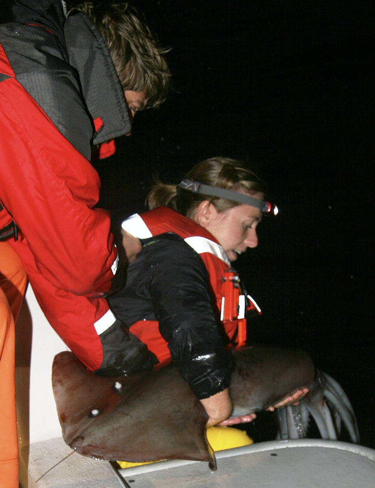
# *JulieReleaseAugerIMG_9397.jpg # release to water
# *IMG_9268.JPG # measure
```

.footnote[
photo: Greg Auger 
]

???

I am actually a squid ecologist, which is why many of you know me as juliesquid. 

That is me on the right, holding a squid that can be nearly as big as I am. 

We caught it and I am releasing it alive back into the ocean with a little electronic tag on it. The tag turns this squid little oceanographer, because it will collect data about it environment as it swims through the ocean. i collected data every second, which means I could actually see the squid breathe, since its breathing and movement are coupled through jet propulsion. 

My whole PhD research group focused on squid. We were interested because squid have huge impact on ecosystems since they eat a lot and grow quickly and they also have huge impact on economies because globally there is such high consumption of calamari. In our lab some focused on ecology like me, others on locomotion, camouflage, or early life development. 

---

<br>

.pull-left[
```{r fieldwork, out.width = '80%', fig.align='center'}
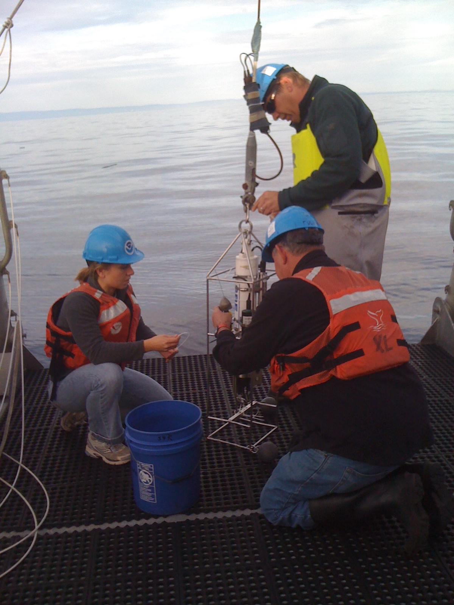  
```
]

.pull-right[
<br>
<br>
```{r fieldwork2, out.width = '100%', fig.align='center'}
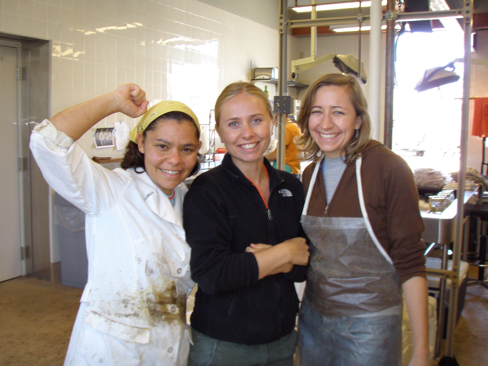 
```
]

.footnote[
web: [Gilly Lab](https://gillylab.stanford.edu/)
]

???

Our research required a lot of teamwork, both at sea and in the laboratory. 

We were a typical research group because we worked like a team about our scientific questions. 

We were also a typical research group because we didn't act like a team when it came to data. Analyzing data was something that was left to each of us to figure out as individuals.  

In in all my education I had never learned computing or how to work responsibly with data. So for me it was a super demoralizing experience to get the tag back and actually hold data in my hand but not be able to analyze it.

transition: It felt like this. 

---
```{r luke}
```
class: center, middle
background-image: url(img/horst-starwars-luke.png)
background-size: contain

.footnote[
art: [@allison_horst](https://twitter.com/allison_horst)
]

???

This is Luke Skywalker after he crashed his plane in the swamp on Degobah. 

He cannot solve the the challenge in front of him with the skillsets he has. 

He is demoralized and alone. And if you imagine him attempting to use whatever pulleys and ropes he might have with him, you know it wouldn't be pretty, it wouldn't be reproducible, and it probably wouldn't get him where he needs to be on time. 

transition: but luckily what happens next is that he meets Yoda

---
class: top, center
```{r yoda, out.width = '88%'}
knitr::include_graphics("img/horst-starwars-yoda.png") 
```

.footnote[
art: [@allison_horst](https://twitter.com/allison_horst)
]

???

Yoda uses the Force to solve Luke's problem in a way Luke never imagined was possible. 

This is going to open up Luke's whole world because he can learn from Yoda and not only solve his current but it will broaden his mind to what is possible in the future. 

transition: But Luke didn't go on to defeat the Empire himself, he had a whole community.

---
```{r hands} 
```
class: center, middle
background-image: url(img/horst-starwars-hands.png)  
background-size: contain


.footnote[
art: [@allison_horst](https://twitter.com/allison_horst)
]

???

And this community is powerful because of the diversity of backgrounds and expertise, and although not everyone is a Jedi, everyone contributes in really critical ways. 

transition: So just to recap, 

---
```{r rey}
```
class: center, middle
background-image: url(img/horst-starwars-rey.png) 
background-size: contain

.footnote[
art: [@allison_horst](https://twitter.com/allison_horst)
]

???

R is the Force that enables us as scientists to do better science in less time. 

It empowers us to get our own data out of the swamp. 

It empowers us and build off of our confidence and experiences and broaden the scope of scientific challenges that we can tackle, which for environmental scientists, includes food security, disease transmission, and climate change. 

For me, I didn't fully feel the power of R until I finished graduate school and joined a research group where I am today, where we learned to work with data as a team. 

```{r OHI hex, out.width = '55%', fig.align='center'}
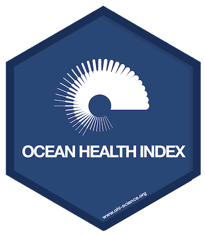
```

.footnote[
source: [Halpern et al. 2012](http://www.nature.com/nature/journal/v488/n7413/full/nature11397.html); web: [ohi-science.org](http://ohi-science.org); [@OHIscience](https://twitter.com/OHIscience)
]

???
The Ocean Health Index is a scientific endeavor to quantify impacts and benefits of oceans around the world using the best publically available data. 

It is being used by the United Nations and by 20 groups around the world. 

There is a lot to it but what is relevant here is that we combine lots of data, we repeat our analyses every year, and we do it as a team.

But we are marine scientists, and we were never trained to work responsibly with data. 

So we found out the hard way that our default approaches were not reproducible by even ourselves. 

Getting through this involved quite a reckoning, but when we got through it, we knew we had a story to tell. 


---
class: middle, center
```{r nature-bsilt, out.width = '100%', fig.align='center'}
knitr::include_graphics("img/nature-screenshot-title.png")
```

.footnote[
source: [Lowndes *et al.* 2017](https://www.nature.com/articles/s41559-017-0160); web: [ohi-science.org/betterscienceinlesstime](http://ohi-science.org/betterscienceinlesstime/)
]

???

We found our path to better science in less time with open data science tools. 

And by this I mean R and GitHub and friends. 

transition: We shared how these tools enabled us to more reproducible science faster each year, as we illustrated in this figure

---
class: middle, center
```{r fig 1-whiteout, out.width = '80%'}
knitr::include_graphics("img/bsilt-fig1-nature-whiteout.jpg")
# lowndes-nature-figure1-slides2.png
# https://docs.google.com/drawings/d/1d25T1fD9irluhQhPvNHZSt3uUBXebxqV9hFabOLZUz4/edit
```

.footnote[
source: [Lowndes *et al.* 2017](https://www.nature.com/articles/s41559-017-0160)
]

???

Shown here as the circles get smaller and moving up the y axis. It also go easier for us to collaborate each year, along the x axis. 

This let us focus on making improvements either on the data science side or the science side

---
class: middle, center
```{r fig 1, out.width = '80%'}
knitr::include_graphics("img/bsilt-fig1-nature.jpg")
# lowndes-nature-figure1-slides2.png
# https://docs.google.com/drawings/d/1d25T1fD9irluhQhPvNHZSt3uUBXebxqV9hFabOLZUz4/edit
```

.footnote[
source: [Lowndes *et al.* 2017](https://www.nature.com/articles/s41559-017-0160)
]


???

We couldn't overhaul everything all at once, but focused on different pieces incrementally each year. 

We started off focused on R and RStudio, and then on using Git and GitHub, then on tidy data and then documentation and Rmd. And ever since we've focused on leading a training program to teach students how to maintain it. 

Having all of this coding infrastructure in place is what enables those 20 independent groups I mentioned to study ocean health in the places they care about. 

But just like Luke, we were able to do this because of community. 

---
class: center, middle
```{r community-logos, out.width = '100%', fig.align='center'}
knitr::include_graphics("img/ods-community-logos.png")
```

???

These communities in particular have been so transformative for our work. 

So many of you in this room and listening around the world have welcomed us and supported us and enabled us. 

And like I said, I've been paying it forward by teaching with the Carpentries and leading local communities —

---
# Eco-Data-Science & RLadies SB

```{r eds2, out.width = '100%', fig.align='center'}
knitr::include_graphics("img/eds-rladies-hex.png")  
```
 
.footnote[
art: [@allison_horst](https://twitter.com/allison_horst); twitter: [@ecodatasci](https://twitter.com/ecodatasci); [@RLadiesSB](https://twitter.com/RLadiesSB)
]

???

leading local study groups like Eco-Data-Science and RLadies chapters, and generally telling everybody how awesome R is. 

This is how I got a fellowship with Mozilla. 

---
class: center, middle

```{r moz, out.width = '100%'}
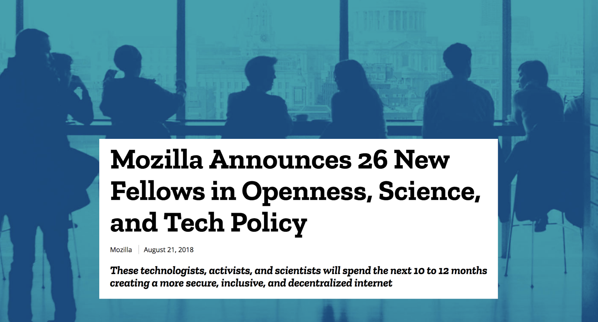
```

.footnote[
blog: [blog.mozilla.org](https://blog.mozilla.org/blog/2018/08/21/mozilla-announces-25-new-fellows-in-openness-science-and-tech-policy/)
]

???

Yes Moz is firefox, but also the internet for good. 

Spent the last year developing a program with Mozilla and NCEAS, the ecology center where I am based. 

---
```{r openscapes hex, out.width = '55%', fig.align='center'}
knitr::include_graphics("img/openscapes-hex.png")
```

.footnote[
art: [@allison_horst](https://twitter.com/allison_horst); 
web: [openscapes.org](https://openscapes.org); [@openscapes](https://twitter.com/openscapes)
]

???

The program is called Openscapes, and it is mentorship program for research groups. 

Openscapes helps them establish and maintain shared practices around data and work as a team. 

It is modeled after our experiences from the Ocean Health Index, which is one of the most visible examples of what open data science can look like in an environmental context. 


---
exclude: TRUE
<br>
```{r openscapes grassland, out.width = '100%', fig.align='center'}
knitr::include_graphics("img/horst_openscapes_grassland_1500px-text.png")
```

<br>

.pull-left[
### Welcome and empower scientists as labs
]

.pull-right[
### Increase visibility and value by amplifying labs
]


.footnote[
art: [@allison_horst](https://twitter.com/allison_horst); 
web: [openscapes.org](https://openscapes.org)
]

???

welcome and empower scientists as research groups

increase visibility and valuee by amplifying labs and creating more examples of how powerful open data science can be for environmental science

---
exclude: TRUE
<br>
```{r openscapes desert, out.width = '100%', fig.align='center'}
knitr::include_graphics("img/horst_openscapes_desert_1500px.png")
```

.pull-left[
### Mentorship program for early career scientists & their labs
]

.pull-right[
### Normalize open data science in the lab & seed change beyond
]

.footnote[
art: [@allison_horst](https://twitter.com/allison_horst);
web: [openscapes.org/champions](https://openscapes.org/champions)
]

???

Centered mentorship program for early career scientists & their labs

Normalize open data science in the lab & seed change beyond

---
```{r env-r4ds}
```
class: center, middle
background-image: url(img/horst-eco-r4ds.png) 
background-size: contain

.footnote[
.left[
art: [@allison_horst](https://twitter.com/allison_horst); 
updated from [Wickham & Grolemund](https://r4ds.had.co.nz/)
]
]

???

This is the vision I see for environmental science. 

Where the elements that environmental scientsts are great at, like theory, and experimental design are streeamlined together by ODS, and help us communicate around environmental solutions. 

I know this graphic looks familiar from R4DS, but notice that all of the data science components here are ringed by communities and support that our OHI team has found so critical to our success. 

So this is the vision I'm working towards with Openscapes, and I am optimistic we can do this because the first cohort of Openscapes participants are well on their way after only 5 months.

---
```{r env-comm}
```
class: center, middle
background-image: url(img/horst-eco-r4ds-env-comm-only.png) 
background-size: contain

.footnote[
art: [@allison_horst](https://twitter.com/allison_horst)
]

???

But right now environmental science looks like this. We rarely have formal training with coding or computing or data and so folks learn in pockets and are unsupported at broader institutional levels. 

And often they are not supported even at level of the research group, which is already poised to work like a team. 

Helping complete this picture drives my work now. I want to figure out how to best introduce open data science and teamwork to this picture.

I've found that scientists are often not aware of what tools are availabe. But that is just the first sliver of the challenge. 

The real challenge is about mindset around open data science, and helping scientists feel included so that it can be part not only of their future, but of their present. 

---
```{r loop-wtext, out.width = '100%'}
knitr::include_graphics("img/horst-lowndes-loop-wtext.png")
# https://docs.google.com/presentation/d/13JkwCiXjfZfNucAsDwHI6FdEvpOngCv50cjnT7HXJK8/edit#slide=id.g625ce81eb0_0_1645
```

.footnote[
art: [@allison_horst](https://twitter.com/allison_horst)   
]

???

<water>

So the first is that open data science is a mindset. 

---
# Art by Allison Horst

```{r horst-air, out.width = '60%', fig.align='center'}
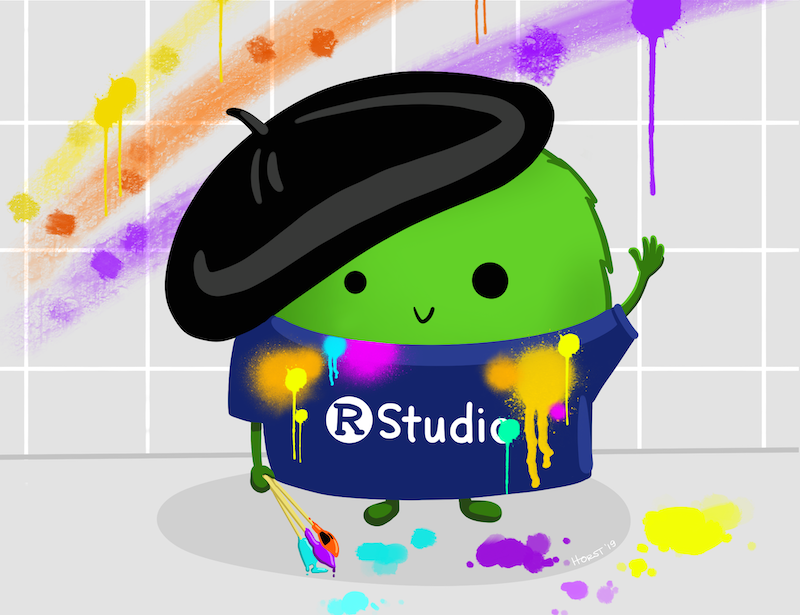
```

.footnote[
blog: [RStudio](https://blog.rstudio.com/2019/11/18/artist-in-residence/)
]

---
class: inverse, center, middle
# Open data science is a mindset

### expect a better way • build confidence & willingness • reimagine science communication

???

<br>

This involves expecting there is a better way with data science, 

Building confidence & willingness with open science, 

and reimagining what is possible with the available tools. 

---
class: middle, center
# Expect there is a better way

???

It can be really hard to expect that there is a better way to do something when you do not know what is possible and you don't see any examples within your own context. 

It's like how Luke would have never expected the Force to have been a thing if he hadn't run into ObiWan and Yoda. 

When I struggled with my squid data, I couldn't expect there was a better way because I thought my challenges with column renaming was a part of my squid research, not something separate like data wrangling. 

So this mindset drained weeks of my time, because I didn't have the mindset or the vocabulary to articulate my struggles and ask for help. 

transition: so when I talk about data science with Openscapes — 
---
```{r data-science}
```
.whisper[Data science] 

???

I make it clear that it is not just about big data, machine learning, and artifical intelligence, which is basically all you ever hear about in the news. 

I think this narrow definition really excludes scientists, who then feel that data science tools are not meant for them. 

transition: I like this definition: 

---
```{r data-science}
```
.whisper[Data science is the discipline of turning raw data into understanding] 
  
<br>

```{r data-science-r4ds, out.width = '90%', fig.align='center'}
knitr::include_graphics("img/r4ds_data-science.png")
```
  
.footnote[
source: [Wickham & Grolemund](https://r4ds.had.co.nz/)
]  

???

This definition resonates with me because I can see myself included in it — and then with the graphic I can actually walk through the steps. 

This clearly describes what many scientist like me I have been fumbling around trying to every time from scratch. 

The idea of tidying your data first and then being streamlined with the tools you can use for science is amazing. Rather than accommodating around weird data.

transition So expecting there is a better way is a big part of a shifting mindset towards open data science. And along with it comes

---
# Open data science tools
<br>
```{r tidyverse, out.width = '60%', fig.align='center'}
knitr::include_graphics("img/r4ds_data-science-tidyverse.png")
```
  
.footnote[
source: [Hadley Wickham, 2019](https://speakerdeck.com/hadley/welcome-to-the-tidyverse?slide=28); web: [tidyverse.org](https://www.tidyverse.org/); new pub: [Welcome to the Tidyverse](https://joss.theoj.org/papers/10.21105/joss.01686)
]  

???

Expect there's a better way


---
class: middle, center
# Build confidence & willingness

???

Building confidence & willingness to engage in a completely different way to work. 

Open science is a big part of this confidence and willingness to engage. 

transition: but Open science has many different definitions and even more interpretations. 

---
```{r open-science}
```
.whisper[Open science]

???

For many environmental scientists, open science can be a negative thing. It's seen as extra work and high risk on already overburdened scientists, particularly those who are early career. 

And that is because it often also has a narrow definition of sharing your data and code at the end of your study, at the risk of people stealing your work and misconstuing your science. 

In this narrow mindset it's not considered that open science could ever be a benefit to the scientist who pays such cost in terms of time and risk.

transition: So in Openscapes, we talk about open science with this definition: 

---
```{r open-science}
```
.whisper[Open science is the concept of transparency at all stages of the research process, coupled with free and open access to data, code, and papers]

```{r spectrum, out.width = '90%', fig.align='center'}
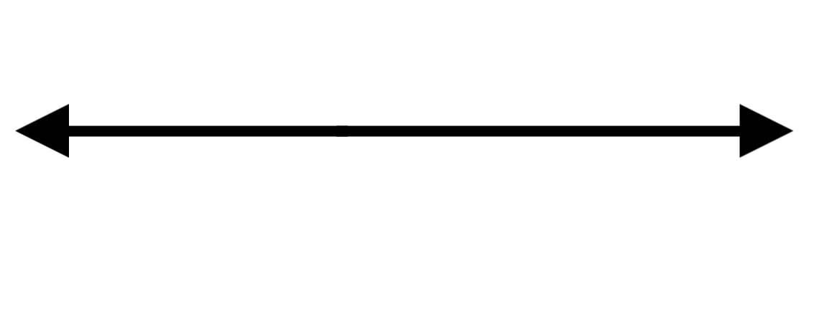
```

.footnote[
source: [Hampton et al. 2015](https://esajournals.onlinelibrary.wiley.com/doi/full/10.1890/ES14-00402.1)
]

???

I like this definition of open science

I teach that open science is a spectrum, with many entryways to engage

I like this too because it helps dispell the idea that you're either doing open science or you're not, but that you can always engage more as you are able.

In Openscapes we talk about how entryways can include sharing slides from a talk online. 

We also practice working openly with their own teams, even if it is within a private repository, because it is practicing the tools and taking the first steps. 

transition: and these 2 pieces really trigger you to reimagine what data science and open science can do for communication

---
class: center, middle
# Reimagine science communication

???

In environmental science, communication is something we really value. 

We are very similar to the open source community like R and Moz in that all of our work is for the public good, and thus communication about it is critical

transition: But For a lot of people, science communication still largely occurs at the end of a study, when everything is complete. 

---
.whisper[Communication tools]

???

And I think this mindset is rooted in the fact that for a long time, sharing your work was hard to do. 

It involved a lot of bookkeeping and formatting and physically printing in many cases, and then distribution was also limited to mail, either phyical or electronic. 

But the internet provides amazing channels to share our work not only at the end, but throughout all of the process. This is critical to establish trust and action for environmental solutions. 

---
.whisper[Communication tools]

```{r ods-software, out.width = '65%', fig.align='center'}
knitr::include_graphics("img/screenshot-paur-talk-ods.png") 
```

.footnote[
source: [OHI slides](https://docs.google.com/presentation/d/12m8dUpIOz16x1RlZWLtj9u5E9wMxtYuP0T_HxoDnyKw/edit?usp=sharing)
]

???

So these are the communication tools I use for open data science — it is a small suite, primarily based with R, RStudio, Git, and GitHub. 

And keeping it so simple really streamlines how manageable it is to focus on science communication, because we use the exact same tools for analysis.

I may as well also say that I can be a big curmudgen about introducing extra software into my life and having to create new user accounts. 

I remember in one NSSD episode, Roger Peng said that if he has to create a new user account, he's like 50% out. For me it's like 80%. 

But anyways, these tools have reimagined what communication means, and I'll show you a few examples from the OHI. 

<next go quickly>

---
exclude: TRUE
class: center, middle
```{r global-map, out.width = '100%'}
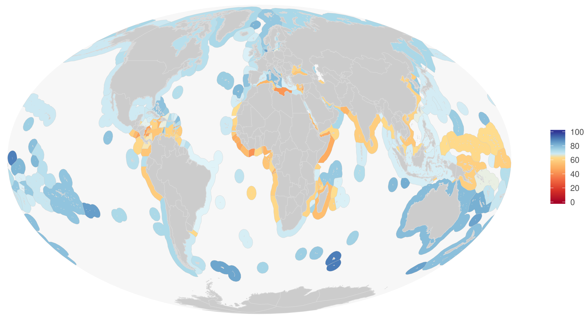
```

.footnote[
source: [ohi-science.org/ohi-global](http://ohi-science.org/ohi-global/)
]

???

We create ocean health index maps like these, in R, with scores reflecting how healthy oceans are for every coastal country around the world. and making these every year by modeling almost 100 data sets forces documentation and decision making to be part of science communication. 

---
class: center, middle
```{r ohi-science-github, out.width = '100%'}
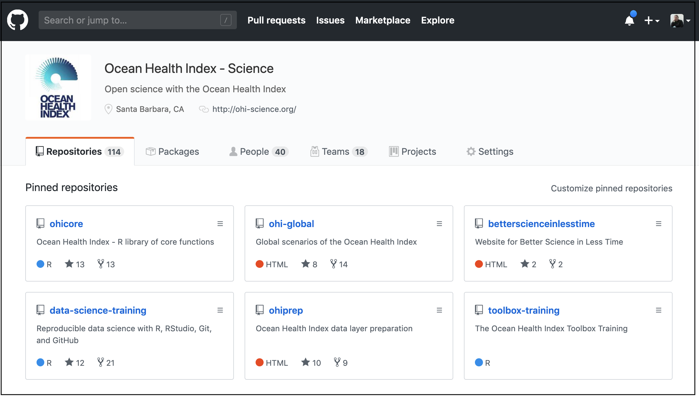 
```

.footnote[
web: [github.com/ohi-science](https://github.com/ohi-science)
]

???

We put all of our code online, pubically, in a GitHub organization for the OHI. This means that others can discover, access, and run our code, understanding what we've done and doing assessments of their own. 

But GitHub repositories are not a friendly landing page for everyone. So —

---
class: center, middle
```{r ohi-science-homepage, out.width = '100%'}
knitr::include_graphics("img/ohi-science-homepage.png") 
```

.footnote[
web (Jekyll): [ohi-science.org](http://ohi-science.org)
]

???

So we built a website that we can maintain ourselves. And here we can put addition information and tutorials and blogs. 

---
class: center, middle
```{r rmd-global-web, out.width = '80%', fig.align='center'}
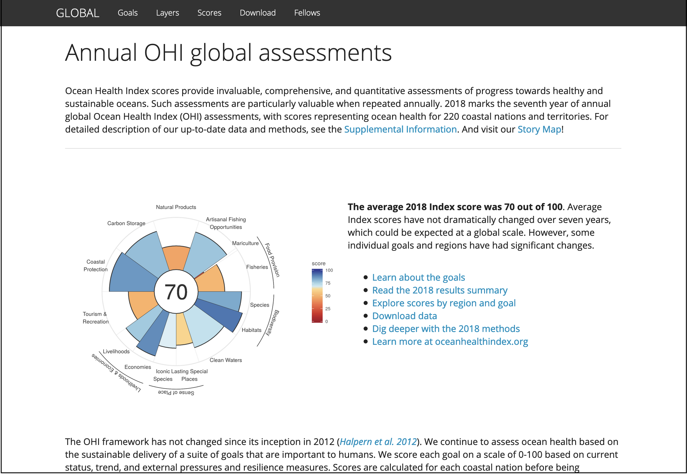
```

.footnote[
web (simple RMarkdown): [ohi-science.org/ohi-global](http://ohi-science.org/ohi-global)
]

???

We also can spin up lighter-weight websites that will render with the most recent information we have 

This is not only useful for us, but for our colleagues leading their own assessments on their coastlines. 

---
```{r ohi-esw, out.width = '80%', fig.align='center'}
knitr::include_graphics("img/ohi-esw-web.png") 
```

.footnote[
web (simple RMarkdown): [ohi-science.org/esw](http://ohi-science.org/esw)
]

???
Another way science communication has changed is that  

---
class: center, middle
```{r toolbox-training, out.width = '80%'}
knitr::include_graphics("img/ohi-toolbox-training.png")
```

.footnote[
web: [ohi-science.org/toolbox-training](http://ohi-science.org/toolbox-training/)
]

???

We can create really nicely formatted guides and documentation also using these same tools. 

---
<br>
```{r shiny-ne, out.width = '100%', fig.align='center'}
knitr::include_graphics("img/jafflerbach-shiny-ne.png") 
```

.footnote[
dashboard (Shiny): [@jafflerbach](https://twitter.com/jafflerbach), work in progress. 
inspiration: [Imagine Boston](https://analytics.boston.gov/app/imagine-boston) 
]

???

And when we are working closely with partners who are engaged with data analysis decisions, we have been able to create dashboards as well. 

---
<br>
```{r openscapes-web, out.width = '80%', fig.align='center'}
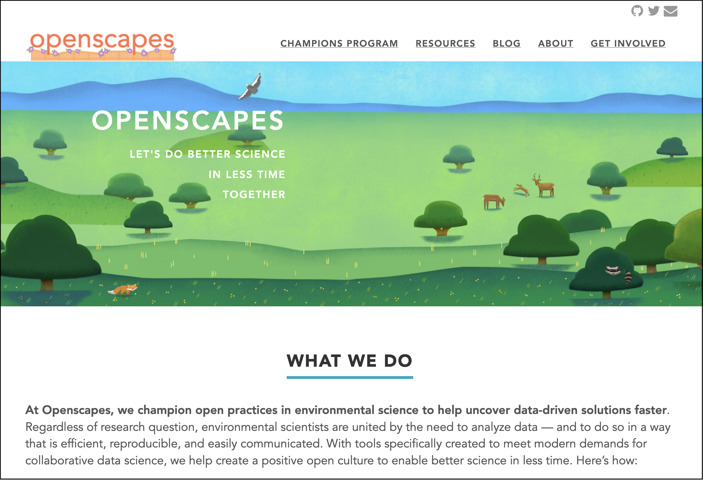 
```

.footnote[
web (blogdown): [openscapes.org](https://openscapes.org)
]

???

Additionally, these tools have been amazing for blogging and sharing Openscapes stories

---
<br>
```{r user-xaringan, out.width = '80%', fig.align='center'}
knitr::include_graphics("img/user-keynote-titleslide.png") 
```

.footnote[
slides (xaringan): [jules32.github.io/useR-2019-keynote](https://jules32.github.io/useR-2019-keynote)
]

???

And for fun, for creating talks at useR

transition: 

---
```{r r4ds-env-reprise}
```
class: center, middle
background-image: url(img/horst-eco-r4ds.png) 
background-size: contain

.footnote[
.left[
<br>
art: [@allison_horst](https://twitter.com/allison_horst);
updated from [Wickham & Grolemund](https://r4ds.had.co.nz/)
]
]

???

So open data science as a mindset is the framing that we start with in Openscapes. 

But the way we actually start acting on all of this is through teamwork, which starts with openness.

---
class: inverse, center, middle
# Teamwork starts with openness
### build trust around shared needs • fuel vertical & horizontal leadership • engage with & build community

???

--water

Teams to me mean rings of people you respect, innovate with, and can rely upon. It does not have to be limited to a certain deliverable, location, discipline or anything else really. 

Teamwork is critical in science because no one it can do it all. And for the sake for innovation as well as for emotional well-being we need to shed the expectation that we should be able to. Instead, we need to value teamwork. 

So I've categorized teamwork here but there are definitely a lot of blurred lines. 

But actually one of the coolest things to me throughout everything I've learned is how teamwork and collaboration and leadership and community all intertwine when you work openly. 


---
class: center, middle
# Build trust around shared needs

???

Open data science streamlines working with data but also working with each other. 

Shared workflows like tidyverse and GitHub mean that even when you aren't working on the same project or interest, you have the same skills and are equipped to help each other out. 

As an OHI team, these tools let us co-develop things, share early drafts, and we can constantly giving feedback and iterating with each other. 

transition: But working openly is something you have to feel safe doing. 

---
# Ocean Health Index team strategies

.pull-left[
### Learn what's possible, how to teach & lead
**rOpenSci • RStudio** • **RLadies • Mozilla • The Carpentries**
]

.pull-right[
```{r community-logosx, out.width = '100%', fig.align='center'}
knitr::include_graphics("img/ods-community-logos.png")
```

]

???

---
# Ocean Health Index team strategies

.pull-left[
### Learn what's possible, how to teach & lead
**rOpenSci • RStudio** • **RLadies • Mozilla • The Carpentries**

### Create skill-sharing spaces
**Seaside Chats** • **Eco-Data-Science • RLadiesSB** • **OHI Fellows**
]

.pull-right[
```{r community-logos3, out.width = '100%', fig.align='center'}
knitr::include_graphics("img/ods-community-logos.png")
```
 
```{r eds, out.width = '100%', fig.align='center'}
knitr::include_graphics("img/eds-rladies-hex.png")  
```
]

???

This Reinforced shared values

I'm a recovering perfectionist

---
exclude: TRUE
# Ocean Health Index team
 
```{r team, out.width = '100%', fig.align='center'}
knitr::include_graphics("img/ohi-team-2018b-crop.jpeg") 
```

???

We as an OHI team have spent years building up trust with each other, and that makes us be able to do our best work. 

This trust really centers on respect for each other and also kindness.

But on an individual level, we all have had to get comfortable with sharing things before they are perfect and being vulnerable to critique, which gets easier when you can assume the best intentions from anyone's feedback. 

But this has resulted in a really positive team culture, where we are comfortable with trying new things & learning from failure, and we are comfortable asking for help. 

---
exclude: TRUE
# Ocean Health Index team
 
```{r team2, out.width = '90%', fig.align='center'}
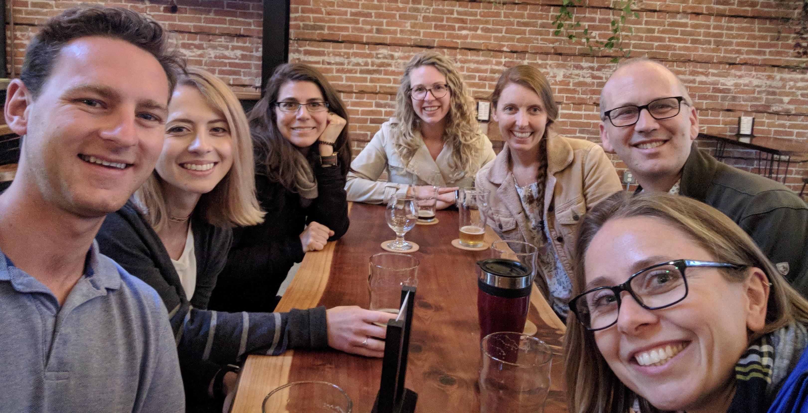 
```

???

Another thing about our team is that we prioritize social time, obviously, since it is impossible to find a picture of our team that is not at happy hour. 

But seriously, getting along well together builds resilience into our team and has helped avoid burnout. And it helps us us manage as people come and go into our group, as is common in science.

transition: one of the ways to start working on this as a team is to create safe spaces where you can deliberately talk about shared stuff.

And in Openscapes, that's what we do in our cohort calls. 

---
# Openscapes lesson series
.pull-left[
<br>
<br>
```{r series, out.width = '100%', fig.align='center'}
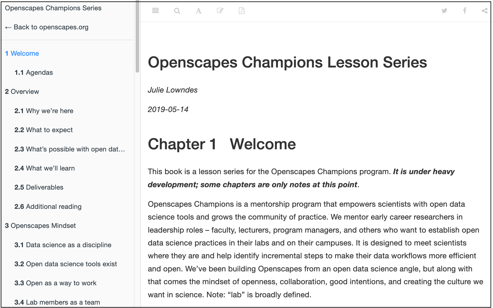
```

.footnote[
lesson series: [openscapes.org/series](https://openscapes.github.io/series)
]
]

.pull-right[
```{r thread, out.width = '95%', fig.align='center'}
knitr::include_graphics("img/tweet-openscapes-series-thread.png")
```

.footnote[
tweet thread: [@openscapes](https://twitter.com/openscapes/status/1131243910200668160)
]
]

???

We covered a lot of other things in our cohort calls, and I'm working on capturing them all in the lesson series that anyone is able to use. 

transition: and in addition to these cohort calls, we focused a lot on leadership, both vertical and horizontal. 

---
# [Sea]side chats & hacky hours
```{r allison-tidytuesday, out.width = '90%', fig.align='center'}
knitr::include_graphics("img/seasidechats-meetup-montage.png") 
```

.footnote[
tweets: [@RLadiesHPNJ](https://twitter.com/RLadiesHPNJ/status/1139867491822383104); [@allison_horst](https://twitter.com/allison_horst/status/1110242520833769472); blogs: [bayside chats](https://github.com/wood-lab/wood-lab-resources#wood-lab-resources); [seaside chats](https://www.openscapes.org/blog/2019/03/10/seaside-chats/);  
]


???

We call these conversations Seaside Chats, or Bayside, Bluffside or Fishbowl chats. They are specific times and places to talk about reproducible research, discuss coding issues, and learn about cool new packages relevant for research. 

This something that our OHI team has been doing for years now in addition to our weekly science lab meetings. This is a dedicated space to discuss and develop shared systems for the lab start weaving open data science into their every day work

We have also coopted the term hackathon, which is when our OHI team we will all drop our own projects and come together for a day or an afternoon to do something that will benefit the whole group, but is no one person's responsibility,like upgrading our filepath strategies with the "here" package. 

Some labs have also done hackathons too, and gotten metadata organized and developed onboarding procedures for the lab, so that new teammembers can get on board with the lab's workflow as soon as possible.


---
class: center, middle
# Fuel vertical & horizontal leadership

???


---
### Ocean Health Index team
.pull-left[
```{r halpern0, out.width = '90%', fig.align='center'}
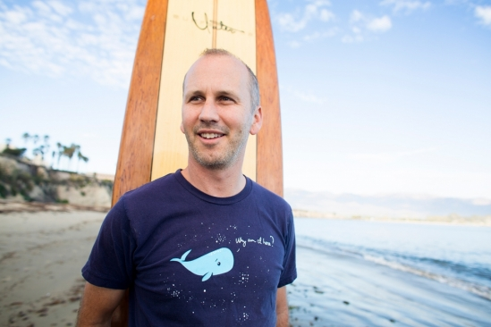
```


.footnote[
web: [National Center for Ecological Analysis & Synthesis](https://www.nceas.ucsb.edu/);
]
]

.pull-right[
```{r shiny-laughing0, out.width = '90%', fig.align='center'}
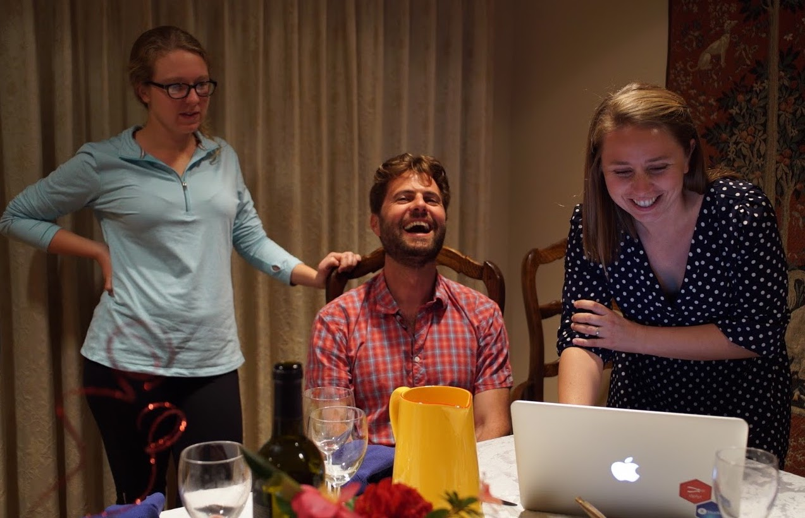
# 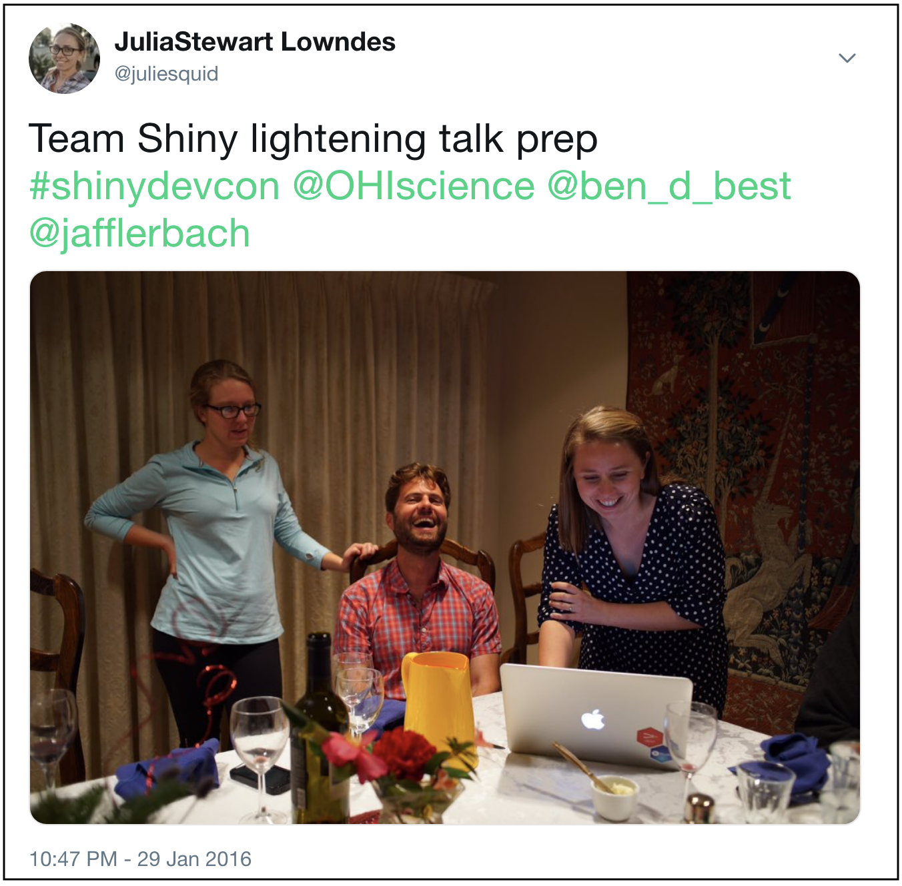
```

.footnote[
tweet: [@juliesquid](https://twitter.com/juliesquid/status/693324555704610816)
]
]

**Vertical leadership: enabling & supportive**  
**Horizontal leadership: jazzed about open data science**   
**Team mindset: trusting and willing**  

**Overlapping & complimentary skillsets; resilience for on/offboarding**   


???

**Vertical leadership: gave us time & space to learn**  
**Horizontal leadership: jazzed about open data science**     
**Team mindset: trusting and willing because it seemed awesome, we saw welcoming entryways, and we were struggling** 

---
exclude: TRUE
# Ocean Health Index team
.pull-left[
```{r halpern, out.width = '100%', fig.align='center'}

```

.footnote[
web: [National Center for Ecological Analysis & Synthesis](https://www.nceas.ucsb.edu/); 
]
]

.pull-right[
```{r shiny-laughing, out.width = '100%', fig.align='center'}

# 
```

.footnote[
tweet: [@juliesquid](https://twitter.com/juliesquid/status/693324555704610816)
]
]

???

On the right here are Jamie Afflerbach, Ben Best, and me. They are my teammates but they are also leaders for me. Ben spent countless hours sitting with me and teaching me R and was patient when I deliberately made emails from github go to my spam folder because I thought GitHub was not going to be useful to me. I told you I am really skeptical of new software. 

And Jamie is an amazing leader as well, I'll tell a story about her in a moment. 

And together we are partners in crime. We cofounded the eco-data-science study group together and have taught multiple carpentries workshops together. This is us preparing for the Shiny conference in 2016. 

transition: Enabling this kind of vertical and horizontal leadership around data is what I try to ignite with Openscapes. 

---
### Openscapes inaugural cohort 2019
.pull-left[
```{r champions-web, out.width = '100%', fig.align='center'}
knitr::include_graphics("img/openscapes-summit-web-champions.png")
```
.footnote[
blog: [openscapes.org](https://www.openscapes.org/blog/2019/03/27/champions-incorporate-open-science/)
]
]

.pull-right[
```{r zoom-left, out.width = '100%'}
knitr::include_graphics("img/Cohort1_zoom.png") 
```
]

**1) everyone sees and values what is possible**   
**2) leads enable members to invest time**  
**3) members have guidance, agency, and support**  
**4) everyone champions open data science**


???
That's what we were did in this first cohort that I mentioned. Really focused on the teamwork side, but immediately around open data science and iteratively, make this a spiral 

And it's been exciting to not only see changes within labs, but across them, and new UW alliances. 

transition: really focused on enabling others

???

This is the first cohort from Openscapes! 

These are scientists from 7 labs, with the faculty or lecturers of each lab participating along with their lab members, who are graduate students, postdocs, technicians, lab managers, visiting faculty. 

We all meet twice each month to discuss open data science concepts and to build community. 

In our calls, I try to model the behavior I want to see, so that they can bring it to their labs. We start off every meeting with a Code of Conduct. 

transiton: So this is an excellent transition into community.   

---
class: center, middle
# Engage with & build community

???

I think that the best thing I do for the Openscapes cohort is to introduce and welcome them to our communities. 

When we talk about the awesomeness of R communities in Openscapes, it's not only to encourage them to become a part of them, but also to extend its ethos and kick-start this kind of movement in science. 

I used to have my feet squarely in the marine science community, but now I feel like a bridge across environmental communtities, R communities and Mozilla communities. 

I've learn so much from each and try to help channel those lessons between groups.
 
transition: And engaging in these broader communities for me started on Twitter.
 
---
# \#rstats

```{r jafflerbach, out.width = '45%', fig.align='center'}
knitr::include_graphics("img/tweet-juliesquid-jafflerbachspatial.png") 
```

.footer[
tweet: [@juliesquid](https://twitter.com/juliesquid/status/728326585485402112)
]

???

I joined twitter to learn R because of my teammate Jamie.

And you know me, I was definitely skeptical. I  thought Twitter was a megaphone for angry people. 

But she taught me how to use it to listen and learn from other others. And then to gradually build up the courage to like and retweet things. 

She taught me that liking and retweeting was not only a way to engage with the community yourself, but it was a way to welcome and amplify other people as well.   

So I was amazed that you could have community on Twitter

---
```{r ropensci-unconf, out.width = '70%', fig.align='center'}
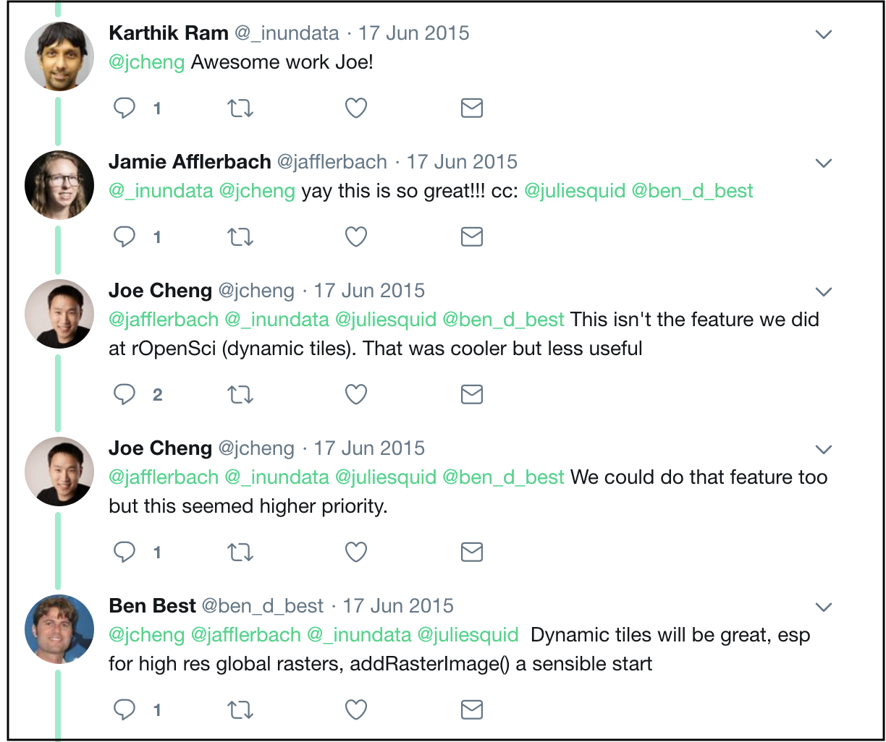 
```
 
.footer[
tweet: [@jcheng](https://twitter.com/jcheng/status/611260382741577729)
]

???

But you can. 

And I was also amazed that software developers were real people. And not only that, they were super nice people that made me feel welcome and valued.

Prior to conversations like these, I had never stopped to think that there were real people behind software. 

transition: And that might sound crazy, but before twitter, this is the closest I'd ever come to interacting with software:

---
class:middle, inverse, center
```{r clippy}
```


<!--- --->
???

I'm not kidding. 

But seriously, realizing that software developers went well beyond Clippy here was really a defining point in my life. 

This is was that turning point when I really became the person I am today — that person who never stops talking about how awesome R is and how it will change your life

transition: Even back in 2016 my 4 year old niece knew about ggplot and dplyr

---
class: center, middle
```{r out.width = '100%'}
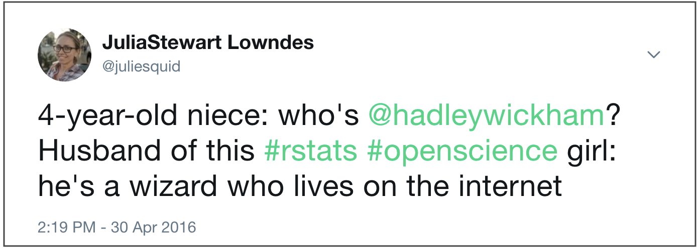
# https://twitter.com/juliesquid/status/726521325821431808
```

.footnote[
tweet: [@juliesquid](https://twitter.com/juliesquid/status/726521325821431808)
]

???

transition: So in Openscapes, I encourage everyone to engage, and it's cool to see them 

---
# rOpenSci & RStudio & RLadies

```{r ropensci, out.width = '100%', fig.align='center'}
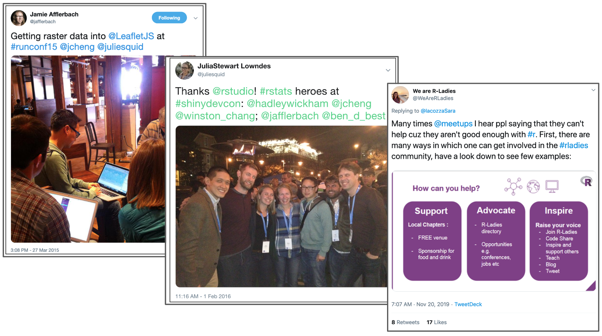 
```

.footnote[
tweets: [@jafflerbach](https://twitter.com/jafflerbach/status/581578558977368064);  [@juliesquid](https://twitter.com/juliesquid/status/694237930991161344); [@WeAreRLadies](https://twitter.com/WeAreRLadies/status/1197169476837498880)
]

???

So, rOpenSci, RStudio, RLadies have just ignited such a change in my life.

They have been so welcoming and supportive of me from well before I knew how impactful this would be. 

I'm deliberately not going to talk about how because every time I practiced I cannot stop my voice from waivering at the impactfulness of individuals and the broad communities. It's something I'll work on  because it's  important to  be able to say but for now,  and limiting myself by putting them on the same slide here because I otherwise could go on for days. 


They have created communities where developers and new users who are strangers become collabortors and friends and where there is deliberate attention to setting the right space to make that happen. 

It was a big deal to not only connect online, but also in person, with so many other people in these communiies. It really solidified that we were part of this. 

And I wanted Openscapes to have this same opportunity


RLadies is changing the world. Increasing gender diversity in the R community is so impactful. But I think it's the the beginning. 

RLadies has given me confidence in myself, and made me be a better advocate for women in science. And that is something I try to pass on through Openscapes; I encourage them to become a part of RLadies adn extend its ethos to science. 

transition: The Openscapes cohort has engaged with RLadies and existing coding clubs, and also created new opportunities to code. 

---
```{r ropensci-janitor-redoc, out.width = '100%', fig.align='center'}
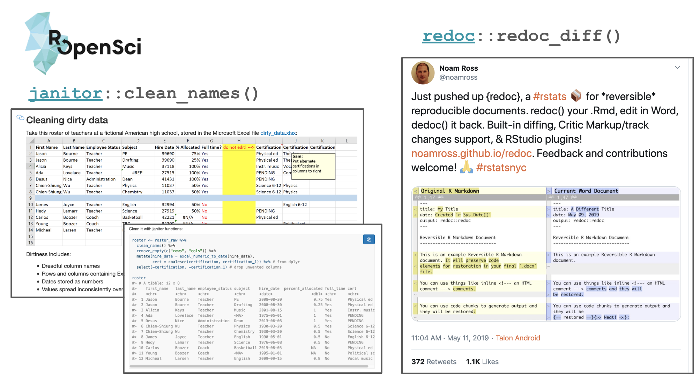  
```

.footnote[
web: [ropensci/packages](https://ropensci.org/packages); [janitor](https://sfirke.github.io/janitor); [redoc](https://twitter.com/noamross/status/1127273301443850240?lang=en)
]


???
These kinds of conversations and communities enable packages like these, from rOpenSci

transition: and when we talk about them in Openscapes it leads to tweets like these 

---
class: center, middle

```{r halley-rnoaa, out.width = '60%', fig.align='center'}
knitr::include_graphics("img/tweet-docfroehlich-rnoaa-full.png")  
```
 
.footnote[
tweet: [@DocFroehlich](https://twitter.com/DocFroehlich/status/1085990833571020800)
]

???

Halley has a big science follwing already and now tweets also about open data science, so this is a great example of the influence these champions are already having. 


---
```{r welcome-rstats, out.width = '75%', fig.align='center'}
knitr::include_graphics("img/horst-welcome_to_rstats_twitter.png")
```

.footnote[
art: [@allison_horst](https://twitter.com/allison_horst);
blog: [openscapes.org](https://www.openscapes.org/blog/2019/01/15/personify-code/)
]

???

and from her little #rstats monsters 

transition: But she is also a lecturer of data science and statistics in an environmental science and management program, and she is an Openscapes Champion. 

---
exclude: TRUE
class: middle
.whisper[This isn’t just about coding and GitHub, this is about changing how we do science <br>— Malin Pinsky, Professor & Openscapes Champion]

.footnote[
blog: [openscapes.org](https://www.openscapes.org/blog/2019/04/08/summit-reflections1/)
]

???

So Malin said that this isn’t just about coding and GitHub, this is about changing how we do science. 

I'm just so excited that they feel this way, because mindset change comes from truly feeling it

transition: There are many more communities that I love but I'm going to talk about one more right now, and that's RLadies

---
class: middle, center
```{r loopx, out.width = '100%'}
knitr::include_graphics("img/horst-lowndes-loop-wtext.png")
```

.footnote[
art: [@allison_horst](https://twitter.com/allison_horst)   
]


---
```{r rey2}
```
class: center, middle
background-image: url(img/horst-starwars-rey.png) 
background-size: contain

.footnote[
art: [@allison_horst](https://twitter.com/allison_horst)
]

???
So what can you do (rey)

---
# Talk about data
<br>
```{r careers-screenshot, out.width = '85%', fig.align='center'}
knitr::include_graphics("img/nature-careers-supercharge.png") 
```

<br>

<!---
**Normalize data discussions • Identify and address shared needs • Think ahead: Future You & Future Us**
--->

???
"Seaside chats", "Hacky hours", Coding clubs/meetups

Establish trust, share challenges & wins, learn together

10-week plan. 


---
# Have a team mindset

.pull-left[
### Redefine collaborators
**Research group as a team** • **Future you, future us**

### Redefine community
**Online** •  **Beyond your own discipline**
]

.pull-right[
```{r horst-seaside-chats2, out.width = '90%', fig.align='center'}
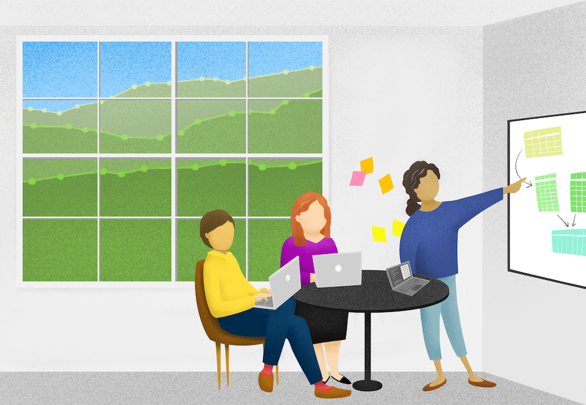 
```
]

### Reimagine challenges
**Expect there is a better way** • **Approch with confidence, agency, & community** • **You're not alone, it's not too late**  

???
It's not your fault

---
# Enable and support leaderful teams

.pull-left[
### Learn what's possible, how to teach & lead
**rOpenSci • RStudio** • **RLadies • Mozilla • The Carpentries**

### Create skill-sharing spaces
**[Sea]side Chats** • **Coding clubs • Hacky hours/weeks** • **courses** • **webinar movie nights** • **[your awesome idea here]**

.footnote[
resources: [openscapes.org/resources](https://www.openscapes.org/resources)
]

]

.pull-right[
```{r handshands, out.width = '75%'}
knitr::include_graphics("img/horst-starwars-hands.png")
```

**trust** • **resilience** • **overlapping skillsets & interoperability** • **leadership • kindness**  

]

???

Teams to me mean rings of people you respect, innovate with, and can rely upon. It does not have to be limited to a certain deliverable, location, discipline or anything else really. 

This trust really centers on respect for each other and also kindness.

But on an individual level, we all have had to get comfortable with sharing things before they are perfect and being vulnerable to critique, which gets easier when you can assume the best intentions from anyone's feedback. 

But this has resulted in a really positive team culture, where we are comfortable with trying new things & learning from failure, and we are comfortable asking for help. 

---
# Engage with \#rstats Twitter
.pull-left[
```{r welcome-rstats2, out.width = '100%', fig.align='center'}
knitr::include_graphics("img/horst-welcome_to_rstats_twitter.png")
```

.footnote[
art: [@allison_horst](https://twitter.com/allison_horst);
blog: [openscapes.org](https://www.openscapes.org/blog/2019/01/15/personify-code/)
]
]

.pull-right[
### Follow selectively, listen, learn, meet awesome allies

**Start with:** 

**\#rstats, @hadleywickham, @JennyBryan, @WeAreRLadies, @rOpenSci**  

**@openscapes**  

]

---
class: center, middle
# Incremental progress, together

```{r hadley-could-be-better, out.width = '90%'}
knitr::include_graphics("img/tweet-allimoberger-hadley.png")
```

---
```{r horst-eco-r4ds0fin}
```
name: environ-comm-r4ds
class: center, middle
background-image: url(img/horst-eco-r4ds.png) 
background-size: contain

.footnote[
.left[
<br>
art: [@allison_horst](https://twitter.com/allison_horst);
updated from [Wickham & Grolemund](https://r4ds.had.co.nz/)
]
]


---
```{r closing-thoughts}
```
name: environ-comm-r4ds
class: center, middle
background-image: url(img/horst-eco-r4ds.png) 
background-size: contain

.footnote[
.left[
<br>
art: [@allison_horst](https://twitter.com/allison_horst);
updated from [Wickham & Grolemund](https://r4ds.had.co.nz/)
]
]

???

And I am working to continue to develop and grow the program so that I can lead cohorts every year and begin on-demand workshops with teams on the ground. 

We do have a long way to go before this is is truly the reality in science.

But I am optimistic that Openscapes can play a role. I think the more we talk about and see why open data science is important for environmental science, the more it will be valued and the quicker we can change the culture as a whole.

---
```{r hands} 
```
class: center, middle
background-image: url(img/horst-starwars-hands.png)  
background-size: contain

.footnote[
art: [@allison_horst](https://twitter.com/allison_horst)
]

???

And the awesome thing is that we all have our part to play in helping this change.

We can all welcome and amplify these awesome environmental sicnetists as they in engage in R and join our community, so that we all can benefit from better science in less time. 

---
# Thank you all so much

.pull-left[
#### especially for this talk:
###OHI team <br>Mozilla team<br>Openscapes labs<br>Allison Horst<br>RLadies team

<br>

####all artwork: [@allison_horst](https://twitter.com/allison_horst)<br>xaringan theme: [@apreshill](https://github.com/apreshill/talks/blob/master/uo-sad-plot-better/index.Rmd#L7)

]

.pull-right[
<br>
<br>

### Please get involved: [openscapes.org/contact](https://www.openscapes.org/contact/); [@openscapes](https://openscapes.org)


#### Find me for stickers...  
]

???

Thank you.

---
```{r fin}
```
class: title-slide, right, bottom
background-image: url(img/horst-starwars-rey.png)
background-size: contain
background-position: bottom left   


# `r rmarkdown::metadata$title`

### `r rmarkdown::metadata$author`
### `r rmarkdown::metadata$role`
### `r rmarkdown::metadata$institute`

[`r icon::fa("twitter")` @juliesquid](https://twitter.com/juliesquid)  
[`r icon::fa("paper-plane")` lowndes@nceas.ucsb.edu](mailto:lowndes@nceas.ucsb.edu)  
[`r icon::fa("desktop")` jules32.github.io/user-2019-keynote](http://jules32.github.io/user-2019-keynote)  


