```{r setup, include=FALSE}
options(htmltools.dir.version = FALSE, warning=FALSE, message=FALSE, verbose = FALSE)
knitr::opts_chunk$set(echo = FALSE, message=FALSE, warning=FALSE)

library(xaringan)
library(fontawesome)
```


class: title-slide, right, bottom
background-image: url(img/horst-starwars-rey.png)
background-size: contain
background-position: bottom left 


## `r rmarkdown::metadata$title`
### `r rmarkdown::metadata$author`
### `r rmarkdown::metadata$institute`

[`r icon::fa("twitter")` @juliesquid](https://twitter.com/juliesquid)  
[`r icon::fa("paper-plane")` lowndes@nceas.ucsb.edu](mailto:lowndes@nceas.ucsb.edu)  
[`r icon::fa("desktop")` openscapes.org/media](http://openscapes.org/media)  


???

---
```{r loop-wtext, out.width = '100%'}
knitr::include_graphics("img/horst-lowndes-loop-wtext.png")
# https://docs.google.com/presentation/d/13JkwCiXjfZfNucAsDwHI6FdEvpOngCv50cjnT7HXJK8/edit#slide=id.g625ce81eb0_0_1645
```

.footnote[
art: [@allison_horst](https://twitter.com/allison_horst)   
]

???

I'm here really to talk about teams big and small. But something that I've found too is that many people feel like they are not a part of a team at all, that they are a team of one
If there is one take home message, it's that open data science is not only tools, it's a mindset. It is within reach, but you need teamwork. (blarg). Maybe put 


I am a marine scientist and R as a language and as a community has been game-changing for my science, and my life. 


This is my (Openscapes) mindset; this is where I'm coming from when I talk about better science in less time. It's this beautiful feedback loop. It's the idea that there are really powerful open data science tools and practices that exist (here on the left) and that having shared tools and workflows enables you to collaborate more easily with others and think as a team (on the right). And also, If you work with others and have a team mindset, you're more able or nimble to engage with new software and practices. 

Start off: R for BSILT. Really about open data science more broadly. And how there are really powerful tools that exist, that we can use for science. But also, they are most powerful when we use them as a team. 

---
exclude:TRUE
.pull-left[
### The problem
**Individual mindset in science**: 

struggling with data analysis  
"working alone"  
reinventing the wheel <!---difficult to repeat, reproduce--->


### This matters now
**No time to waste:** 

studying critical systems affected by climate change  
bad practices perpetuated

]

.pull-right[
### A solution
**Team mindset centered on open data science**: 

redefine collaborators & communities  
expect better ways  
create resilient teams  


]

???

The 3 lessons are Open data science is a mindset, Teamwork starts with openness, and Harness the power of welcome.  

I'm going to spend the whole talk building out these lessons.

But first I wanted to tell a bit about me and the main experiences that have driven these lessons. 

I am often asked why a marine scientist would use R, so I want to make sure you leave here knowing that marine scientists, as well as environmental scientist more broadly, work with data every single day to do our science, and it is critical that we are supported to work with data responsibly. 

So let me start off when I was a graduate student in a marine research group, which we also call laboratories in the US. 

---

```{r luke}
```
class: center, middle
background-image: url(img/horst-starwars-luke.png)
background-size: contain

.footnote[
art: [@allison_horst](https://twitter.com/allison_horst)
]

???

This is Luke Skywalker after he crashed his plane on Dagobah. He is there staring at a problem that he can’t solve with the skillsets he has, and it is demoralizing. 

This plane can represent a lot of things for data analysis. 
It can be data that is too big to be opened in Excel. 
It can be your self-taught code that you are too ashamed of embarrassed to share
It can be not being able to run code sent by a colleague. 
it can be the time spent at the end of your study trying to reorganize and clean up data in order to submit to a data repo
It can be the time spent organizing the files your students send you through a mosaic of Google Drive and GitHub links, email attachments, and thumb drives. 

For environmental scientists, there are ways big and small that can leave you feeling like Luke here. 

If you imagine what it would be like for Luke if he had used whatever ropes or pulleys he had on hand, it probably wouldn’t have been pretty, reproducible, or gotten him where he needs to be on time.

transition: but luckily what happens next is that he meets Yoda

---
class: top, center
```{r yoda, out.width = '88%'}
knitr::include_graphics("img/horst-starwars-yoda.png") 
```

.footnote[
art: [@allison_horst](https://twitter.com/allison_horst)
]

???

But Yoda comes along and can solve Luke's problem in a way Luke never imagined. He uses the Force. And the Force is a powerful skillset and mindset because Luke can see this and learn from Yoda, and he can go on then to not only solve his current but it will broaden his mind to what is possible in the future.

Open data science is the Force that helps us do better science in less time. It can be:
code in an open source language like R
coding with community-norms and tools like from rOpenSci, RStudio, and RLadies
coding and coordinating collaboratively with tools like GitHub
being empowered by open practices and having it be part of the whole research process
These types of practices not only save time and are more reproducible, but it’s a whole mindset of what is possible as you reduce friction in the day-to-day analyses and become comfortable with the power of these tools. 

So the Force is a powerful thing, but importantly, it is not something that exists on its own.

Transition: But Luke didn't go on to defeat the Empire himself, he had a whole community.

---
```{r hands} 
```
class: center, middle
background-image: url(img/horst-starwars-hands.png)  
background-size: contain


.footnote[
art: [@allison_horst](https://twitter.com/allison_horst)
]

???

And this community is powerful because of the diversity of backgrounds and expertise, and although not everyone is a Jedi, everyone contributes in really critical ways.

So in science this can be
Teaching scientists how to code through university courses and trainings like the Carpentries
Championing open science by mentioning it in science talks, publications faculty meetings, 
Funding opportunities for scientists to participate in open science
Building software to meet scientists where they are

---
```{r rey-toc-full}
```
class: title-slide, right, bottom
background-image: url(img/horst-starwars-rey.png)
background-size: contain
background-position: bottom left   


???

And end with how to supercharge. 

R is the Force that enables us as scientists to do better science in less time. 

It empowers us to get our own data out of the swamp. 

It empowers us and build off of our confidence and experiences and broaden the scope of scientific challenges that we can tackle, which for environmental scientists, includes food security, disease transmission, and climate change. 

For me, I didn't fully feel the power of R until I finished graduate school and joined a research group where I am today, where we learned to work with data as a team. 

transition: So I'll talk today about 


---
```{r loop-toc1, out.width = '100%'}
knitr::include_graphics("img/horst-lowndes-loop-wtext.png")
# https://docs.google.com/presentation/d/13JkwCiXjfZfNucAsDwHI6FdEvpOngCv50cjnT7HXJK8/edit#slide=id.g625ce81eb0_0_1645
```

???
This is my outline. Try to talk this through

---
exclude: TRUE
```{r rey-toc-full}
```
class: title-slide, right, bottom
background-image: url(img/horst-lowndes-loop-wtext-full.png)
background-size: contain
background-position: bottom left   


???

And end with how to supercharge. 

---
exclude: TRUE
```{r rey-toc-look-like}
```
class: title-slide, right, bottom
background-image: url(img/horst-lowndes-loop.png)
background-size: contain
background-position: bottom left   


# Better science in less time 

### What does it look like
Why it is a mindset  
How to engage

### Open data science tools & workflows
### Mindsets and culture

<br>
<br>
<br>
<br>
<br>


???

I'm going to focus on tools and workflow first and get into team but you'll see that mindset is a big part

---
<br>
```{r OHI hex, out.width = '100%', fig.align='center'}
knitr::include_graphics("img/OHI-banner-hex.png")
```

<br>

.pull-left[
**A scientific method, tool, and community for channeling the best available scientific information into marine policy.**  
<br>
**Global assessments annually 2012-**  
**Independent assessment2 20+**

.footnote[
source: [Halpern et al. 2012](http://www.nature.com/nature/journal/v488/n7413/full/nature11397.html)
web: [ohi-science.org](http://ohi-science.org); [@OHIscience](https://twitter.com/OHIscience)
]
]

.pull-right[
```{r teamx, out.width = '100%', fig.align='center'}
knitr::include_graphics("img/ohi-team-2018b-crop.jpeg") 
```

]

???

The Ocean Health Index is a scientific endeavor to quantify impacts and benefits of oceans around the world using the best publically available data. 

It is being used by the United Nations and by 20 groups around the world. 

There is a lot to it but what is relevant here is that we combine lots of data, we repeat our analyses every year, and we do it as a team.

---
```{r openscapes grasslandx, out.width = '100%', fig.align='center'}
knitr::include_graphics("img/horst_openscapes_grassland_1500px-text-hex.png")
```

.pull-left[
**A mentorship program for research teams to help build mindsets and habits around open data science.**  
<br>
**Cohorts (5 months, remote) 2019-**  
**Workshops (2-day, in-person) 2020-**  
]

.pull-right[
```{r zoom1, out.width = '85%', fig.align='center'}
knitr::include_graphics("img/Cohort1_zoom.png") 
```

]

---
exclude: TRUE
# OHI process
```{r ohi-workflow, out.width = '100%', fig.align='center'}
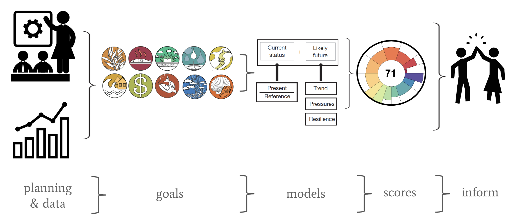
```

---
exclude: TRUE
# OHI process
```{r ohi-workflow-repeat, out.width = '100%', fig.align='center'}
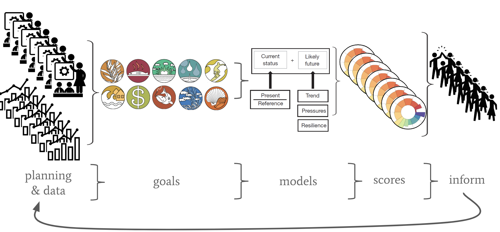
```


---
.pull-left[
```{r luke-smaller, out.width = '60%', fig.align='center'}
knitr::include_graphics("img/horst-starwars-luke.png")
```

```{r teucher1, out.width = '100%', fig.align='center'}
knitr::include_graphics("img/teucher1.png")
```

.footnote[
art: [@allison_horst](https://twitter.com/allison_horst), graphics: [Andy Teucher](https://github.com/ateucher/vic-geogeeks-2018-01-30)
]
]

.pull-right[

```{r yoda-smaller, out.width = '60%', fig.align='center'}
knitr::include_graphics("img/horst-starwars-yoda.png")
```

<br>

```{r teucher2, out.width = '95%', fig.align='center'}
knitr::include_graphics("img/teucher2.png")
```

]

???

We felt like this. Even though we were working as a team. Really difficult for reproducibility, reinventing the wheel. Each of us individually was doing our own way or was on piece of that, isolated. 

---
exclude: TRUE
```{r ods-software, out.width = '65%', fig.align='center'}
knitr::include_graphics("img/screenshot-paur-talk-ods.png") 
```

.footnote[
source: [OHI slides](https://docs.google.com/presentation/d/12m8dUpIOz16x1RlZWLtj9u5E9wMxtYuP0T_HxoDnyKw/edit?usp=sharing)
]

???

So this is how we work: the tools we use

---
exclude: TRUE
# OHI Toolbox
```{r ohi-toolbox, out.width = '100%', fig.align='center'}
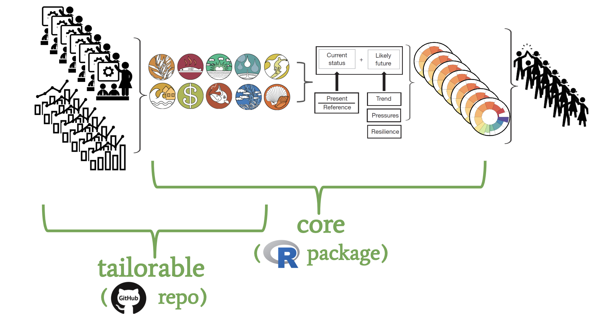
```

---
class: middle, center
```{r nature-bsilt, out.width = '100%', fig.align='center'}
knitr::include_graphics("img/nature-screenshot-title.png")
```

.footnote[
source: [Lowndes *et al.* 2017](https://www.nature.com/articles/s41559-017-0160); web: [ohi-science.org/betterscienceinlesstime](http://ohi-science.org/betterscienceinlesstime/)
]

???

Figuring out was a big enough deal that we published this in Nature Ecology & Evolution. 

What made it unique: we shared our struggles, and described the transition

---
### More reproducibility & collaboration, less time
```{r fig 1-whiteout, out.width = '80%'}
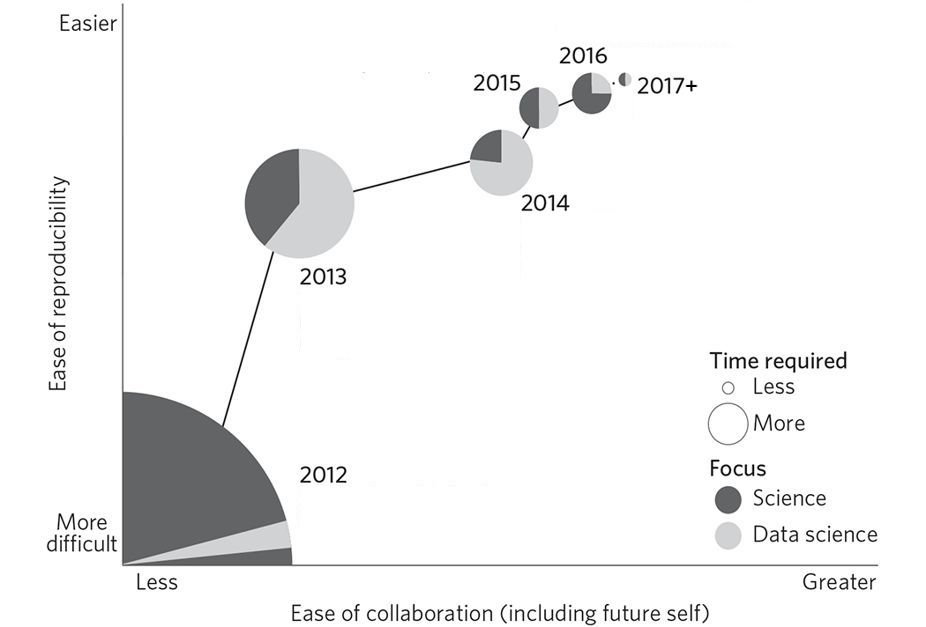
# lowndes-nature-figure1-slides2.png
# https://docs.google.com/drawings/d/1d25T1fD9irluhQhPvNHZSt3uUBXebxqV9hFabOLZUz4/edit
```

.footnote[
source: [Lowndes *et al.* 2017](https://www.nature.com/articles/s41559-017-0160)
]

???

It looks like this. 

Shown here as the circles get smaller and moving up the y axis. It also go easier for us to collaborate each year, along the x axis. 

This let us focus on making improvements either on the data science side or the science side

---
### More reproducibility & collaboration, less time
```{r fig 1, out.width = '80%'}
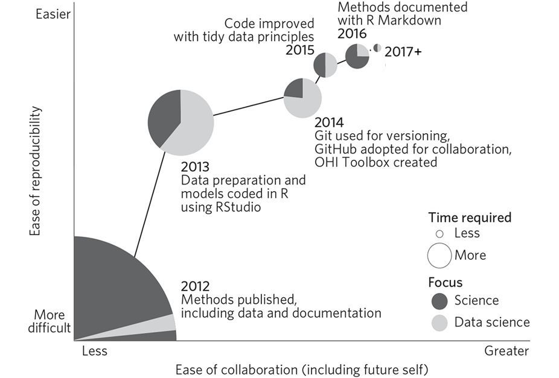
# lowndes-nature-figure1-slides2.png
# https://docs.google.com/drawings/d/1d25T1fD9irluhQhPvNHZSt3uUBXebxqV9hFabOLZUz4/edit
```

.footnote[
source: [Lowndes *et al.* 2017](https://www.nature.com/articles/s41559-017-0160)
]


???

We couldn't overhaul everything all at once, but focused on different pieces incrementally each year. 

We started off focused on R and RStudio, and then on using Git and GitHub, then on tidy data and then documentation and Rmd. And ever since we've focused on leading a training program to teach students how to maintain it. 

Having all of this coding infrastructure in place is what enables those 20 independent groups I mentioned to study ocean health in the places they care about. 


---
class: center, middle
```{r workflow-repro-wtext, out.width = '100%'}
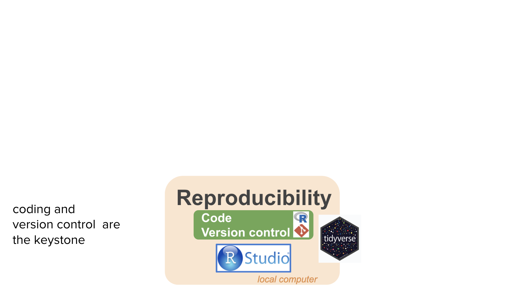
```

.footnote[
source: [OHI slides — WHOI](https://drive.google.com/open?id=1SHvJbBWrGVqzjAPos1jbtxSn_2DAl44JmDgY5v2NxC8)
]

???

---
class: center, middle
```{r workflow-full-wtext, out.width = '100%'}
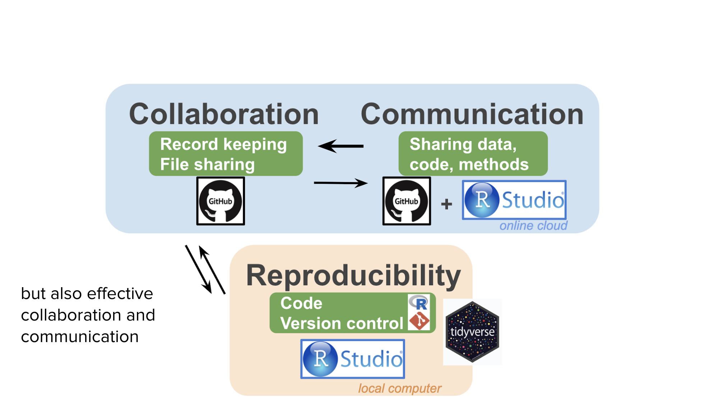
```

.footnote[
source: [OHI slides — WHOI](https://drive.google.com/open?id=1SHvJbBWrGVqzjAPos1jbtxSn_2DAl44JmDgY5v2NxC8)
]

???

---
exclude: TRUE
class: center, middle
```{r lowndes-table1, out.width = '100%'}
knitr::include_graphics("img/lowndes-nature-table1.png")
```

.footnote[
source: [Lowndes *et al.* 2017](https://www.nature.com/articles/s41559-017-0160)
]

???

We have it in the table but let me show you. 

---
## RStudio for R, text editing, Github sync, & more
```{r workflow-ex-repro-wtext, out.width = '100%'}
knitr::include_graphics("img/workflow-ex-repro-wtext.png")
```

.footnote[
source: [OHI slides — WHOI](https://drive.google.com/open?id=1SHvJbBWrGVqzjAPos1jbtxSn_2DAl44JmDgY5v2NxC8)
]

???

---
## GitHub for archiving and bookkeeping
```{r workflow-ex-collab-wtext, out.width = '100%'}
knitr::include_graphics("img/workflow-ex-collab-wtext.png")
```

.footnote[
source: [OHI slides — WHOI](https://drive.google.com/open?id=1SHvJbBWrGVqzjAPos1jbtxSn_2DAl44JmDgY5v2NxC8)
]

???

---
## Github for discussion & project mgmt
```{r workflow-ex-collab2-wtext, out.width = '100%', fig.align='center'}
knitr::include_graphics("img/workflow-ex-collab2-wtext.png")
```

.footnote[
source: [OHI slides — WHOI](https://drive.google.com/open?id=1SHvJbBWrGVqzjAPos1jbtxSn_2DAl44JmDgY5v2NxC8)
]

???

---
## R + Github for docs & publishing
```{r workflow-ex-comm-wtext, out.width = '100%'}
knitr::include_graphics("img/workflow-ex-comm-wtext.png")
```

.footnote[
source: [OHI slides — WHOI](https://drive.google.com/open?id=1SHvJbBWrGVqzjAPos1jbtxSn_2DAl44JmDgY5v2NxC8)
]

???

---
## Reimagining communication and publishing
```{r rmd-reimagine, out.width = '50%', fig.align='center'}
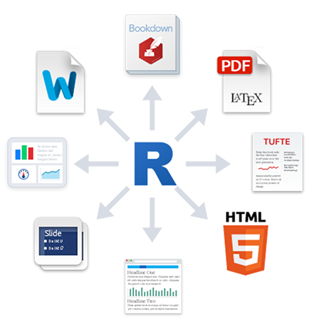
```

.footnote[
source: [RStudio](http://www.robbyshaver.com/rmarkdownGen/lesson-11.html)
]

---
class: center, middle
```{r rmd-global-web, out.width = '80%', fig.align='center'}
knitr::include_graphics("img/web-rmd-global.png")
```

.footnote[
web (simple RMarkdown): [ohi-science.org/ohi-global](http://ohi-science.org/ohi-global)
]

???

We also can spin up lighter-weight websites that will render with the most recent information we have 

This is not only useful for us, but for our colleagues leading their own assessments on their coastlines. 

---
```{r ohi-esw, out.width = '80%', fig.align='center'}
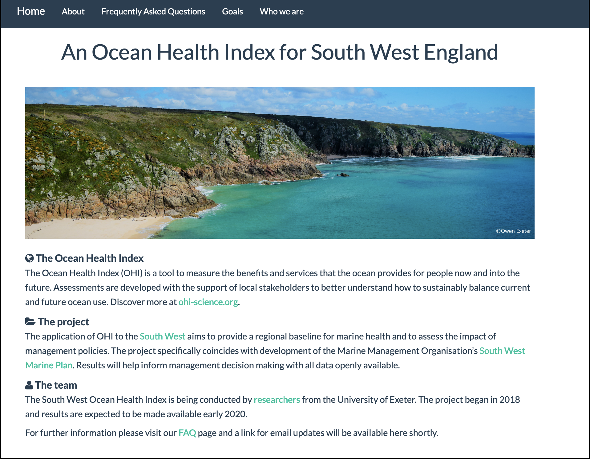 
```

.footnote[
web (simple RMarkdown): [ohi-science.org/esw](http://ohi-science.org/esw)
]

???
Another way science communication has changed is that  

---
exclude: TRUE
class: center, middle
```{r toolbox-training, out.width = '80%'}
knitr::include_graphics("img/ohi-toolbox-training.png")
```

.footnote[
web: [ohi-science.org/toolbox-training](http://ohi-science.org/toolbox-training/)
]

???

We can create really nicely formatted guides and documentation also using these same tools. 


---
<br>
```{r shiny-ne, out.width = '100%', fig.align='center'}
knitr::include_graphics("img/jafflerbach-shiny-ne.png") 
```

.footnote[
dashboard (Shiny): [@jafflerbach](https://twitter.com/jafflerbach), work in progress. 
inspiration: [Imagine Boston](https://analytics.boston.gov/app/imagine-boston) 
]

???

And when we are working closely with partners who are engaged with data analysis decisions, we have been able to create dashboards as well. 


---
exclude: TRUE
<br>
```{r openscapes-web, out.width = '80%', fig.align='center'}
knitr::include_graphics("img/web-blogdown-openscapes.png") 
```

.footnote[
web (blogdown): [openscapes.org](https://openscapes.org)
]

???

Additionally, these tools have been amazing for blogging and sharing Openscapes stories

---
exclude: TRUE
<br>
```{r user-xaringan, out.width = '80%', fig.align='center'}
knitr::include_graphics("img/user-keynote-titleslide.png") 
```

.footnote[
slides (xaringan): [jules32.github.io/useR-2019-keynote](https://jules32.github.io/useR-2019-keynote)
]

???

And for fun, for creating talks at useR

transition: 

--->

---
```{r loop-wtext2, out.width = '100%'}
knitr::include_graphics("img/horst-lowndes-loop-wtext.png")
```

.footnote[
art: [@allison_horst](https://twitter.com/allison_horst)   
]

???

But remember, I said these tools are really most powerful with teams.


---
exclude: TRUE
```{r rey-toc-mindset-header}
```
class: title-slide, right, bottom
background-image: url(img/horst-starwars-rey.png)
background-size: contain
background-position: bottom left   


# Better science in less time 

### Open data science as a mindset
<br>
<br>
<br>
<br>
<br>
<br>
<br>
<br>

---
exclude: TRUE
```{r rey-toc-mindset-list}
```
class: title-slide, right, bottom
background-image: url(img/horst-starwars-rey.png)
background-size: contain
background-position: bottom left   


# Better science in less time 

### Open data science as a mindset

Data science as a discipline  
Open as a way to work  
Collaborators and community (redefined) as a way to learn  
The internet as an underleveraged tool for science  
Lab members as a team  
<br>
<br>
<br>

???

This is what we talk about in Openscapes. 

???

This is how we talk about this in Openscapes: 

Data science as a discipline
Open data science tools exist
Open as a way to work
Lab members as a team
Collaborators and community (redefined) as a way to learn
The internet as an underleveraged tool for science


---
# OHI Team circa 2013-2014

.pull-left[
### Traits
A knowledgable & skillsharing coder, an enabling & supportive leader, willing others  

### Strategies
Twitter
Seaside chats
Webinars & conferences/webin
Coding clubs
]

???

.pull-right[
```{r team-side, out.width = '80%', fig.align='center'}
knitr::include_graphics("img/horst-startwars-hands.png") 
```

]


---
<br>
```{r data-science-r4ds, out.width = '90%', fig.align='center'}
knitr::include_graphics("img/r4ds_data-science.png")
```

.footnote[
<br>
[Wickham & Grolemund, 2016: "R for Data Science"](https://r4ds.had.co.nz/)
]  

???

Abstract from your problem. 

This graphic really changed they way we work and think. 

First, it separates the Understand part. This is this science part. It's an iterative process of transforming, subsetting, comparting data, vizulazing, modeling. And it's distinct from the import and tidying parts. This is critical. 

---
exclude: TRUE
# Data science is a discipline
### "the discipline of turning raw data into understanding"

```{r data-science-r4ds-tidy, out.width = '90%', fig.align='center'}
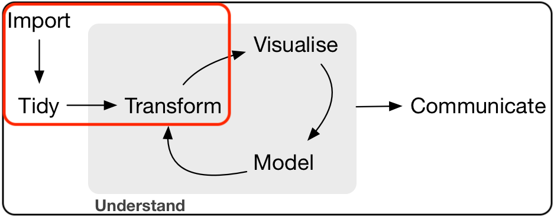
```

.footnote[
<br>
[Wickham & Grolemund, 2016](https://r4ds.had.co.nz/)
]  

???
OHI: It actually took us a long time to realize that this was discrete, separate thing. 

---
<br>
```{r tidyverse, out.width = '60%', fig.align='center'}
knitr::include_graphics("img/r4ds_data-science-tidyverse.png")
```
  
.footnote[
[Hadley Wickham, 2019](https://speakerdeck.com/hadley/welcome-to-the-tidyverse?slide=28)
]  

???

Expect there's a better way


---
# Open as a way to work  
### open science is "the concept of transparency at all stages of the research process, coupled with free and open access to data, code, and papers"

source: [Hampton et al. 2015](https://esajournals.onlinelibrary.wiley.com/doi/full/10.1890/ES14-00402.1)

--

### "transparency, collaboration, empowerment, inclusivity, and accountability" ... "trust" ... "safe to be vulnerable"

source: [Wright 2019](https://medium.com/@stephanie_6761/why-bother-with-the-open-anyway-c76afb4dcb85)
???

For many environmental scientists, open science can be a negative thing. It's seen as extra work and high risk on already overburdened scientists, particularly those who are early career. 

And that is because it often also has a narrow definition of sharing your data and code at the end of your study, at the risk of people stealing your work and misconstuing your science. 

In this narrow mindset it's not considered that open science could ever be a benefit to the scientist who pays such cost in terms of time and risk

I like this definition of open science

I teach that open science is a spectrum, with many entryways to engage

I like this too because it helps dispell the idea that you're either doing open science or you're not, but that you can always engage more as you are able.

In Openscapes we talk about how entryways can include sharing slides from a talk online. 

We also practice working openly with their own teams, even if it is within a private repository, because it is practicing the tools and taking the first steps. 

transition: and these 2 pieces really trigger you to reimagine what data science and open science can do for communication


---
class: middle
.pull-left[
# Teamwork

**trust**  
**shared values**  
**resilience**  
**overlapping skillsets & interoperability**  
**horizontal leadership**  
<br>
ADD: Expect there is a better way  
Abstract my problem. 
]

.pull-right[
```{r team-hands, out.width = '100%', fig.align='center'}
knitr::include_graphics("img/horst-starwars-hands.png") 
```
]


???

Team mindset. Overlapping skillsets

Our story started with us not working like a team. Having one person who knew how to code. Very inefficient, very brittle. 

See this in OHI+ as well: hire one person to code, no decision making, no creativity, no domain knowledge. 

What you really want in a team. 

Ben enabled us to become leaders. horizontal leadership: evolve with the softwarescape


---
```{r horst-eco-r4ds}
```
name: environ-comm-r4ds
class: center, middle
background-image: url(img/horst-eco-r4ds.png) 
background-size: contain

.footnote[
.left[
<br>
art: [@allison_horst](https://twitter.com/allison_horst);
updated from [Wickham & Grolemund](https://r4ds.had.co.nz/)
]
]

???

So all of this together makes a possible for env science


---
```{r horst-eco-r4ds-env-comm-only}
```
name: environ-comm-r4ds
class: center, middle
background-image: url(img/horst-eco-r4ds-env-comm-only.png) 
background-size: contain

.footnote[
.left[
<br>
art: [@allison_horst](https://twitter.com/allison_horst);
updated from [Wickham & Grolemund](https://r4ds.had.co.nz/)
]
]

???

But this is where we are. And why is that? It's because we don't have the skills because we're never trained, but we aslso don't have the accompanying mindset and teamwork. 

---
```{r loop-wtext3, out.width = '100%'}
knitr::include_graphics("img/horst-lowndes-loop-wtext.png")
# https://docs.google.com/presentation/d/13JkwCiXjfZfNucAsDwHI6FdEvpOngCv50cjnT7HXJK8/edit#slide=id.g625ce81eb0_0_1645
```

.footnote[
art: [@allison_horst](https://twitter.com/allison_horst)   
]

???

We're missing this feedback loop. Or maybe it encompasses the whole idea. 

Coming back to this feedback loop: 
The biggest things that I've learned are that science teams — research groups, labs — don't necessarily think like a team or work like a team when it comes to data. Shouldn't be surprising from my own experience in my PhD lab; we worked like a team when it came to science. but not data.  


---
```{r rey-toc-supercharge-list}
```
class: title-slide, right, bottom
background-image: url(img/horst-starwars-rey.png)
background-size: contain
background-position: bottom left   


# Better science in less time 

### How to supercharge your research
Lessons from Openscapes  
How to supercharge science
<br>
<br>
<br>
<br>
<br>
<br>

???

I'm really going to focus on the mindset part here; there are we also have 10 weeks of recommendations. 
---
```{r openscapes grasslandx2, out.width = '100%', fig.align='center'}
knitr::include_graphics("img/horst_openscapes_grassland_1500px-text-hex.png")
```

.pull-left[
**A mentorship program for research teams to help build mindsets and habits around open data science.**  
<br>
**Cohorts (5 months, remote) 2019-**  
**Workshops (2-day, in-person) 2020-**  
]

.pull-right[
```{r zoom, out.width = '85%', fig.align='center'}
knitr::include_graphics("img/Cohort1_zoom.png") 
```

]


.footnote[
art: [@allison_horst](https://twitter.com/allison_horst); 
web: [openscapes.org](https://openscapes.org)
]

???

welcome and empower scientists as research groups

increase visibility and valuee by amplifying labs and creating more examples of how powerful open data science can be for environmental science

---
exclude: TRUE
```{r openscapes-grassland, out.width = '100%', fig.align='center'}
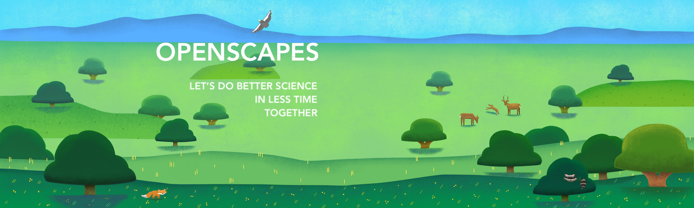
```

### We welcome scientists to open data science by mentoring research teams.

**Engage**: build awareness and excitement with empathy, art, and storytelling  
**Empower**: connect with existing open software and communities  
**Amplify**: champion broadly to increase visibility, value, and practice  

.footnote[
web: [openscapes.org](https://www.openscapes.org); 
]

---
<br>
```{r connecting-awesome-researchers, out.width = '100%', fig.align='center'}
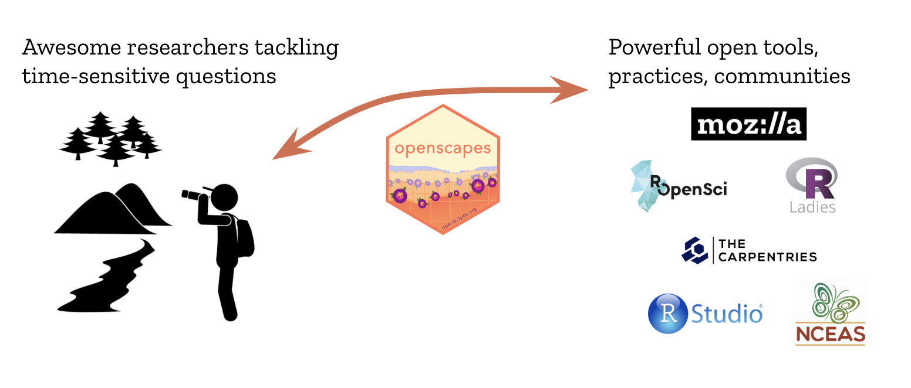 
```

--

>"This isn’t just about coding and GitHub, this is about changing how we do science"<br>— [Dr. Malin Pinsky, Marine Ecologist at Rutgers & Openscapes Champion](https://www.openscapes.org/blog/2019/04/08/summit-reflections1/)

???
Complements existing efforts

---

???

written as group leads, but the idea is to enable a team, whether it's vertical leadership or horizontal leadership. 

---
# Redefine collaborators
```{r horst-seaside-chats, out.width = '60%', fig.align='center'}
knitr::include_graphics("img/horst-seaside-chats.png") 
```

### Research group as a team
### Future you, future us

---
### Talk about data
.pull-left[
```{r careers-screenshot, out.width = '100%', fig.align='center'}
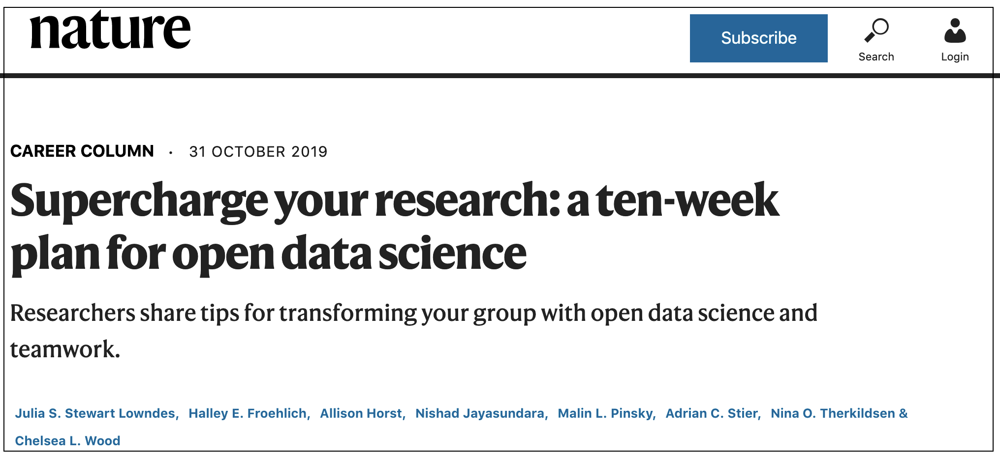 
```
]

.pull-right[
### Normalize data discussions
### Identify and address shared needs
# Think ahead: Future You & Future Us

"Seaside chats", "Hacky hours", Coding clubs/meetups

Establish trust, share challenges & wins, learn together

???


???

10-week plan. 


---
# 

```{r clippy, fig.align='center'}
knitr::include_graphics("https://media.giphy.com/media/13V60VgE2ED7oc/giphy.gif") 
```


???
**On/offboarding documents**  
**Codes of Conduct**  
<br>
**Coding clubs**  
**University courses**
<br>
**Champion open data science**

---
# Enable and support leaderful teams
.pull-left[
### Qualities
**Resilience**  
**Horizontal leadership**  
**Trust**  
**Overlapping skillsets & skillsharing**  
]

--

.pull-right[
### Strategies
**"Seaside Chats"**  
**Coding clubs**  
**University courses**  
]

Openscapes Resources pages

???


Teams to me mean rings of people you respect, innovate with, and can rely upon. It does not have to be limited to a certain deliverable, location, discipline or anything else really. 

Teamwork is critical in science because no one it can do it all. And for the sake for innovation as well as for emotional well-being we need to shed the expectation that we should be able to. Instead, we need to value teamwork. 
We as an OHI team have spent years building up trust with each other, and that makes us be able to do our best work. 

This trust really centers on respect for each other and also kindness.

But on an individual level, we all have had to get comfortable with sharing things before they are perfect and being vulnerable to critique, which gets easier when you can assume the best intentions from anyone's feedback. 

But this has resulted in a really positive team culture, where we are comfortable with trying new things & learning from failure, and we are comfortable asking for help. 

---
class: center, middle
```{r allisonhorst-github-io, out.width = '60%'}
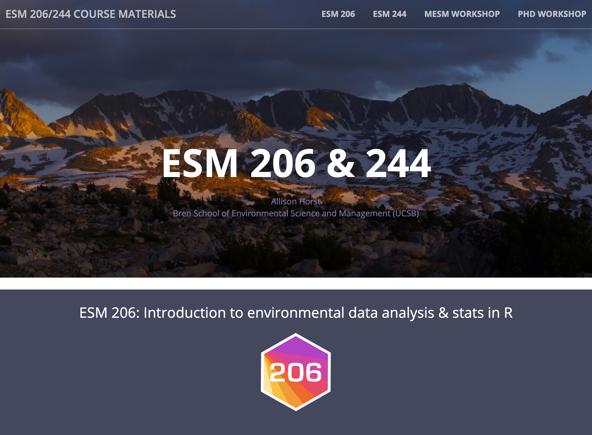
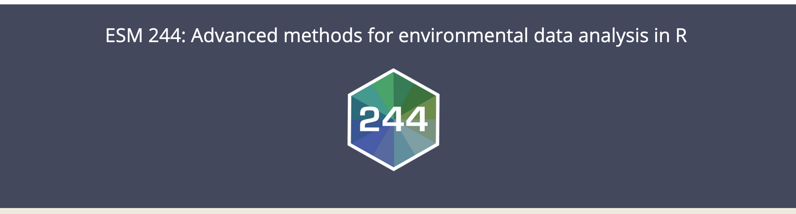
```
 
.footnote[
web: [allisonhorst.github.io](https://allisonhorst.github.io/) 
]

???

One of the cool things she did to give back to the community is she created this website for her classes and posted all course materials and homeworks online. 

This is now a resource for Allison's students but also for anyone else wanting to learn on their own, or teach their own course.

I mentioned that Michelle is going to teach a new open data science course; she is going to use Allison's lessons.

transition: Those are just some stories of the teamwork, leadership, and community involvement that the Openscapes champions have been engaged in.


---
# Redefine community

---
### Collaborators and community (redefined) as a way to learn
```{r community-logos, out.width = '100%', fig.align='center'}
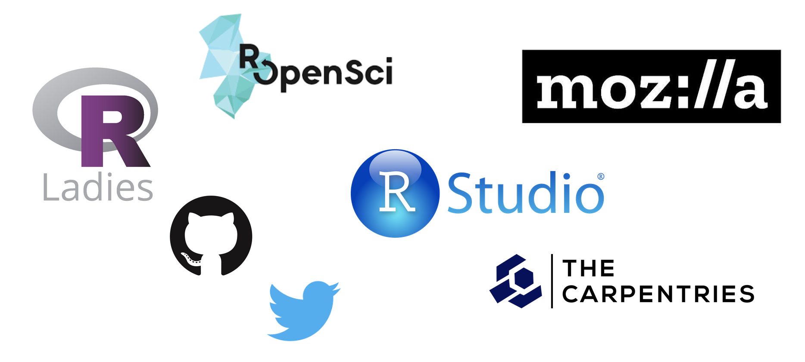
```

???

Community was really my entry way into open science. 

Take a moment to say a few things

I'm a Mozilla Fellow

And I connect with all of thesee through Twitter

---
.pull-left[
<br>
```{r rnoaa, out.width = '100%'}
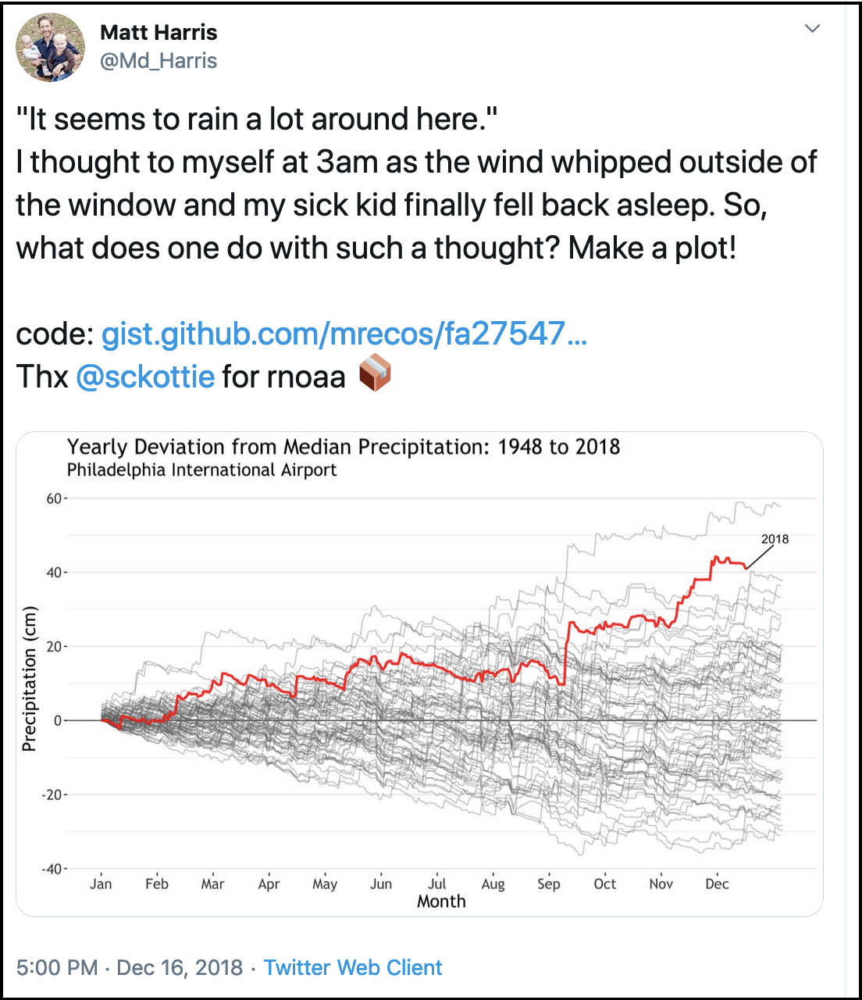
```

.footnote[
tweet: [@Md_Harris](https://twitter.com/Md_Harris/status/1074469302974193665/photo/1)
]
]

--
.pull-right[
<br>
<br>
### My internal monologue: 

**Cool visualization!**  
**I want to represent my data this way**  
**He includes [his code](https://gist.github.com/mrecos)!**  
**Package from [@sckottie](https://twitter.com/sckottie) at [rOpenSci](https://ropensci.org)**  
**rnoaa is a package making NOAA data more accessible!**  
]

---
class: center, middle
```{r halley-rnoaa, out.width = '60%', fig.align='center'}
knitr::include_graphics("img/tweet-docfroehlich-rnoaa-full.png")  
```
 
.footnote[
tweet: [@DocFroehlich](https://twitter.com/DocFroehlich/status/1085990833571020800)
]

???

Halley has a big science follwing already and now tweets also about open data science, so this is a great example of the influence these champions are already having. 


---
```{r rladies-sydney, out.width = '60%', fig.align='center'}
knitr::include_graphics("img/tweet-apreshill-rladies-sydney.png")
```

.footnote[
twitter: [@apreshill](https://twitter.com/apreshill/status/1184660994007519232); 
web: [RLadies Sydney](https://rladiessydney.org/courses/ryouwithme/)
]

???

https://twitter.com/WeAreRLadies/status/1087741684618809346
https://twitter.com/frau_dr_barber/status/1127189812308369408

```{r tweet-maybe, out.width = '60%', fig.align='center'}
knitr::include_graphics("img/horst-welcome_to_rstats_twitter.png")
# https://twitter.com/danidlsa/status/1192773907088064512
```


---
### \#rstats Twitter
```{r welcome-rstats, out.width = '60%', fig.align='center'}
knitr::include_graphics("img/horst-welcome_to_rstats_twitter.png")
```

.footnote[
art: [@allison_horst](https://twitter.com/allison_horst);
blog: [openscapes.org](https://www.openscapes.org/blog/2019/01/15/personify-code/)
]

???

---
exclude: TRUE
# Share knowledge
```{r efficiency-tips, out.width = '70%', fig.align='center'}
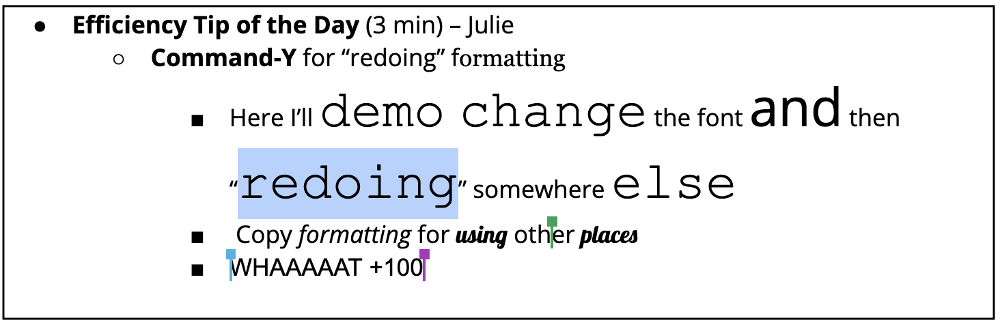 
```

???

---
### Use Twitter for learning
.pull-left[
```{r welcome-rstats2, out.width = '100%', fig.align='center'}
knitr::include_graphics("img/horst-welcome_to_rstats_twitter.png")
```

.footnote[
art: [@allison_horst](https://twitter.com/allison_horst);
blog: [openscapes.org](https://www.openscapes.org/blog/2019/01/15/personify-code/)
]
]

.pull-right[
**Follow selectively, listen & learn**

\#rstats, @hadleywickham, @JennyBryan, @WeAreRLadies  

@openscapes, @nceas, @OHIscience, @EcoDataScience  

@pinskylab, @ntherk, @DocFroehlich, @AdrianStier, @allison_horst, @DrChelseaLWood

]


---
# Get involved

### Follow us on Twitter @openscapes

### Join our mailing list

### Talk with your colleagues

### Amplify through media and events

### Book or sponsor Champions Cohorts and Workshops

### Email us with your ideas


---
# Thank you all so much

.pull-left[
#### especially for this talk:
###OHI team <br>Mozilla team<br>Openscapes labs<br>Allison Horst<br>RLadies team

<br>

####all artwork: [@allison_horst](https://twitter.com/allison_horst)<br>xaringan theme: [@apreshill](https://github.com/apreshill/talks/blob/master/uo-sad-plot-better/index.Rmd#L7)

]

.pull-right[
<br>
<br>

### Please get involved: [openscapes.org/contact](https://www.openscapes.org/contact/); [@openscapes](https://openscapes.org)


#### Find me for stickers... 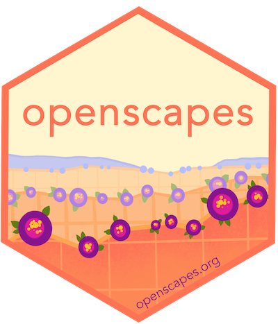 
]

???

Thank you.

---
```{r fin}
```
class: title-slide, right, bottom
background-image: url(img/horst-starwars-rey.png)
background-size: contain
background-position: bottom left   


# `r rmarkdown::metadata$title`

### `r rmarkdown::metadata$author`
### `r rmarkdown::metadata$role`
### `r rmarkdown::metadata$institute`

[`r icon::fa("twitter")` @juliesquid](https://twitter.com/juliesquid)  
[`r icon::fa("paper-plane")` lowndes@nceas.ucsb.edu](mailto:lowndes@nceas.ucsb.edu)  
[`r icon::fa("desktop")` jules32.github.io/user-2019-keynote](http://jules32.github.io/user-2019-keynote)  


---
# Orphan

---
# Eco-Data-Science & RLadies SB

```{r eds, out.width = '100%', fig.align='center'}
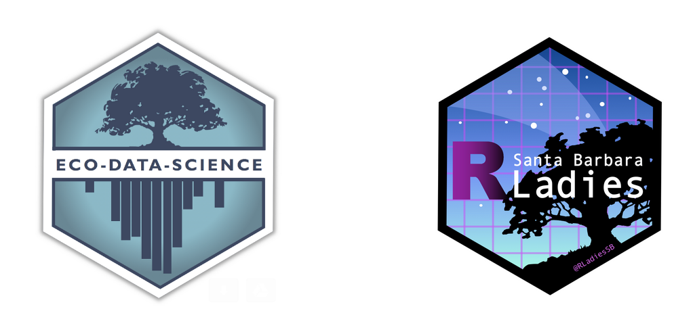  
```
 
.footnote[
art: [@allison_horst](https://twitter.com/allison_horst); twitter: [@ecodatasci](https://twitter.com/ecodatasci); [@RLadiesSB](https://twitter.com/RLadiesSB)
]

???

leading local study groups like Eco-Data-Science and RLadies chapters, and generally telling everybody how awesome R is. 

This is how I got a fellowship with Mozilla. 

---
class: center, middle

```{r moz, out.width = '100%'}
knitr::include_graphics("img/moz-fellow-announcement.png")
```

.footnote[
blog: [blog.mozilla.org](https://blog.mozilla.org/blog/2018/08/21/mozilla-announces-25-new-fellows-in-openness-science-and-tech-policy/)
]

???

Yes Moz is firefox, but also the internet for good. 

Spent the last year developing a program with Mozilla and NCEAS, the ecology center where I am based. 

---
```{r openscapes hex, out.width = '55%', fig.align='center'}

```

.footnote[
art: [@allison_horst](https://twitter.com/allison_horst); 
web: [openscapes.org](https://openscapes.org); [@openscapes](https://twitter.com/openscapes)
]

???

The program is called Openscapes, and it is mentorship program for research groups. 

Openscapes helps them establish and maintain shared practices around data and work as a team. 

It is modeled after our experiences from the Ocean Health Index, which is one of the most visible examples of what open data science can look like in an environmental context. 


---
<br>
```{r openscapes grassland, out.width = '100%', fig.align='center'}

```

<br>

.pull-left[
### Welcome and empower scientists as labs
]

.pull-right[
### Increase visibility and value by amplifying labs
]


.footnote[
art: [@allison_horst](https://twitter.com/allison_horst); 
web: [openscapes.org](https://openscapes.org)
]

???

welcome and empower scientists as research groups

increase visibility and valuee by amplifying labs and creating more examples of how powerful open data science can be for environmental science

---
<br>
```{r openscapes desert, out.width = '100%', fig.align='center'}
knitr::include_graphics("img/horst_openscapes_desert_1500px.png")
```

.pull-left[
### Mentorship program for early career scientists & their labs
]

.pull-right[
### Normalize open data science in the lab & seed change beyond
]

.footnote[
art: [@allison_horst](https://twitter.com/allison_horst);
web: [openscapes.org/champions](https://openscapes.org/champions)
]

???

Centered mentorship program for early career scientists & their labs

Normalize open data science in the lab & seed change beyond

---
```{r env-r4ds}
```
class: center, middle
background-image: url(img/horst-eco-r4ds.png) 
background-size: contain

.footnote[
.left[
art: [@allison_horst](https://twitter.com/allison_horst); 
updated from [Wickham & Grolemund](https://r4ds.had.co.nz/)
]
]

???

This is the vision I see for environmental science. 

Where the elements that environmental scientsts are great at, like theory, and experimental design are streeamlined together by ODS, and help us communicate around environmental solutions. 

I know this graphic looks familiar from R4DS, but notice that all of the data science components here are ringed by communities and support that our OHI team has found so critical to our success. 

So this is the vision I'm working towards with Openscapes, and I am optimistic we can do this because the first cohort of Openscapes participants are well on their way after only 5 months.

---
```{r env-comm}
```
class: center, middle
background-image: url(img/horst-eco-r4ds-env-comm-only.png) 
background-size: contain

.footnote[
art: [@allison_horst](https://twitter.com/allison_horst)
]

???

But right now environmental science looks like this. We rarely have formal training with coding or computing or data and so folks learn in pockets and are unsupported at broader institutional levels. 

And often they are not supported even at level of the research group, which is already poised to work like a team. 

Helping complete this picture drives my work now. I want to figure out how to best introduce open data science and teamwork to this picture.

I've found that scientists are often not aware of what tools are availabe. But that is just the first sliver of the challenge. 

The real challenge is about mindset around open data science, and helping scientists feel included so that it can be part not only of their future, but of their present. 

---
class: inverse
# Lessons learned
<br>

### Open data science is a mindset
### Teamwork starts with openness 
### Harness the power of welcome 

???

<water>

So the first is that open data science is a mindset. 

---
class: inverse, center, middle
# Open data science is a mindset

### expect a better way • build confidence & willingness • reimagine science communication

???

<br>

This involves expecting there is a better way with data science, 

Building confidence & willingness with open science, 

and reimagining what is possible with the available tools. 


