```{r setup, include=FALSE}
options(htmltools.dir.version = FALSE, warning=FALSE, message=FALSE, verbose = FALSE)
knitr::opts_chunk$set(echo = FALSE, message=FALSE, warning=FALSE)

library(xaringan)
library(fontawesome)
```

class: title-slide, right, bottom
background-image: url(img/horst-starwars-rey.png)
background-size: contain
background-position: bottom left 


## `r rmarkdown::metadata$title`
### `r rmarkdown::metadata$author`
### `r rmarkdown::metadata$institute`

[`r icon::fa("twitter")` @juliesquid](https://twitter.com/juliesquid)  
[`r icon::fa("paper-plane")` lowndes@nceas.ucsb.edu](mailto:lowndes@nceas.ucsb.edu)  
[`r icon::fa("desktop")` openscapes.org/media](http://openscapes.org/media)  


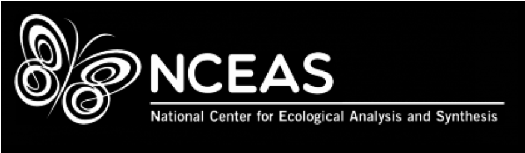

???

---
```{r loop-wtext, out.width = '100%'}
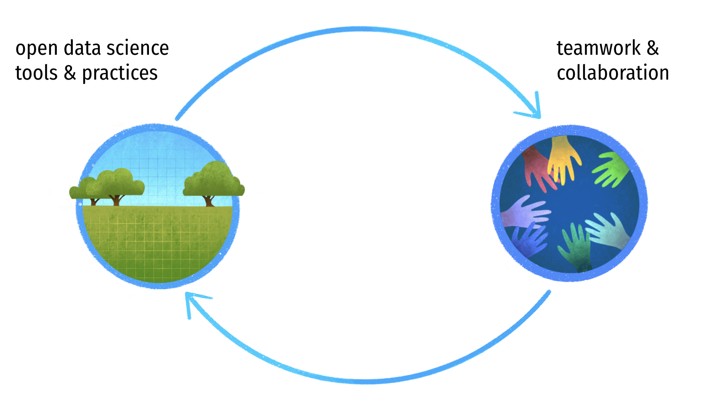
# https://docs.google.com/presentation/d/13JkwCiXjfZfNucAsDwHI6FdEvpOngCv50cjnT7HXJK8/edit#slide=id.g625ce81eb0_0_1645
```

.footnote[
art: [@allison_horst](https://twitter.com/allison_horst)   
]

???

I've been thinking a lot about this feedback loop and am excited to be able to talk it through with you a bit more. 

Learning and using similar software promotes and streamlines teammwork. And also working as a team better equips you to learn open practices data science.

transition: I've been thinking about this over the last 7 years at NCEAS, at the OHI:

---
<br>
```{r OHI hex3, out.width = '100%', fig.align='center'}
knitr::include_graphics("img/OHI-banner-hex.png")
```

<br>

.pull-left[
**A scientific method, tool, and community for channeling the best available scientific information into marine policy.**  
<br>
**Global assessments annually 2012-**  
**Independent assessments 20+**

.footnote[
source: [*Halpern et al. 2012*: An Index to assess the health and benefits of the global ocean](http://www.nature.com/nature/journal/v488/n7413/full/nature11397.html)  
web: [ohi-science.org](http://ohi-science.org); twitter: [@OHIscience](https://twitter.com/OHIscience)
]
]

.pull-right[
```{r teamx2, out.width = '100%', fig.align='center'}
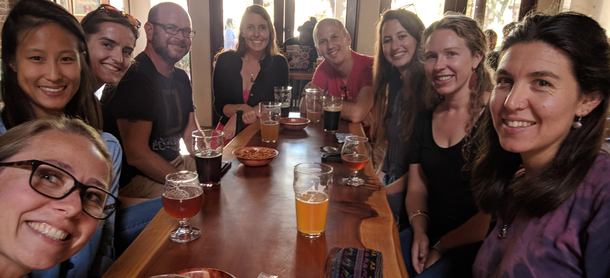 
```
]

???

The Ocean Health Index is a scientific endeavor to quantify impacts and benefits of oceans around the world using the best publically available data. 

It is being used by the United Nations and by 20 groups around the world. 

There is a lot to it but what is relevant here is that we combine lots of data, we repeat our analyses every year, and we do it as a team.

transition: and also over the last year, with Openscapes

---
```{r openscapes grasslandx, out.width = '100%', fig.align='center'}
knitr::include_graphics("img/horst_openscapes_grassland_1500px-text-hex.png")
```

.pull-left[
**A mentorship program for research teams to help build mindsets and habits around open data science, and grow the community of practice.**  
<br>
**Cohorts (5 months, remote) 2019-**  
**Workshops (2-day, in-person) 2020-**  

.footnote[
web: [openscapes.org](https://openscapes); twitter: [@openscapes](https://twitter.com/openscapes)
]
]
]

.pull-right[
```{r zoom12, out.width = '85%', fig.align='center'}
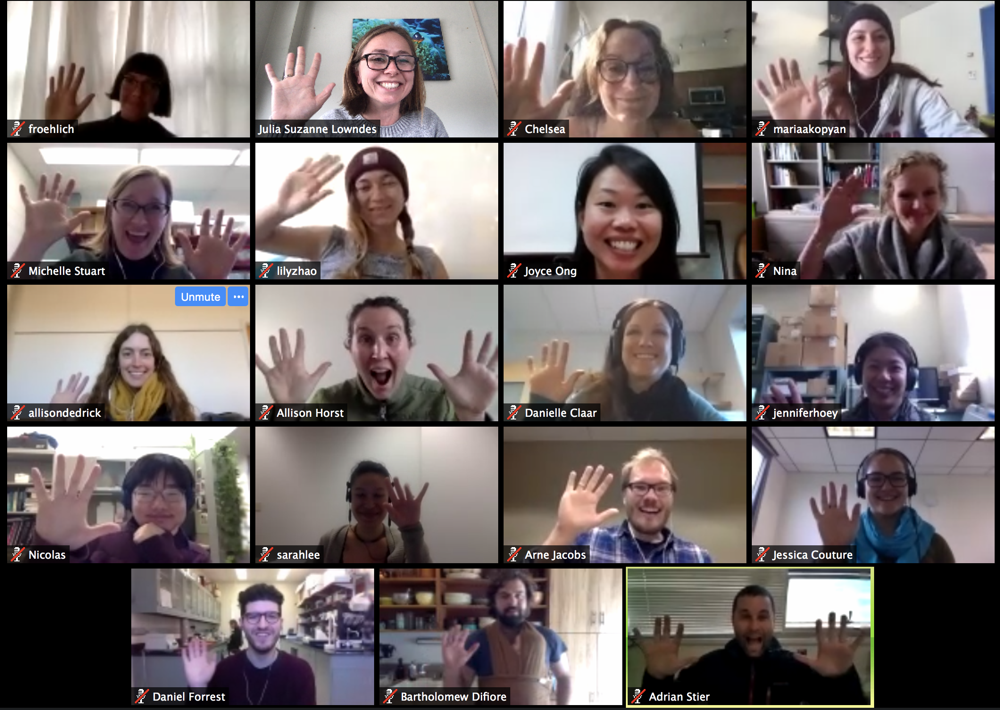 
```
]

???

But I like to talk about this with analogies from Star Wars 

---
exclude:TRUE
.pull-left[
### The problem
**Individual mindset in science**: 

struggling with data analysis  
"working alone"  
reinventing the wheel <!---difficult to repeat, reproduce--->


### This matters now
**No time to waste:** 

studying critical systems affected by climate change  
bad practices perpetuated

]

.pull-right[
### A solution
**Team mindset centered on open data science**: 

redefine collaborators & communities  
expect better ways  
create resilient teams  
]

???

---

```{r luke}
```
class: center, middle
background-image: url(img/horst-starwars-luke.png)
background-size: contain

.footnote[
art: [@allison_horst](https://twitter.com/allison_horst)
]

???

This is Luke Skywalker after he crashed his plane on Dagobah. He is there staring at a problem that he can’t solve with the skillsets he has, and it is demoralizing. 

This plane can represent a lot of things for data analysis. 
As an individual, it can be data that is too big to be opened in Excel. 
It can be your self-taught code that you are too ashamed of embarrassed to share
And as a team, it can be not being able to run code sent by a colleague. 
It can be the time spent organizing the files your students send you through a mosaic of Google Drive and GitHub links, email attachments, and thumb drives. 

For environmental scientists, there are ways big and small that can leave you feeling like Luke here. 

If you imagine what it would be like for Luke if he had used whatever ropes or pulleys he had on hand, it probably wouldn’t have been pretty, reproducible, or gotten him where he needs to be on time.

transition: but luckily what happens next is that he meets Yoda

---
class: top, center
```{r yoda, out.width = '88%'}
knitr::include_graphics("img/horst-starwars-yoda.png") 
```

.footnote[
art: [@allison_horst](https://twitter.com/allison_horst)
]

???

But Yoda comes along and can solve Luke's problem in a way Luke never imagined. He uses the Force. And the Force is a powerful skillset and mindset because Luke can see this and learn from Yoda, and he can go on then to not only solve his current but it will broaden his mind to what is possible in the future.

Open data science is the Force that helps us do better science in less time. It can be:
As an individual: 
code in an open source language like R, having your own work be more automated and reproducible 
And as a team: 

coding and coordinating collaboratively with tools like GitHub
being empowered by open practices and having it be part of the whole research process
These types of practices not only save time and are more reproducible, but it’s a whole mindset of what is possible as you reduce friction in the day-to-day analyses and become comfortable with the power of these tools. 

So the Force is a powerful thing, but importantly, it is not something that exists on its own.

Transition: But Luke didn't go on to defeat the Empire himself, he had a whole community.

---
```{r hands} 
```
class: center, middle
background-image: url(img/horst-starwars-hands.png)  
background-size: contain


.footnote[
art: [@allison_horst](https://twitter.com/allison_horst)
]

???

And this community is powerful because of the diversity of backgrounds and expertise, and although not everyone is a Jedi, everyone contributes in really critical ways.

So in science this can be
Teaching scientists how to code through university courses and trainings like the Carpentries
Championing open science by mentioning it in science talks, publications faculty meetings, 
Funding opportunities for scientists to participate in open science
Building software to meet scientists where they are

transition: So to recap: 

---
```{r rey-toc-full}
```
class: title-slide, right, bottom
background-image: url(img/horst-starwars-rey.png)
background-size: contain
background-position: bottom left   


???

R is the Force that enables us as scientists to do better science in less time. 

It empowers us to get our own data out of the swamp. 

It empowers us and build off of our confidence and experiences and broaden the scope of scientific challenges that we can tackle, which for environmental scientists, includes food security, disease transmission, and climate change. 

For me, I didn't fully feel the power of R until I finished graduate school and joined a research group where I am today, where we learned to work with data as a team. 

transition: So I'll talk today about 


---
```{r loop-toc1, out.width = '100%'}

# https://docs.google.com/presentation/d/13JkwCiXjfZfNucAsDwHI6FdEvpOngCv50cjnT7HXJK8/edit#slide=id.g625ce81eb0_0_1645
```

???

This is my outline. Will talk this through

---
```{r OHI-illustration, out.width = '85%', fig.align='center'}
knitr::include_graphics("img/ohi-illustration-hex.png")
```

.pull-left[
```{r OHI-map, out.width = '90%'}
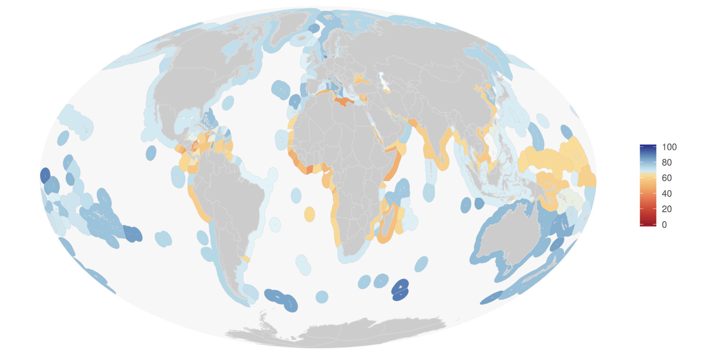
```

.footnote[
source: [Halpern et al. 2012](http://www.nature.com/nature/journal/v488/n7413/full/nature11397.html)
web: [ohi-science.org](http://ohi-science.org); [@OHIscience](https://twitter.com/OHIscience)
]
]

.pull-right[
```{r shiny-ne, out.width = '80%'}
knitr::include_graphics("img/jafflerbach-shiny-ne.png") 
```

.footnote[
dashboard (Shiny): [@jafflerbach](https://twitter.com/jafflerbach), work in progress. 
]
]

???

OHI models tourism, clean waters, and biodiversity, among others, synthesizing nearly 100 data sets into quantitative scores that can be tracked through time and inform policy. 
We lead assessments at the global scale, like the bottom left, which we've done each  year since 2012 and being formally considered for UN SDG 14; also in the US Northeast, tracking change for the last 10 years.  

transition: But we didn't start here. 

---
.pull-left[
```{r luke-smaller, out.width = '60%', fig.align='center'}
knitr::include_graphics("img/horst-starwars-luke.png")
```

```{r teucher1, out.width = '100%', fig.align='center'}
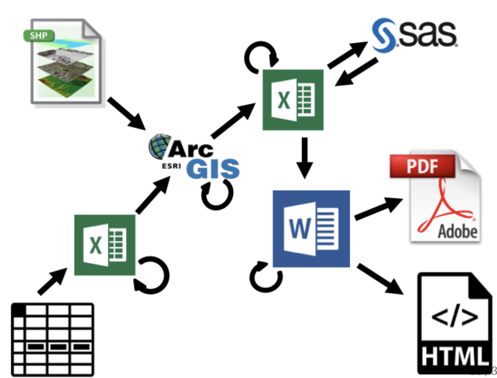
```

.footnote[
art: [@allison_horst](https://twitter.com/allison_horst), graphics: [Andy Teucher](https://github.com/ateucher/vic-geogeeks-2018-01-30)
]
]

.pull-right[

```{r yoda-smaller, out.width = '60%', fig.align='center'}
knitr::include_graphics("img/horst-starwars-yoda.png")
```

<br>

```{r teucher2, out.width = '95%', fig.align='center'}
knitr::include_graphics("img/teucher2.png")
```

]

???

Because we were all self taught, we came at OHI with the mismatches. Difficult workflows, and difficult to collaborate. 

---
class: middle, center
```{r nature-bsilt, out.width = '100%', fig.align='center'}
knitr::include_graphics("img/nature-screenshot-title.png")
```

.footnote[
source: [Lowndes *et al.* 2017](https://www.nature.com/articles/s41559-017-0160); web: [ohi-science.org/betterscienceinlesstime](http://ohi-science.org/betterscienceinlesstime/)
]

???

Figuring out was a big enough deal that we published this in Nature Ecology & Evolution. 

What made it unique: we shared our struggles, and described the transition

---
### More reproducibility & collaboration, less time
```{r fig 1-whiteout, out.width = '60%', fig.align='center'}
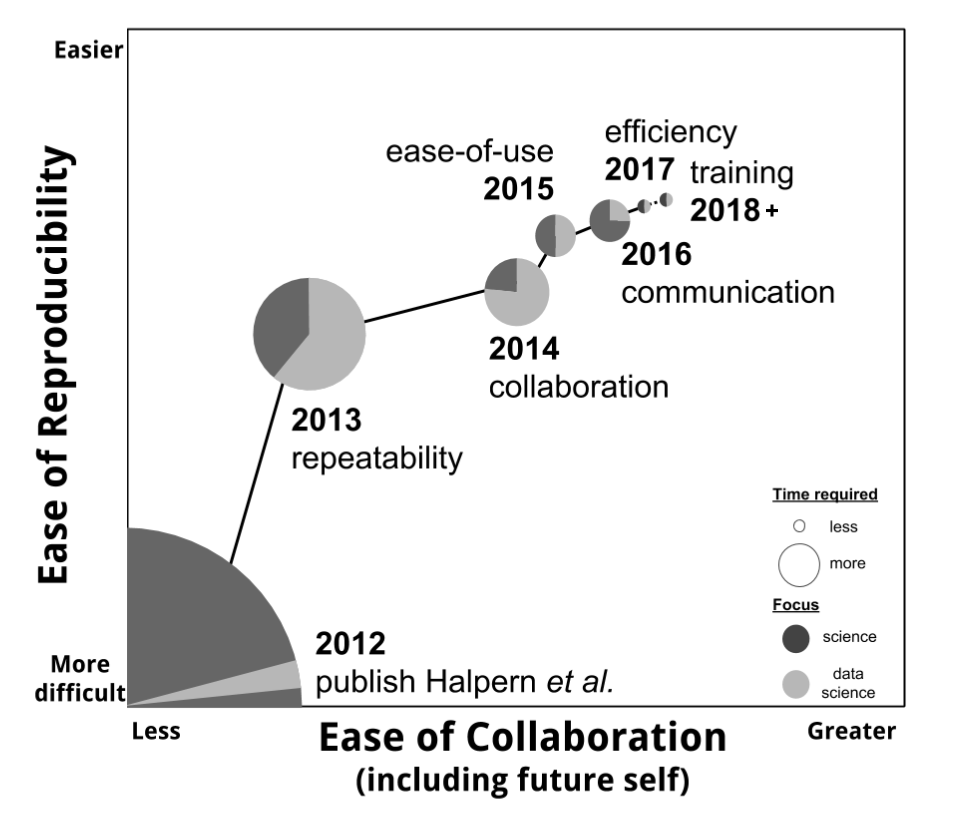
```

.footnote[
source: [*Lowndes et al. 2017* Our path  to better science in less time using open data science tools](https://www.nature.com/articles/s41559-017-0160)
]

???

It looks like this. 

Shown here as the circles get smaller and moving up the y axis. It also go easier for us to collaborate each year, along the x axis. 

This let us focus on making improvements either on the data science side or the science side

We couldn't overhaul everything all at once, but focused on different pieces incrementally each year. 

We started off focused on R and RStudio, and then on using Git and GitHub, then on tidy data and then documentation and Rmd. And ever since we've focused on leading a training program to teach students how to maintain it. 

Having all of this coding infrastructure in place is what enables those 20 independent groups I mentioned to study ocean health in the places they care about. 


---
class: center, middle
```{r workflow-repro-wtext, out.width = '100%'}
knitr::include_graphics("img/workflow-repro-wtext.png")
```

.footnote[
source: [OHI slides — WHOI](https://drive.google.com/open?id=1SHvJbBWrGVqzjAPos1jbtxSn_2DAl44JmDgY5v2NxC8)
]

???

---
class: center, middle
```{r workflow-full-wtext, out.width = '100%'}
knitr::include_graphics("img/workflow-full-wtext.png")
```

.footnote[
source: [OHI slides — WHOI](https://drive.google.com/open?id=1SHvJbBWrGVqzjAPos1jbtxSn_2DAl44JmDgY5v2NxC8)
]

???

---
exclude: TRUE
class: center, middle
```{r lowndes-table1, out.width = '100%'}
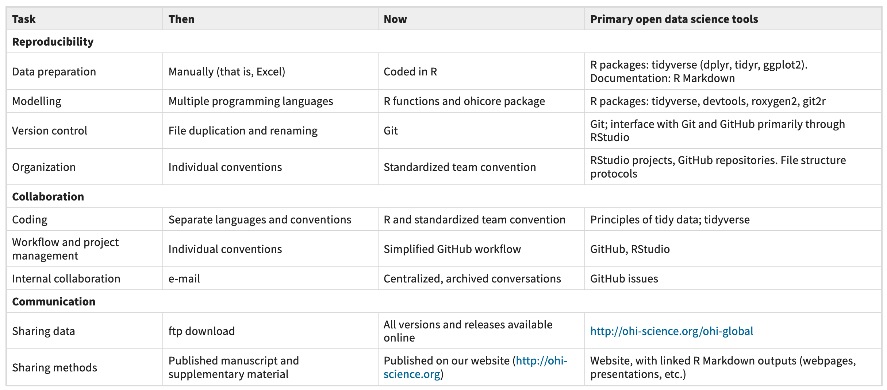
```

.footnote[
source: [Lowndes *et al.* 2017](https://www.nature.com/articles/s41559-017-0160)
]

???

We have it in the table but let me show you. 

---
## RStudio for R, text editing, Github sync, & more
```{r workflow-ex-repro-wtext, out.width = '100%'}
knitr::include_graphics("img/workflow-ex-repro-wtext.png")
```

.footnote[
source: [OHI slides — WHOI](https://drive.google.com/open?id=1SHvJbBWrGVqzjAPos1jbtxSn_2DAl44JmDgY5v2NxC8)
]

???

---
## GitHub for archiving and bookkeeping
```{r workflow-ex-collab-wtext, out.width = '100%'}
knitr::include_graphics("img/workflow-ex-collab-wtext.png")
```

.footnote[
source: [OHI slides — WHOI](https://drive.google.com/open?id=1SHvJbBWrGVqzjAPos1jbtxSn_2DAl44JmDgY5v2NxC8)
]

???

---
## Github for discussion & project mgmt
```{r workflow-ex-collab2-wtext, out.width = '100%', fig.align='center'}
knitr::include_graphics("img/workflow-ex-collab2-wtext.png")
```

.footnote[
source: [OHI slides — WHOI](https://drive.google.com/open?id=1SHvJbBWrGVqzjAPos1jbtxSn_2DAl44JmDgY5v2NxC8)
]

???

---
## R + Github for docs & publishing
```{r workflow-ex-comm-wtext, out.width = '100%'}
knitr::include_graphics("img/workflow-ex-comm-wtext.png")
```

.footnote[
source: [OHI slides — WHOI](https://drive.google.com/open?id=1SHvJbBWrGVqzjAPos1jbtxSn_2DAl44JmDgY5v2NxC8)
]

???

---
exclude: TRUE
class: center, middle
```{r rmd-global-web, out.width = '80%', fig.align='center'}
knitr::include_graphics("img/web-rmd-global.png")
```

.footnote[
web (simple RMarkdown): [ohi-science.org/ohi-global](http://ohi-science.org/ohi-global)
]

???

We also can spin up lighter-weight websites that will render with the most recent information we have 

This is not only useful for us, but for our colleagues leading their own assessments on their coastlines. 

---
exclude: TRUE
```{r ohi-esw, out.width = '80%', fig.align='center'}
knitr::include_graphics("img/ohi-esw-web.png") 
```

.footnote[
web (simple RMarkdown): [ohi-science.org/esw](http://ohi-science.org/esw)
]

???
Another way science communication has changed is that  

---
exclude: TRUE
class: center, middle
```{r toolbox-training, out.width = '80%'}
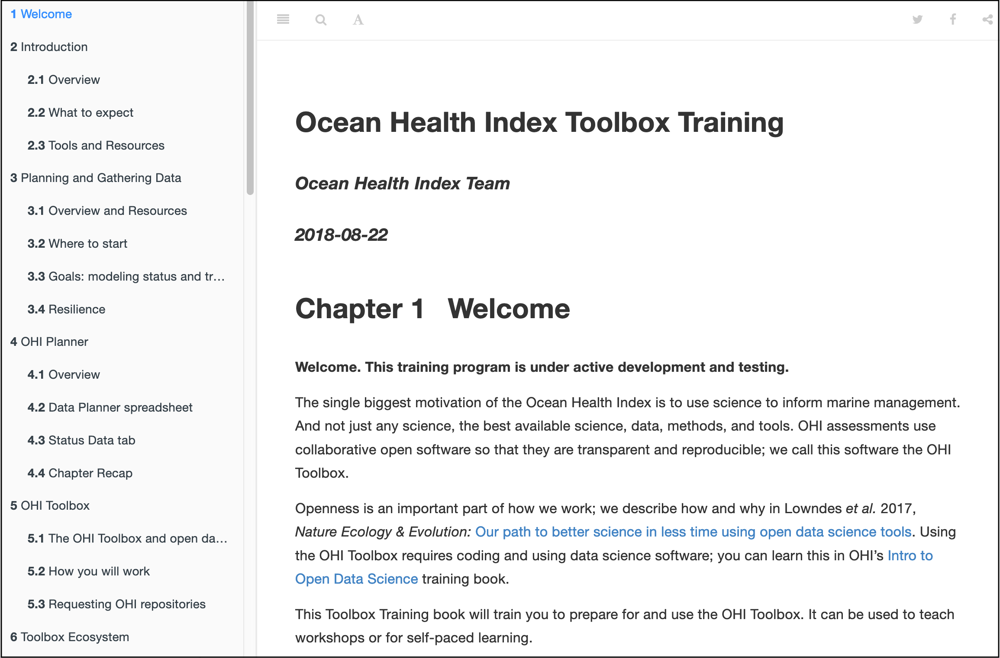
```

.footnote[
web: [ohi-science.org/toolbox-training](http://ohi-science.org/toolbox-training/)
]

???

We can create really nicely formatted guides and documentation also using these same tools. 


---
exclude: TRUE
<br>
```{r openscapes-web, out.width = '80%', fig.align='center'}
knitr::include_graphics("img/web-blogdown-openscapes.png") 
```

.footnote[
web (blogdown): [openscapes.org](https://openscapes.org)
]

???

Additionally, these tools have been amazing for blogging and sharing Openscapes stories

---
exclude: TRUE
<br>
```{r user-xaringan, out.width = '80%', fig.align='center'}
knitr::include_graphics("img/user-keynote-titleslide.png") 
```

.footnote[
slides (xaringan): [jules32.github.io/useR-2019-keynote](https://jules32.github.io/useR-2019-keynote)
]

???

And for fun, for creating talks at useR

transition: 

--->

---
```{r loop-wtext2, out.width = '100%'}

```

.footnote[
art: [@allison_horst](https://twitter.com/allison_horst)   
]

???

But remember, I said these tools are really most powerful with teams.


---
exclude: TRUE
```{r rey-toc-mindset-header}
```
class: title-slide, right, bottom
background-image: url(img/horst-starwars-rey.png)
background-size: contain
background-position: bottom left   


# Better science in less time 

### Open data science as a mindset
<br>
<br>
<br>
<br>
<br>
<br>
<br>
<br>

---
exclude: TRUE
```{r rey-toc-mindset-list}
```
class: title-slide, right, bottom
background-image: url(img/horst-starwars-rey.png)
background-size: contain
background-position: bottom left   


# Better science in less time 

### Open data science as a mindset

Data science as a discipline  
Open as a way to work  
Collaborators and community (redefined) as a way to learn  
The internet as an underleveraged tool for science  
Lab members as a team  
<br>
<br>
<br>

???

This is what we talk about in Openscapes. 

???

This is how we talk about this in Openscapes: 

Data science as a discipline
Open data science tools exist
Open as a way to work
Lab members as a team
Collaborators and community (redefined) as a way to learn
The internet as an underleveraged tool for science

---
# Data science mindset
<br>
```{r data-science-r4ds, out.width = '90%', fig.align='center'}
knitr::include_graphics("img/r4ds_data-science.png")
```

.footnote[
<br>
[Wickham & Grolemund, 2016: "R for Data Science"](https://r4ds.had.co.nz/)
]  

???

Abstract from your problem. 

This graphic really changed they way we work and think. 

First, it separates the Understand part. This is this science part. It's an iterative process of transforming, subsetting, comparting data, vizulazing, modeling. And it's distinct from the import and tidying parts. This is critical. 

---
# Open data science tools
<br>
```{r tidyverse, out.width = '60%', fig.align='center'}
knitr::include_graphics("img/r4ds_data-science-tidyverse.png")
```
  
.footnote[
source: [Hadley Wickham, 2019](https://speakerdeck.com/hadley/welcome-to-the-tidyverse?slide=28); web: [tidyverse.org](https://www.tidyverse.org/)
]  

???

Expect there's a better way

---
## Reimagining communication and publishing
```{r rmd-reimagine, out.width = '50%', fig.align='center'}
knitr::include_graphics("img/rmarkdownWebsite2-cropped.png")
```

.footnote[
source: [RStudio](http://www.robbyshaver.com/rmarkdownGen/lesson-11.html)
]

???
transition: seeing what's possible reduces friction, gives you an open  mindset

---
# Open mindset
### "transparency at all stages of the research process, coupled with free and open access to data, code, and papers"

source: [*Hampton et al. 2015* The Tao of open science for ecology](https://esajournals.onlinelibrary.wiley.com/doi/full/10.1890/ES14-00402.1)

--

### "collaboration, empowerment, inclusivity, and accountability" ... "trust" ... "safe to be vulnerable"

source: [*Wright 2019* Why bother with the “open” anyway?](https://medium.com/@stephanie_6761/why-bother-with-the-open-anyway-c76afb4dcb85)


???

I'd  also add: Kindness


---
# Ocean Health Index team traits
.pull-left[
<br>
```{r team-side, out.width = '100%', fig.align='center'}
knitr::include_graphics("img/horst-starwars-hands.png") 
```
]

--

.pull-right[
### Circa 2013-2014
**Horizontal leadership: jazzed about open data science**   
**Vertical leadership: enabling & supportive**  
**Team mindset: trusting and willing**  
]
???

Teamwork started with trust and willingness. 
Needed to collaborate more easily with each other, so needed to trust each other. Found it was better and free! to work openly. 
A knowledgable & skillsharing coder, an enabling & supportive leader, willing others  

Not everyone codes. But everyone values


---
# Ocean Health Index team traits
.pull-left[
<br>
```{r team-side2, out.width = '100%', fig.align='center'}
knitr::include_graphics("img/horst-starwars-hands.png") 
```
]

.pull-right[
### Circa 2013-2014
**Horizontal leadership: jazzed about open data science**   
**Vertical leadership: enabling & supportive**  
**Team mindset: trusting and willing**  

### Circa 2019
**Overlapping & complimentary skillsets**   
**Resilience: onboarding & offboarding**
]

???

We learned how to talk about data, how to think together about it. 

Our story started with us not working like a team. Having one person who knew how to code. Very inefficient, very brittle. 

See this in OHI+ as well: hire one person to code, no decision making, no creativity, no domain knowledge. 

What you really want in a team. 

Ben enabled us to become leaders. horizontal leadership: evolve with the softwarescape


---
# Ocean Health Index team strategies

.pull-left[
### Learn what's possible, how to teach & lead
**rOpenSci • RStudio** • **RLadies • Mozilla • The Carpentries**
]

.pull-right[
```{r community-logosx, out.width = '100%', fig.align='center'}
knitr::include_graphics("img/ods-community-logos.png")
```

]

???

---
# Ocean Health Index team strategies

.pull-left[
### Learn what's possible, how to teach & lead
**rOpenSci • RStudio** • **RLadies • Mozilla • The Carpentries**

### Create skill-sharing spaces
**Seaside Chats** • **Eco-Data-Science • RLadiesSB** • **OHI Fellows**
]

.pull-right[
```{r community-logos3, out.width = '100%', fig.align='center'}
knitr::include_graphics("img/ods-community-logos.png")
```
 
```{r eds, out.width = '100%', fig.align='center'}
knitr::include_graphics("img/eds-rladies-hex.png")  
```
]

???
Webinars & tutorials  
Conferences and unconferences   

This Reinforced shared values


---
```{r horst-eco-r4ds}
```
name: environ-comm-r4ds
class: center, middle
background-image: url(img/horst-eco-r4ds.png) 
background-size: contain

.footnote[
.left[
<br>
art: [@allison_horst](https://twitter.com/allison_horst);
updated from [Wickham & Grolemund](https://r4ds.had.co.nz/)
]
]

???

So all of this together makes a possible for env science

---
```{r horst-eco-r4ds-env-comm-only}
```
name: environ-comm-r4ds
class: center, middle
background-image: url(img/horst-eco-r4ds-env-comm-only.png) 
background-size: contain

.footnote[
.left[
<br>
art: [@allison_horst](https://twitter.com/allison_horst);
updated from [Wickham & Grolemund](https://r4ds.had.co.nz/)
]
]

???

But this is where we are. And why is that? It's because we don't have the skills because we're never trained, but we aslso don't have the accompanying mindset and teamwork. 

---
```{r loop-wtext3, out.width = '100%'}

# https://docs.google.com/presentation/d/13JkwCiXjfZfNucAsDwHI6FdEvpOngCv50cjnT7HXJK8/edit#slide=id.g625ce81eb0_0_1645
```

.footnote[
art: [@allison_horst](https://twitter.com/allison_horst)   
]

???

We're missing this feedback loop. It's hard to learn these tools if you feel like it's all on you and you're alone, and it's hard to engage with your team if there's no catalyst. Luke never would have imagined to expect that the Force existed unless he had seen it and learned it. He had heard about it and thought it was offlimits or some hokey thing.

Individuals aren't aware of what's possible, and research groups aren't thinking like teams. We talk about science but not data. 


transition: 


---
```{r openscapes-grassland, out.width = '100%', fig.align='center'}
knitr::include_graphics("img/horst_openscapes_grassland_1500px-text-hex.png")
```

### We welcome scientists to open data science by mentoring research teams.

**Engage**: build awareness and excitement with empathy, art, and storytelling  
**Empower**: connect with existing open software and communities  
**Amplify**: champion broadly to increase visibility, value, and practice  

.footnote[
web: [openscapes.org](https://www.openscapes.org); twitter: [@openscapes](https://twitter.com/openscapes)
]

---
### Openscapes inaugural cohort 2019
.pull-left[
<br>
```{r zoom-left, out.width = '100%'}
 
```

.footnote[
web: [openscapes.org](https://www.openscapes.org); twitter: [@openscapes](https://twitter.com/openscapes)
]
]

--

.pull-right[
```{r dorks, out.width = '100%'}
knitr::include_graphics("img/tweet-drchelsealwood-dorks.png") 
```

]

???
That's what we were did in this first cohort that I mentioned. Really focused on the teamwork side, but immediately around open data science and iteratively, make this a spiral 

And it's been exciting to not only see changes within labs, but across them, and new UW alliances. 

transition: really focused on enabling others

---
## Openscapes momentum

.pull-left[

>"This isn’t just about coding and GitHub, this is about changing how we do science"<br>— Dr. Malin Pinsky, Rutgers

<br>

>"This program has honestly completely re-made how I think about my science"<br>-Dr. Chelsea Wood, U Washington

<br>

>"I honestly have learned more from #rstats on twitter in the last 7 months than I have in the prev 5 years." -Anon

]

--
 
.pull-right[
```{r moz-tweet, out.width = '100%'}
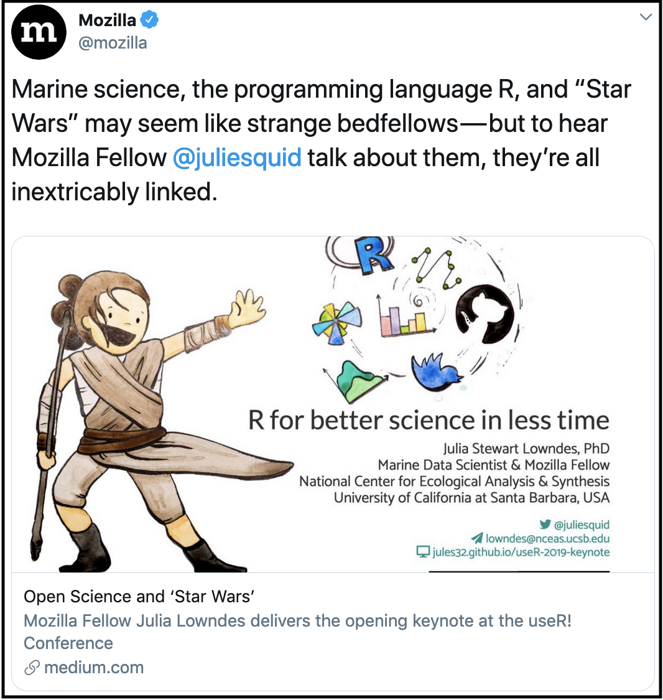 
# https://twitter.com/mozilla/status/1149363508276092928
```
]
???

And there's been amazing momentum, both from mentees and for the program, which is awesome. We plan to have further cohorts,  available for bookings and sponsorships. 

---
### Advice for better science in less time:
```{r yoda-fin, out.width = '72%', fig.align='center'}
knitr::include_graphics("img/horst-starwars-yoda.png") 
```

.footnote[
art: [@allison_horst](https://twitter.com/allison_horst)
]

---
# Talk about data
```{r careers-screenshot, out.width = '80%', fig.align='center'}
knitr::include_graphics("img/nature-careers-supercharge.png") 
```

<br>

**Normalize data discussions • Identify and address shared needs • Think ahead: Future You & Future Us**


???
"Seaside chats", "Hacky hours", Coding clubs/meetups

Establish trust, share challenges & wins, learn together

10-week plan. 


---
# Have a team mindset

.pull-left[
### Redefine collaborators
**Research group as a team** • **Future you, future us**

### Redefine community
**Online** •  **Beyond your own discipline**
]

.pull-right[
```{r horst-seaside-chats2, out.width = '90%', fig.align='center'}
knitr::include_graphics("img/horst-seaside-chats.png") 
```
]

### Reimagine challenges
**Separate your science from your data • Expect there is a better way** • **Have confidence, agency, & community to solve them** • **You're not alone, it's not too late**  


???
It's not your fault

---
exclude: TRUE

```{r clippy, fig.align='center'}
knitr::include_graphics("https://media.giphy.com/media/13V60VgE2ED7oc/giphy.gif") 
```


???
**On/offboarding documents**  
**Codes of Conduct**  
<br>
**Coding clubs**  
**University courses**
<br>
**Champion open data science**

---
# Enable and support leaderful teams

.pull-left[
### Learn what's possible, how to teach & lead
**rOpenSci • RStudio** • **RLadies • Mozilla • The Carpentries**

### Create skill-sharing spaces
**Sea/Bay/Bluff/side Chats** • **Coding Clubs • Hacky hours / weeks** • **University courses**
]

.pull-right[
```{r handshands, out.width = '100%'}
knitr::include_graphics("img/horst-starwars-hands.png")
```

**trust** • **resilience** • **overlapping skillsets & interoperability** • **leadership • kindness**  

]

???
Webinars & tutorials  
Conferences and unconferences   

This Reinforced shared values


Openscapes Resources pages

???


Teams to me mean rings of people you respect, innovate with, and can rely upon. It does not have to be limited to a certain deliverable, location, discipline or anything else really. 

Teamwork is critical in science because no one it can do it all. And for the sake for innovation as well as for emotional well-being we need to shed the expectation that we should be able to. Instead, we need to value teamwork. 
We as an OHI team have spent years building up trust with each other, and that makes us be able to do our best work. 

This trust really centers on respect for each other and also kindness.

But on an individual level, we all have had to get comfortable with sharing things before they are perfect and being vulnerable to critique, which gets easier when you can assume the best intentions from anyone's feedback. 

But this has resulted in a really positive team culture, where we are comfortable with trying new things & learning from failure, and we are comfortable asking for help. 

---
exclude: TRUE
class: center, middle
```{r allisonhorst-github-io, out.width = '60%'}
knitr::include_graphics("img/allisonhorst-github-io.png")
knitr::include_graphics("img/allisonhorst-github-io2.png")
```
 
.footnote[
web: [allisonhorst.github.io](https://allisonhorst.github.io/) 
]

???

One of the cool things she did to give back to the community is she created this website for her classes and posted all course materials and homeworks online. 

This is now a resource for Allison's students but also for anyone else wanting to learn on their own, or teach their own course.

I mentioned that Michelle is going to teach a new open data science course; she is going to use Allison's lessons.

transition: Those are just some stories of the teamwork, leadership, and community involvement that the Openscapes champions have been engaged in.


---
### Engage with the \#rstats Twitter community
.pull-left[
```{r welcome-rstats2, out.width = '100%', fig.align='center'}
knitr::include_graphics("img/horst-welcome_to_rstats_twitter.png")
```

.footnote[
art: [@allison_horst](https://twitter.com/allison_horst);
blog: [openscapes.org](https://www.openscapes.org/blog/2019/01/15/personify-code/)
]
]

.pull-right[
### Follow selectively, listen, learn, meet awesome allies

**\#rstats, @hadleywickham, @JennyBryan, @WeAreRLadies, @rOpenSci**  

**@openscapes, @nceas, @OHIscience, @EcoDataScience**  

**@pinskylab, @ntherk, @DocFroehlich, @AdrianStier, @allison_horst, @DrChelseaLWood**

]


---
```{r openscapes-arctic, out.width = '100%', fig.align='center'}
knitr::include_graphics("img/horst_openscapes_arctic_1500px.png")
```

### Get involved with Openscapes & open data science

.pull-left[
**Follow us on Twitter @openscapes**  

**Join our mailing list**  

**Talk with your colleagues**  
]

.pull-right[
**Amplify through media and events**  

**Book or sponsor Champions Cohorts and Workshops**  

**Email us with your ideas**  
]

.footnote[
get involved: [openscapes.org/contact](https://www.openscapes.org/contact)
]

---
```{r openscapes-desert, out.width = '100%', fig.align='center'}
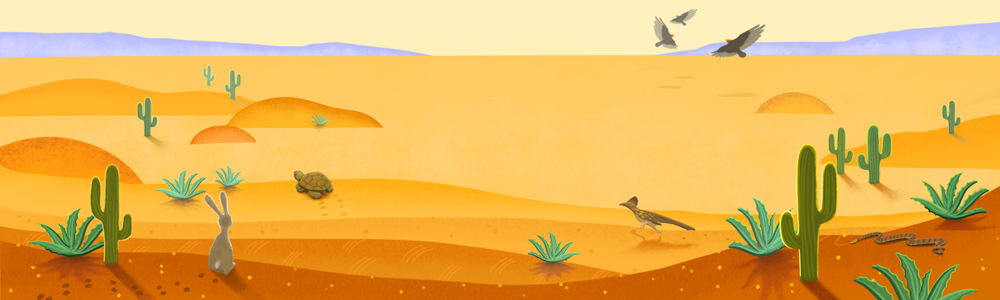
```

.pull-left[
### Parting thoughts
**Collaborative mindset: Future You**  
**Team mindset: Us and Future Us (redefined)**  
**Expect there is a better way; abstract the problem**  
**Open science is kinder science**  
]

.pull-right[
```{r loop-dloop, out.width = '100%'}
knitr::include_graphics("img/horst-lowndes-loop.png")
```

]

---
# Thank you all so much

.pull-left[
#### especially for this talk:
###OHI team <br>Mozilla team<br>Openscapes Champions<br>Allison Horst

<br>

####all artwork: [@allison_horst](https://twitter.com/allison_horst)<br>xaringan theme: [@apreshill](https://github.com/apreshill/talks/blob/master/uo-sad-plot-better/index.Rmd#L7)

]

.pull-right[
<br>
<br>

### Please get involved: [openscapes.org/contact](https://www.openscapes.org/contact/); [@openscapes](https://openscapes.org)


#### Find me for stickers...  
]

???

Thank you.

---
```{r fin}
```
class: title-slide, right, bottom
background-image: url(img/horst-starwars-rey.png)
background-size: contain
background-position: bottom left 


## `r rmarkdown::metadata$title`
### `r rmarkdown::metadata$author`
### `r rmarkdown::metadata$institute`

[`r icon::fa("twitter")` @juliesquid](https://twitter.com/juliesquid)  
[`r icon::fa("paper-plane")` lowndes@nceas.ucsb.edu](mailto:lowndes@nceas.ucsb.edu)  
[`r icon::fa("desktop")` openscapes.org/media](http://openscapes.org/media)  


---


---
.pull-left[
<br>
```{r rnoaa, out.width = '100%'}
knitr::include_graphics("img/tweet-Md_Harris-rnoaa.png")
```

.footnote[
tweet: [@Md_Harris](https://twitter.com/Md_Harris/status/1074469302974193665/photo/1)
]
]

.pull-right[
<br>
<br>
### My internal monologue: 

**Cool visualization!**  
**I want to represent my data this way**  
**He includes [his code](https://gist.github.com/mrecos)!**  
**Package from [@sckottie](https://twitter.com/sckottie) at [rOpenSci](https://ropensci.org)**  
**rnoaa is a package making NOAA data more accessible!**  
]

---
class: center, middle
```{r halley-rnoaa, out.width = '60%', fig.align='center'}
knitr::include_graphics("img/tweet-docfroehlich-rnoaa-full.png")  
```
 
.footnote[
tweet: [@DocFroehlich](https://twitter.com/DocFroehlich/status/1085990833571020800)
]

???

Halley has a big science following already and now tweets also about open data science, so this is a great example of the influence these champions are already having. 

---
```{r rladies-sydney, out.width = '60%', fig.align='center'}
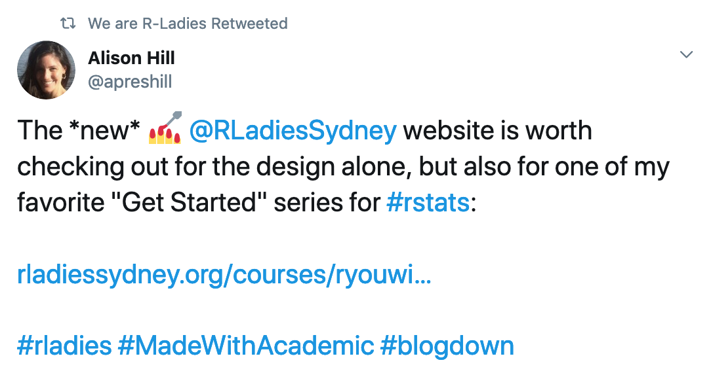
```

.footnote[
twitter: [@apreshill](https://twitter.com/apreshill/status/1184660994007519232); 
web: [RLadies Sydney](https://rladiessydney.org/courses/ryouwithme/)
]

???

https://twitter.com/WeAreRLadies/status/1087741684618809346
https://twitter.com/frau_dr_barber/status/1127189812308369408


